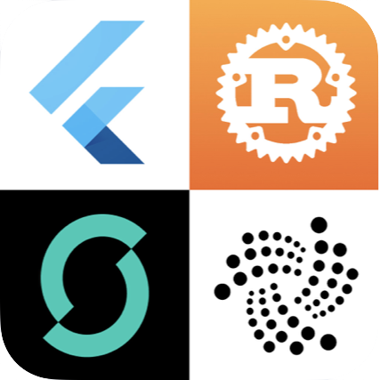

<figure style="margin:0;width:100%;text-align:center;"></figure>

# 👋 About: IOTA for Flutter

---

A Tutorial to build modern apps using IOTA, the next generation Distributed Ledger Technology

---

## Hey there!!

Ready to add some sparkle to your app development? Stay here, where we back the IOTA Mainnet and the Shimmer Network, the staging network of IOTA! Applying this approach, developers can effortlessly incorporate the Stardust Protocol version into their projects (and let's be honest, who doesn't love a little shimmer and stardust in their code)? So why wait? Say hello to Flutter and Rust and join me on this exciting journey and let us make your apps shine!

> Since the Stardust protocol upgrade on the IOTA Mainnet on October 4th, 2023, developers can leverage the latest enhancements not only in the Shimmer network but also on the IOTA Mainnet.
> <a href="https://blog.iota.org/iota-stardust-upgrade/" target="_blank">👉 &nbsp; Stardust protocol upgrade</a>

## Background

Originally I was searching for a workflow to build real-world products in the form of mobile and desktop applications backed by the Distributed Ledger Technology of IOTA. My goal was and is to facilitate the adoption of IOTA.

> Just to clarify, every time I mention _IOTA_, I'm also referring to _Shimmer_.&#x20;

I wanted to create a flexible solution that would allow developers to use a reduced technology stack for their projects. With _IOTA for Flutter_, I believe we've achieved that goal, and I'm excited to share it with the world. And believe me: Coming from Java and JavaScript frameworks I was not at all familiar with Flutter and Rust in the beginning.

I remember those days - the endless hours of debugging, the frustration of hitting the same roadblocks over and over again. But after four long months of trial and error, I finally found the solution with _IOTA for Flutter_.&#x20;

This documentation is a condensed tutorial that summarizes everything I learned during that grueling proof-of-concept process. And now, I want to share that knowledge with you. Think of my tutorial as your personal guide to app development for IOTA - a way to save you time and headaches, so you can focus on what really matters.

Now, before you get too excited, I should warn you that app development is still app development, and there's always a chance that things might not work out the way you planned. Trust me, I've been there. But hey, that's half the fun, right? The thrill of the chase, the excitement of finally figuring out that pesky bug - it's all part of the process. Just don't blame me if you find yourself cursing my name at three in the morning when something doesn't work quite right. But hey, if it was easy, everyone would be doing it, right? So let's roll up our sleeves and get to work!

_IOTA for Flutter_ is a sponsored project by the Tangle Community Treasury. The funding allows me to organize my collected notes and prepare them for you. At this point, a big thank you to everyone involved!

## You know Flutter but not IOTA?

By exploring IOTA, a Distributed Ledger Technology (DLT), you can expand your knowledge and explore the exciting possibilities of new use cases beyond the limitations of Web 2.0. This technology has the potential to revolutionize various industries, such as supply chain management, smart city infrastructure, and digital identity verification.

IOTA is unique in that it is a permissionless, decentralized system designed to enable secure and feeless exchange of value and data transfer between connected actors. Unlike traditional blockchain-based systems, IOTA does not rely on miners to validate transactions. Instead, each transaction verifies two previous transactions, creating a web-like network of transactions called the _Tangle_. This makes IOTA's DLT highly scalable and able to handle large amounts of transactions with zero fees.

> If you're a Flutter developer who's not familiar with IOTA or Shimmer (which is the staging network of IOTA), don't worry! Since October 2023, a series of outstanding blog posts has been emerging, explaining IOTA from the outset and progressively delving deeper over time. Start with <a href="https://blog.iota.org/digital-autonomy-for-everyone/" target="_blank">👉 &nbsp; Digital Autonomy for Everyone: The Future of IOTA</a>

There's no substitute for hands-on experience, and that's where _IOTA for Flutter_ comes in. While the official websites for IOTA and Shimmer provide a great starting point, the best way to truly understand how to use these technologies in your Flutter projects is to give it a try yourself.&#x20;

_IOTA for Flutter_ provides a tutorial-style documentation that walks you through the process of integrating IOTA and Shimmer step-by-step. So don't be afraid to jump in and give it a shot! Who knows, you might just surprise yourself with what you can accomplish.

<a href="https://iota.org" target="_blank">👉 &nbsp; Official IOTA website</a>

<a href="https://shimmer.network" target="_blank">👉 &nbsp; Official Shimmer website</a>
