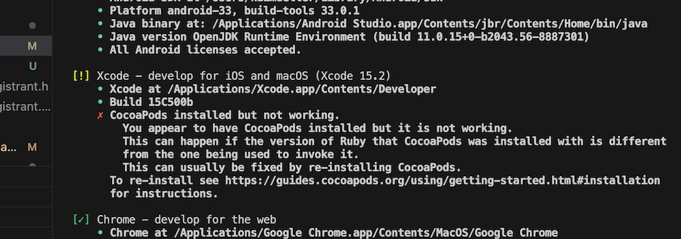
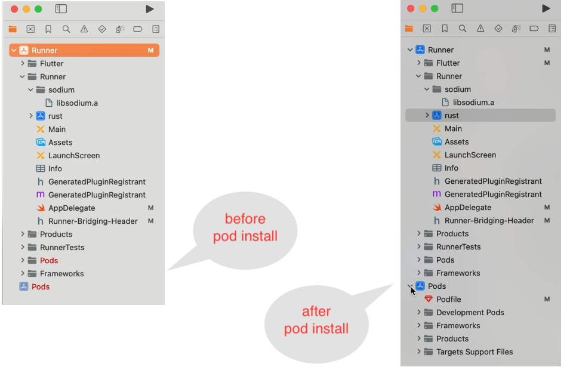
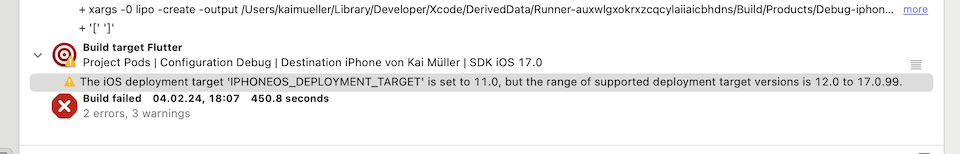
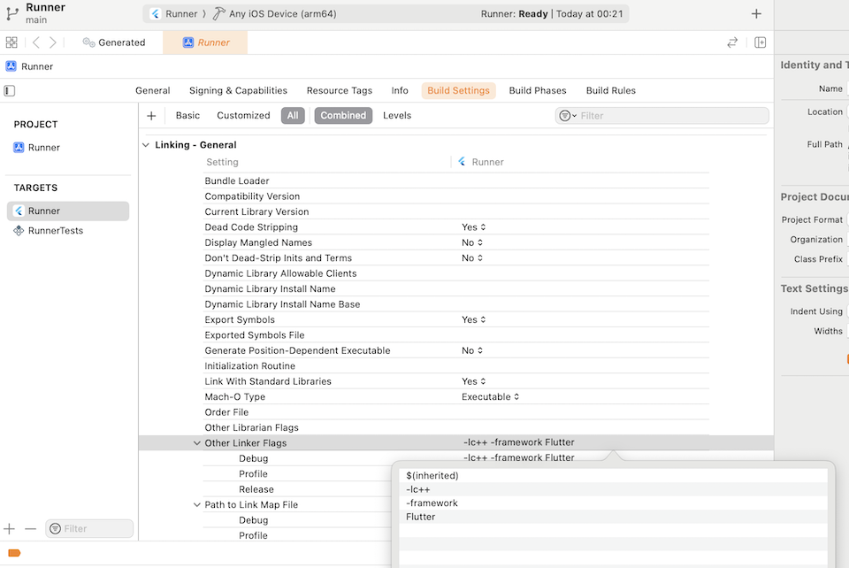
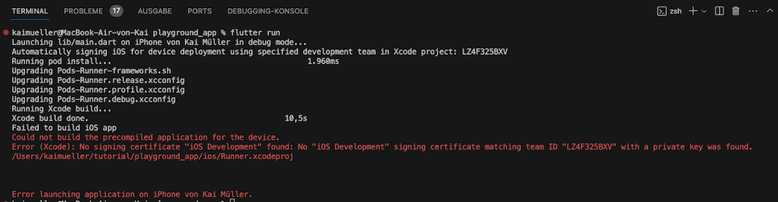
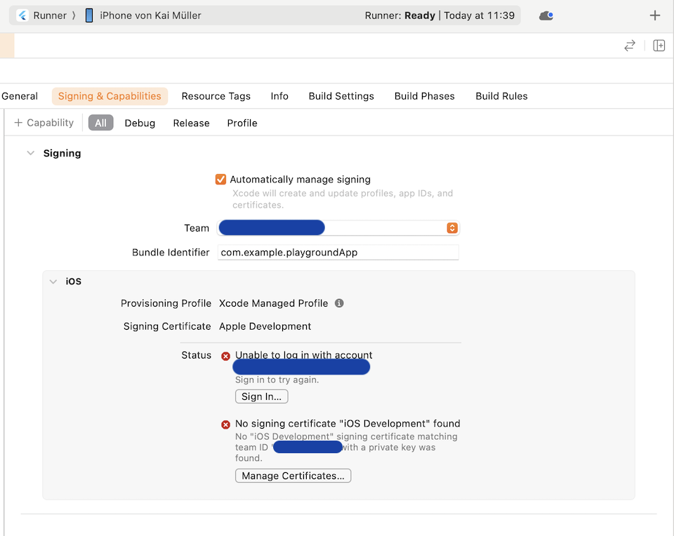
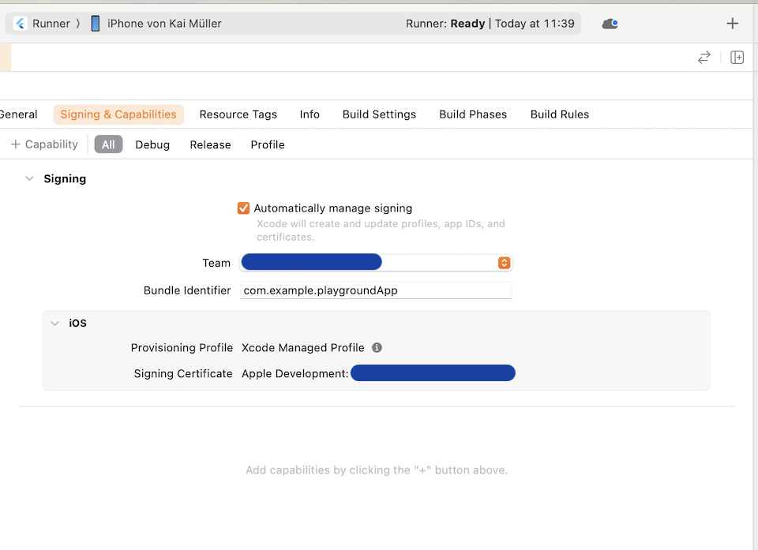

# Building for iOS

---

Building The Playground App for iOS using **IOTA SDK and identity.rs**.

This will be a tough nut to crack once again.

> Status February 2024: This descriptions have been finalized - the video is being prepared.

---

> I presume the functionality of the [-> Android app](../building-for-android.md) is operational. From the iOS standpoint, this implies that you've configured the Flutter Rust Bridge and incorporated both Rust and Dart code.

**I am working on a MacBook Air (Apple M1) with macOS Sonoma 14.2.1 and Xcode 15.2.** It's possible that the standard workflow works smoothly in other working environments.

Unfortunately, on my system, I faced challenges working with iOS. The libsodium-sys wrapper only built successfully when the libsodium library was pre-built as a static lib and manually added. The app only ran on my iPhone, not in the simulator (but refer to the little note at the bottom). It could only be launched from the Runner.xcworkspace project, not the Runner.xcodeproj. These were quite intricate issues that were very time-consuming to resolve.

## Verify your working environment

Before you start working on iOS, I suggest you check your environment by running `flutter doctor` or `flutter doctor -v` for detailed information.

Based on my experience, updating your macOS, Xcode, and/or iOS versions can lead to unforeseen issues. Each update tends to bring about new problems, so it requires patience to set up your workspace properly. It's essential to make it a routine to verify that everything is configured correctly.

See example "CocoaPods installed but not working" in the section "Other Issues you might encounter" at the bottom of this page.

Resolve any issues before proceeding further.

## iOS Set-up

To install the `cargo-xcode` command use:

```
cargo install cargo-xcode@1.5.0
```

After the installation of the command, create the Rust Xcode project. Make sure to be in the _rust/_ directory. From the project's root folder you may switch into the right directory:

```
% cd rust
% cargo xcode
% cd ..
```

## Follow the known iOS instructions

I refer to the chapter [-> iOS instructions](../../building-without-iota/flutter-and-rust/frb-example-app/ios-instructions.md). It contains:

1. Generating the Dart Code
2. Creating the subproject and configuring the projects
3. Adjusting the Runner-Bridging-Header.h and the AppDelegate.swift

---

## Specific steps to solve the Libsodium problem

> Feel free to perform the ultimate act of rebellion and skip this paragraph:
>
> - if you're not vibing with Stronghold (but in our app, we're all about that Stronghold life)
> - if you want to witness firsthand how the conventional path here takes a detour into chaos.
>
> Come on, come on, give it a shot and launch the app already!

I'm unveiling a sneaky maneuver to get the app up and running on iOS:

1. Build libsodium.a manually for the iOS platform
2. Include libsodium.a as static lib into a new Group "sodium" in Xcode
3. Include libsodium.a into the Build Rules of the target "rust-staticlib"

**This process is described in the subchapter [-> Libsodium library for iOS](./libsodium.md).**

---

## Give it a try

1. Connect your iOS _Device_

   Little note: if libsodium.a can be built for the iOS _Simulator_ using the Extended usage, perhaps the app will also strut its stuff on the iOS _Simulator_... I didn't follow this way after all my attempts... I am a bit tired...

2. Options to launch the app

   a) Launch with `flutter run`

   => \*Could fail when the compile process stops - you will get more detailed information when you launch the app from Xcode

   b) Launch with `Runner.xcodeproj`

   => \*Could fail because "shared_preferences_foundation" is not found

   c) Launch with `Runner.xcworkspace`

   => \*Could fail whenever libsodium-sys cannot be built; doesn't fail when you precompile libsodium.a as described in the subchapter

   => \*Could fail when the Pods (dependencies) aren't yet installed

\*Possible failures

---

## Other Issues you might encounter

### Error: CocoaPods installed but not working

Verifying your environment by `flutter doctor -v` might log this error:

<figure style="margin:0;"><figcaption style="font-size: 0.8em;text-align:center;"><p>CocoaPods installed but not working</p></figcaption></figure>

To resolve this issue, I searched online and followed the instructions outlined in the article titled [How to Remove and Re-install cocoapods in Flutter](https://myatminlu.medium.com/how-to-remove-and-re-install-cocoapods-d9f434dd8eca). You may find other sources.

### Error: Missing `pod install`

The first time around, the dependencies "path_provider_foundation" and "shared_preferences_foundation" are not yet installed. You will notice it in Xcode.

<figure style="margin:0;"><figcaption style="font-size: 0.8em;text-align:center;"><p>What "pod install" does</p></figcaption></figure>

The straightforward method is to let Flutter handle the install. Switch to VS Code and launch the app using `flutter run`. You'll notice that before the Xcode build, the command `pod install` will be executed.

### Error: iOS Deployment Target

Throughout the Xcode build process, you may receive an alert indicating that the current iOS Deployment target is incorrect. Example:

<figure style="margin:0;"><figcaption style="font-size: 0.8em;text-align:center;"><p>Message about "iOS Deployment Target"</p></figcaption></figure>

You should go through ALL targets (Runner, Rust, Pods -> path_provider_foundation, Pods -> shared_preferences_foundation) and adjust the default iOS Deployment Targets to your version of choice. In my situation, I often chose the latest available version 17.2 (after updating to Xcode 15.2 and installing iOS SDK 17.2), but it's up to you. It MUST be a version greater than v11.0.

### Linking failed: CoreAudioTypes not found

After updating from Xcode v15.0.1 to Xcode v15.2, I encountered the following error:

```
Linking failed: linker command failed with exit code 1 (use -v to see invocation).
  ld: warning: Could not find or use auto-linked framework 'CoreAudioTypes': framework 'CoreAudioTypes' not found.
```

The message indicating that the framework 'CoreAudioTypes' could not be found is highly misleading!

Potential solutions:

1. Option 1: Attempt to include the Linker Flags `-lc++` and/or `-framework Flutter` (if they are not already present) in the build settings "Other Linker Flags" of the Runner target.

   <figure style="margin:0;"><figcaption style="font-size: 0.8em;text-align:center;"><p>Solution for linking failure</p></figcaption></figure>

2. Option 2: Rebuild the app from scratch. Surprisingly, this seemingly drastic step resolved the issue for me.

### Error: Missing Signing Certificate

<figure style="margin:0;"><figcaption style="font-size: 0.8em;text-align:center;"><p>Missing Signing Certificate</p></figcaption></figure>

"Error (Xcode): No signing certificate 'iOS Development' found"

To proceed, a Development Account is required, and you must be logged in to it within Xcode.

<figure style="margin:0;"> please log in!"><figcaption style="font-size: 0.8em;text-align:center;"><p>You're not logged in -> please log in!</p></figcaption></figure>

<figure style="margin:0;"><figcaption style="font-size: 0.8em;text-align:center;"><p>Solved!</p></figcaption></figure>
````
