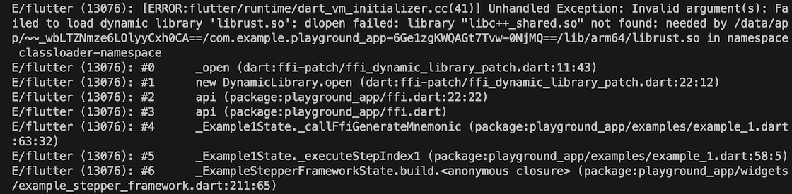
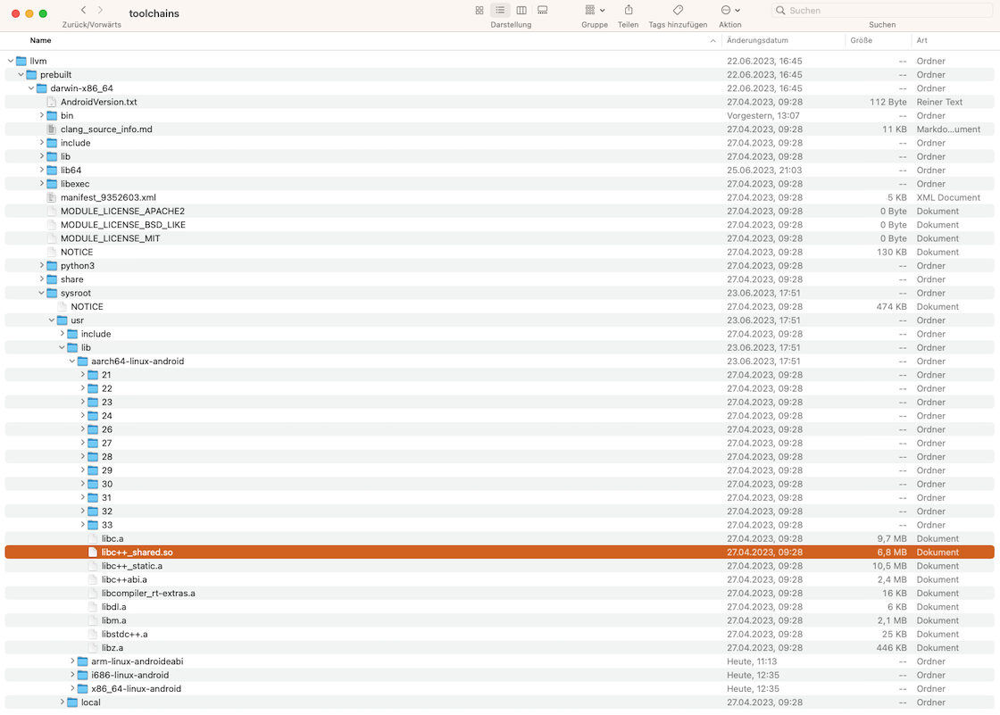
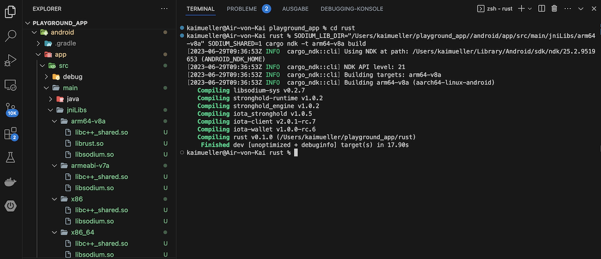

# Building for Android

---

Completing the remaining steps for Android.

---

In the preceding sections, we've effectively configured Flutter and Rust code independently. Additionally, we've incorporated IOTA's Rust libraries into `Cargo.toml`. Furthermore, we've confirmed the validity of the Rust code for each example by compiling the libraries for our target platforms (Android, macOS, and iOS devices). Now, it's time for the finalizing steps.

## Android Setup

If you haven't already, install the `cargo-ndk` command using:

```
cargo install cargo-ndk
```

In _android/app/build.gradle_, fix error:

```
Replace GradleException by FileNotFoundException
```

### Integrate `cargo build` into the Gradle build process

If you've had NO problem with the 3rd party library _libsodium_, add at the bottom:

```
[
        Debug: null,
        Profile: '--release',
        Release: '--release'
].each {
    def taskPostfix = it.key
    def profileMode = it.value
    tasks.whenTaskAdded { task ->
        if (task.name == "javaPreCompile$taskPostfix") {
            task.dependsOn "cargoBuild$taskPostfix"
        }
    }
    tasks.register("cargoBuild$taskPostfix", Exec) {
        workingDir "../../rust"  // <-- ATTENTION: CHECK THE CORRECT FOLDER!!!
        environment ANDROID_NDK_HOME: "$ANDROID_NDK"
        commandLine 'cargo', 'ndk',
                // the 2 ABIs below are used by real Android devices
                // '-t', 'armeabi-v7a',
                '-t', 'arm64-v8a',
                // the below 2 ABIs are usually used for Android simulators,
                // add or remove these ABIs as needed.
                // '-t', 'x86',
                // '-t', 'x86_64',
                '-o', '../android/app/src/main/jniLibs', 'build'
        if (profileMode != null) {
            args profileMode
        }
    }
}
```

Otherwise, if you've HAD a problem with the 3rd party library _libsodium_, add at the bottom:

```
[
        Debug: null,
        Profile: '--release',
        Release: '--release'
].each {
    def taskPostfix = it.key
    def profileMode = it.value
    tasks.whenTaskAdded { task ->
        if (task.name == "javaPreCompile$taskPostfix") {
            task.dependsOn "cargoBuild$taskPostfix"
        }
    }
    tasks.register("cargoBuild$taskPostfix", Exec) {
        workingDir "../../rust"  // <-- ATTENTION: CHECK THE CORRECT FOLDER!!!
        environment ANDROID_NDK_HOME: "$ANDROID_NDK"
        environment SODIUM_LIB_DIR: "/Users/yourname/playground_app/android/app/src/main/jniLibs/arm64-v8a" // <-- ATTENTION: CHECK THE CORRECT FOLDER!!!
        environment SODIUM_SHARED: 1
        commandLine 'cargo', 'ndk',
                // the 2 ABIs below are used by real Android devices
                // '-t', 'armeabi-v7a',
                '-t', 'arm64-v8a',
                // the below 2 ABIs are usually used for Android simulators,
                // add or remove these ABIs as needed.
                // '-t', 'x86',
                // '-t', 'x86_64',
                '-o', '../android/app/src/main/jniLibs', 'build'
        if (profileMode != null) {
            args profileMode
        }
    }
}
```

> Please note that due to the manual use of libsodium, there are two additional lines related to SODIUM_LIB_DIR and SODIUM_SHARED (compared to the former configurations) -> please also refer to [Libsodium library for Android](./rust-code/example-3/libsodium.md).

## Enabling Dynamic Library Loading

Even if the our dynamic library `librust.so` has been successfully compiled in Android, you haven't won yet. It also needs to be able to be loaded.

There is an error message that only becomes apparent when using the app, after you have completed all steps and successfully launched the app in Flutter.

Let's say you want to invoke the "Generate Mnemonic" example. Here's where you stumble when you click on "Execute" in Example 2, as the console displays the following message:

<figure style="margin:0;"><figcaption style="font-size: 0.8em;text-align:center;"><p>Error message: "Failed to load dynamic library 'librust.so'"</p></figcaption></figure>

### Workaround

As the message text also says: The "library 'libc++\_shared.so' is not found". So, adding this library is the solution.

**Where do we get this one from?**

It is provided by the NDK. For example, if you're using NDK v25.2.9519653 on macOS, navigate to the folder _~/Library/Android/sdk/ndk/25.2.9519653/toolchains/llvm/prebuilt/darwin-x86_64/sysroot/usr/lib/_ where you will find subfolders for each of the targets:

<figure style="margin:0;"><figcaption style="font-size: 0.8em;text-align:center;"><p>Location to copy libc++_shared.so from</p></figcaption></figure>

> Alternatively, here are also some download links from Android NDK 25 on macOS:
>
> [arm64-v8a/libc++\_shared.so](../assets/download/arm64-v8a/libc++_shared.so)
>
> [armeabi-v7a/libc++\_shared.so](../assets/download/armeabi-v7a/libc++_shared.so)
>
> [x86/libc++\_shared.so](../assets/download/x86/libc++_shared.so)
>
> [x86_64/libc++\_shared.so](../assets/download/x86_64/libc++_shared.so)

**Where do we need to place it?**

Once you have copied or downloaded the `libc++_shared.so` library, you should ensure that you place it in a directory where it can be accessed by your application. To simplify the process, you can place it in the same folder as the `librust.so` library.

<figure style="margin:0;"><figcaption style="font-size: 0.8em;text-align:center;"><p>Location to paste libc++_shared.so</p></figcaption></figure>

## Preparatory steps on the Dart side

Here, you will find the same steps as in the Simple App.

{{#include ../building-a-simple-app/building-for-android.md:91:131}}

## Adjust the Dart code in the examples

As the final step, we now need to integrate and use the API (ffi.dart) in each example class. I will provide the final code for all examples here.

It's a bit of effort, but take comfort in knowing that you've covered Android, macOS, and iOS all at once.

### Example 1: Get Node Information

The source code for Example 1 can be found at `lib/examples/example_0.dart`.

At the top, add:

```dart
import 'package:flutter_rust_bridge/flutter_rust_bridge.dart';
import '../ffi.dart';
```

Replace the fake code of `_callFfiNodeInfo()` by:

```dart
  Future<void> _callFfiNodeInfo() async {
    String nodeUrl =
        Provider.of<AppProvider>(context, listen: false).currentNetwork.url;
    String faucetUrl = Provider.of<AppProvider>(context, listen: false)
            .currentNetwork
            .faucetApiUrl ??
        '';
    final NetworkInfo networkInfo =
        NetworkInfo(nodeUrl: nodeUrl, faucetUrl: faucetUrl);
    try {
      customOverlay.show(context);
      final receivedText = await api.getNodeInfo(networkInfo: networkInfo);
      if (mounted) {
        Provider.of<AppProvider>(context, listen: false).nodeInfo =
            receivedText;
        setState(() => exampleSteps[1].setOutput(receivedText));
      }
      customOverlay.hide();
    } on FfiException catch (e) {
      setState(() => exampleSteps[1].setOutput(e.message));
      customOverlay.hide();
    }
  }
```

### Example 2: Generate Mnemonics

The source code for Example 2 can be found at `lib/examples/example_1.dart`.

At the top, add:

```dart
import '../ffi.dart';
```

Replace the fake code of `_callFfiGenerateMnemonic()` by:

```dart
  Future<void> _callFfiGenerateMnemonic() async {
    customOverlay.show(context);
    final receivedText = await api.generateMnemonic();
    if (mounted) {
      setState(() {
        Provider.of<AppProvider>(context, listen: false).mnemonic =
            receivedText;
        exampleSteps[1].setOutput(receivedText);
      });
    }
    customOverlay.hide();
  }
```

### Example 3: Create Wallet Account

The source code for Example 3 can be found at `lib/examples/example_2.dart`.

At the top, add:

```dart
import 'package:flutter_rust_bridge/flutter_rust_bridge.dart';
import '../ffi.dart';
```

Replace the fake code of `_callFfiCreateWalletAccount()` by:

```dart
  Future<void> _callFfiCreateWalletAccount() async {
    String nodeUrl =
        Provider.of<AppProvider>(context, listen: false).currentNetwork.url;
    String faucetUrl = Provider.of<AppProvider>(context, listen: false)
            .currentNetwork
            .faucetApiUrl ??
        '';
    final NetworkInfo networkInfo =
        NetworkInfo(nodeUrl: nodeUrl, faucetUrl: faucetUrl);
    final WalletInfo walletInfo = WalletInfo(
      alias: exampleSteps[1].output ?? 'Account_1',
      mnemonic: Provider.of<AppProvider>(context, listen: false).mnemonic,
      strongholdPassword:
          exampleSteps[2].output ?? 'my_super_secret_stronghold_password',
      strongholdFilepath: _strongholdFilePath,
      lastAddress: "",
    );
    try {
      customOverlay.show(context);

      final receivedText = await api.createWalletAccount(
          networkInfo: networkInfo, walletInfo: walletInfo);
      if (mounted) {
        setState(() => exampleSteps[3].setOutput(receivedText));
      }
      customOverlay.hide();
    } on FfiException catch (e) {
      setState(() => exampleSteps[3].setOutput(e.message));
      customOverlay.hide();
    }
  }
```

### Example 4: Generate Address

The source code for Example 4 can be found at `lib/examples/example_3.dart`.

At the top, add:

```dart
import 'package:flutter_rust_bridge/flutter_rust_bridge.dart';
import '../ffi.dart';
```

Replace the fake code of `_callFfiGenerateAddress()` by:

```dart
  Future<void> _callFfiGenerateAddress() async {
    final WalletInfo walletInfo = WalletInfo(
      alias: exampleSteps[1].output ?? 'Account_1',
      mnemonic: Provider.of<AppProvider>(context, listen: false).mnemonic,
      strongholdPassword:
          exampleSteps[2].output ?? 'my_super_secret_stronghold_password',
      strongholdFilepath: _strongholdFilePath,
      lastAddress: Provider.of<AppProvider>(context, listen: false).lastAddress,
    );
    try {
      customOverlay.show(context);

      final receivedText = await api.generateAddress(walletInfo: walletInfo);
      if (mounted) {
        setState(() {
          Provider.of<AppProvider>(context, listen: false).lastAddress =
              receivedText;
          exampleSteps[3].setOutput(receivedText);
        });
      }
      customOverlay.hide();
    } on FfiException catch (e) {
      customOverlay.hide();
      setState(() => exampleSteps[3].setOutput(e.message));
    }
  }

```

### Example 5: Request Funds

The source code for Example 5 can be found at `lib/examples/example_4.dart`.

At the top, add:

```dart
import 'package:flutter_rust_bridge/flutter_rust_bridge.dart';
import '../ffi.dart';
```

Replace the fake code of `_callFfiRequestFunds()` by:

```dart
  Future<void> _callFfiRequestFunds() async {
    String nodeUrl =
        Provider.of<AppProvider>(context, listen: false).currentNetwork.url;
    String faucetUrl = Provider.of<AppProvider>(context, listen: false)
            .currentNetwork
            .faucetApiUrl ??
        '';
    final NetworkInfo networkInfo =
        NetworkInfo(nodeUrl: nodeUrl, faucetUrl: faucetUrl);
    final WalletInfo walletInfo = WalletInfo(
      alias: "",
      mnemonic: "",
      strongholdPassword: "",
      strongholdFilepath: _strongholdFilePath,
      lastAddress: Provider.of<AppProvider>(context, listen: false).lastAddress,
    );

    try {
      customOverlay.show(context);

      final receivedText = await api.requestFunds(
          networkInfo: networkInfo, walletInfo: walletInfo);
      if (mounted) {
        setState(() => exampleSteps[1].setOutput(receivedText));
      }
      customOverlay.hide();
    } on FfiException catch (e) {
      customOverlay.hide();
      setState(() => exampleSteps[1].setOutput(e.message));
    }
  }
```

### Example 6: Check Balance

The source code for Example 6 can be found at `lib/examples/example_5.dart`.

At the top, add:

```dart
import 'package:flutter_rust_bridge/flutter_rust_bridge.dart';
import 'package:provider/provider.dart';
import '../coin_utils.dart';
import '../data/app_provider.dart';
import '../ffi.dart';
```

Replace the fake code of `_callFfiCheckBalance()` by:

```dart
  Future<void> _callFfiCheckBalance() async {
    String coinCurrency =
        Provider.of<AppProvider>(context, listen: false).currentNetwork.coin;
    final WalletInfo walletInfo = WalletInfo(
      alias: exampleSteps[0].output ?? 'Account_1',
      mnemonic: "",
      strongholdPassword: "",
      strongholdFilepath: _strongholdFilePath,
      lastAddress: Provider.of<AppProvider>(context, listen: false).lastAddress,
    );

    try {
      customOverlay.show(context);

      final receivedBaseCoinBalance =
          await api.checkBalance(walletInfo: walletInfo);
      if (mounted) {
        String totalString =
            displayBalance(receivedBaseCoinBalance.total, coinCurrency);
        String availableString =
            displayBalance(receivedBaseCoinBalance.available, coinCurrency);
        String result =
            'Total:         $totalString\nAvailable:  $availableString';
        setState(() {
          exampleSteps[1].setOutput(result);
          Provider.of<AppProvider>(context, listen: false).balanceTotal =
              receivedBaseCoinBalance.total;
          Provider.of<AppProvider>(context, listen: false).balanceAvailable =
              receivedBaseCoinBalance.available;
        });
      }
      customOverlay.hide();
    } on FfiException catch (e) {
      customOverlay.hide();
      setState(() => exampleSteps[1].setOutput(e.message));
    }
  }
```

### Example 7: Create DID

The source code for Example 7 can be found at `lib/examples/example_6.dart`.

At the top, add:

```dart
import 'package:flutter_rust_bridge/flutter_rust_bridge.dart';
import '../ffi.dart';
```

Replace the fake code of `_callFfiCreateDecentralizedIdentifier()` by:

```dart
  Future<void> _callFfiCreateDecentralizedIdentifier() async {
    String nodeUrl =
        Provider.of<AppProvider>(context, listen: false).currentNetwork.url;
    final NetworkInfo networkInfo =
        NetworkInfo(nodeUrl: nodeUrl, faucetUrl: '');
    final WalletInfo walletInfo = WalletInfo(
      alias: "",
      mnemonic: "",
      strongholdPassword: 'my_super_secret_stronghold_password',
      strongholdFilepath: _strongholdFilePath,
      lastAddress: Provider.of<AppProvider>(context, listen: false).lastAddress,
    );

    try {
      customOverlay.show(context);

      final receivedText = await api.createDecentralizedIdentifier(
          networkInfo: networkInfo, walletInfo: walletInfo);
      if (mounted) {
        setState(() {
          exampleSteps[0].setOutput(receivedText);
        });
      }
      customOverlay.hide();
    } on FfiException catch (e) {
      customOverlay.hide();
      setState(() => exampleSteps[0].setOutput(e.message));
    }
  }
```

### Bin to Hex

The source code can be found at `lib/widgets/my_drawer.dart`.

At the top, add:

```dart
import '../ffi.dart';
```

Replace the fake code in line 59 `receivedText = 'fake 0000 0000 0000';` by:

```dart
  receivedText = await api.binToHex(val: substr, len: 1);
```

### Video

Follow the video for the remaining steps.
