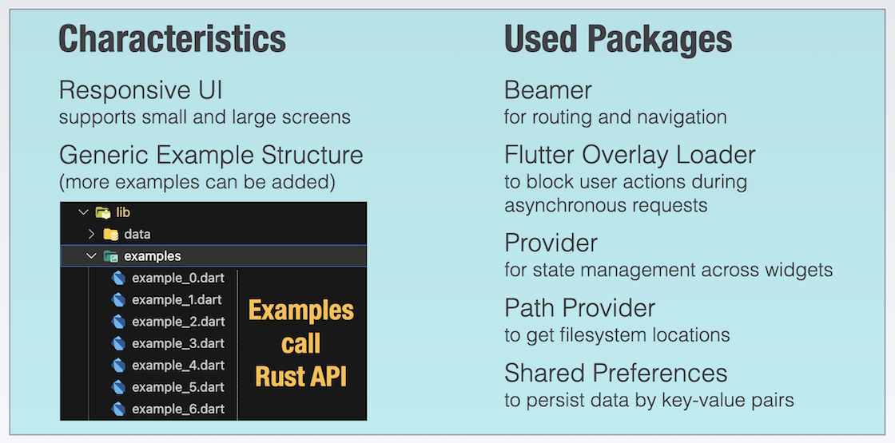
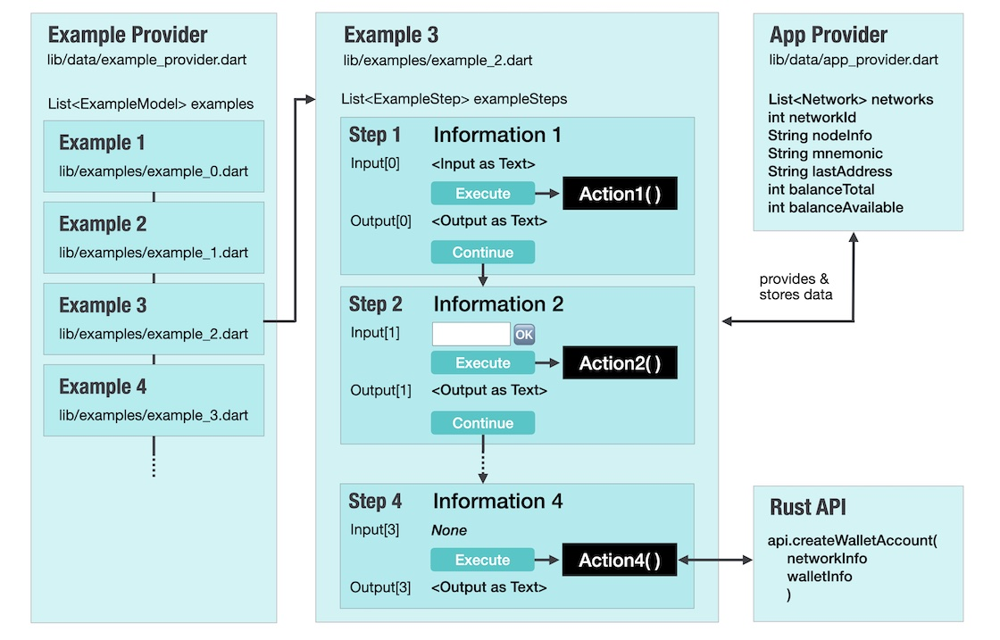

# Initialize the Flutter App and Setup the Flutter-Rust-Bridge

---

Watch the video! We start by cloning the pure Flutter project that includes everything but the backend calls.

---

<iframe 
    class="video"  
    src="https://www.youtube.com/embed/y95zag8kJsA" 
    title="Building the Playground App - Starting the project" 
    frameborder="0" 
    allow="accelerometer; autoplay; clipboard-write; encrypted-media; gyroscope; picture-in-picture; web-share" 
    allowfullscreen>
</iframe>

## GitHub Repository

<a href="https://github.com/iota-for-flutter/playground_app" target="_blank">👉 &nbsp; GitHub Repo - Playground App (Flutter only)</a>

> Are you encountering the "Could not create task ':generateLockfiles" issue after cloning the project and launching VSCode? Here's the cause: Gradle files are absent in the Android subfolder at this stage. These files are fetched when you initially run the project on your Virtual Android device. To resolve it, follow these steps: Run the Flutter app on your Android device, stop it, and then restart VSCode. The error should disappear.

---

## App Characteristics and used Packages

<figure style="margin:0;"><figcaption style="font-size: 0.8em;text-align:center;">
Playground App - Flutter Part
</figcaption></figure>

## Example Structure

This is a brief explanation of the Example Structure. The examples contain the core functionality of the app and implement the integration with the Rust interface. If you're interested, you can also add your own examples.

Each _Example_ consists of a sequence of _ExampleSteps_, which have a similar structure.

> It's a minor detail: The numbering of Examples and ExampleSteps begin with 1 in the User Interface, but in the code, the index starts with 0. Therefore, `example_0.dart` corresponds to _Example 1_, and so on.

<figure style="margin:0;"><figcaption style="font-size: 0.8em;text-align:center;">
Example Structure
</figcaption></figure>

Along with a title and an information text, an _ExampleStep_ can display an input value as text and/or as an input field.

The "Execute" button invokes a function that can be freely defined. After executing the action, it is useful to present an output text to the user. The action can be repeated any number of times, but in order to proceed to the next step (by clicking the "Continue" button), it must be executed at least once. In the last step, there is no "Continue" button.

The App Provider can be used at any point to retrieve stored data or to store new or updated data.

In my examples, I generally follow a pattern where I use the first step for resetting or entering values, and intermediate steps when I require multiple data inputs from the user to execute the final step. The final step always involves calling the Rust API method.

> **Important**
>
> Some examples assume that previous examples have been executed and the data generated during those executions is stored in the app. For example, the third example (Create Wallet Account) assumes that mnemonics were generated in Example 2. It is best to follow the sequence of executing all the examples one after another, starting with "Get Node Info," when using the app for the first time.

A hidden feature is located behind the "Input" and "Output" labels. When you click on either of these labels, the content of the input or output will be copied to the clipboard.
