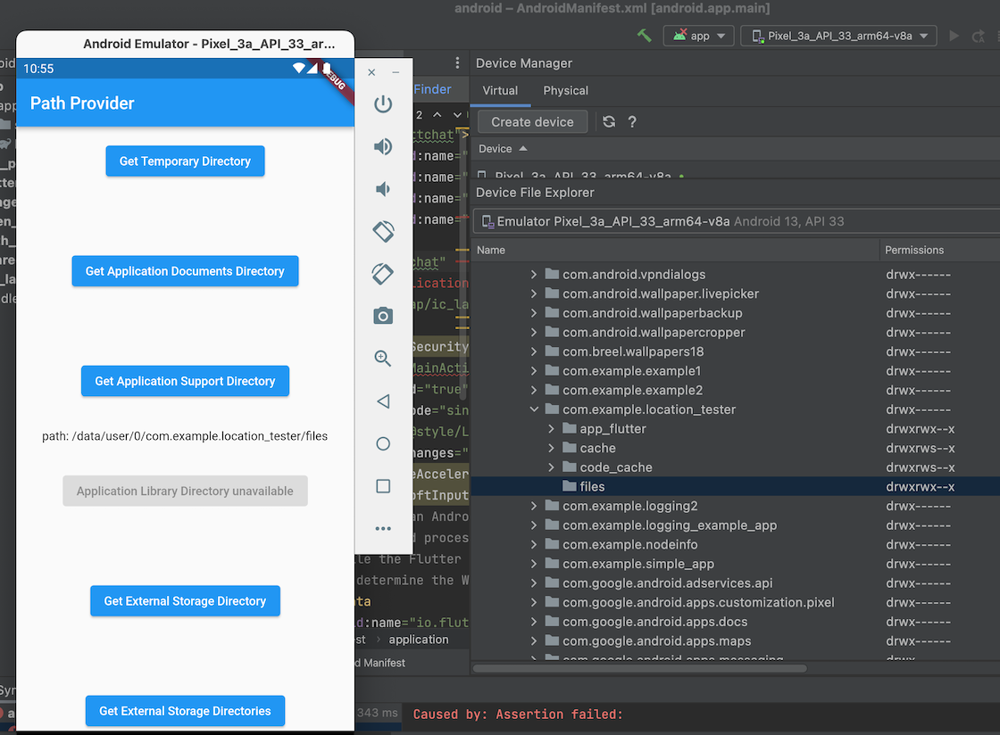
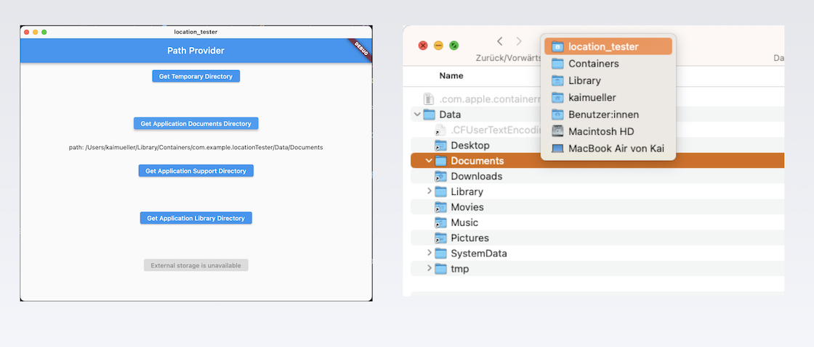
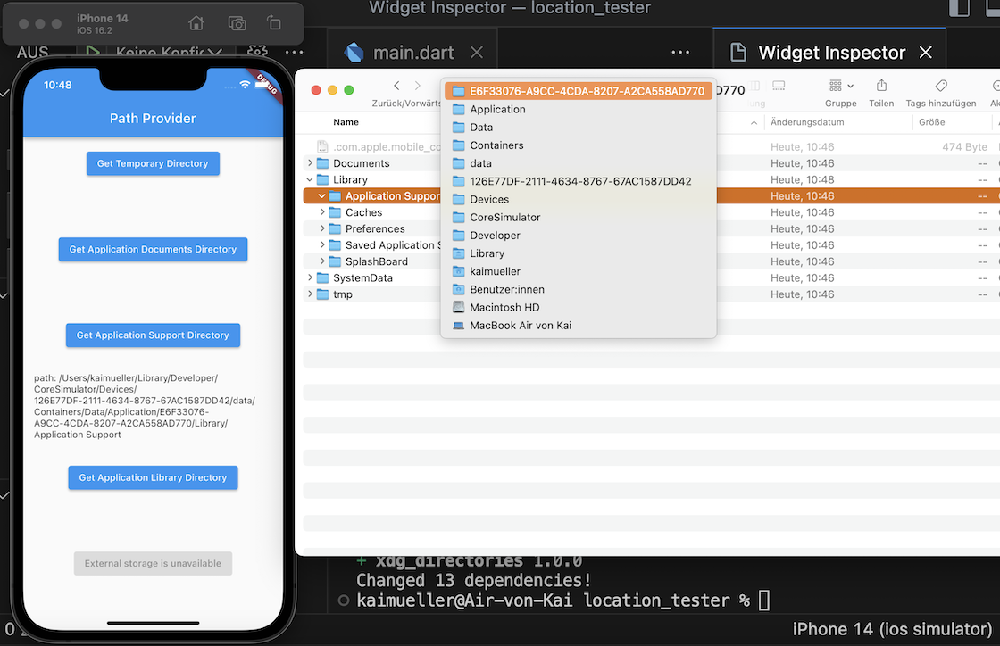

# Locations on the Filesystem

---

Exploring the File System in a Flutter Rust App: Key Considerations and Tips.

---

## Motivation

When developing apps, especially those that involve file storage, it is important to know where these files can be stored within the app. This knowledge is crucial for both development and app verification.

In the _Playground App_, a snapshot file and a database file are stored within the app. This is needed for the usage of Stronghold and the Wallet. The creation and storage of these files are handled by the Rust library. However, the Rust library does not know _where_ exactly these files should be stored.

To solve this problem, the Flutter code needs to determine the folder path and pass it to Rust. This is where the _path_provider_ comes into play. This official Flutter package enables Flutter to find commonly used locations on the filesystem. It supports Android, iOS, Linux, macOS and Windows - but not all methods ("directories") are supported on all platforms. You can find a compatibility matrix on the _path_provider_ page:

<a href="https://pub.dev/packages/path_provider" target="_blank">👉 &nbsp; Flutter Plugin _Path Provider_</a>

## Short Exercise

The installation and usage of the plugin are very simple and should be performed by you as a short exercise (Flutter only). Create a new app (e.g. "location_tester") and open it in VS Code:

```
flutter create --empty location_tester

cd location_tester

code .
```

Within your IDE, open a Terminal and install the plugin with the command:

```
flutter pub add path_provider
```

Then, copy the [Path Provider Example](https://pub.dev/packages/path_provider/example) and replace the content of your `main.dart` file by the example.

### Practice

Launch the Flutter app on different platforms. You will see a bunch of buttons each refering to a certain directory.

Click on a button and observe the result. Then, try to locate the displayed file location:

- In the Android Emulator, open Android Studio and search for the specified directory in the [Device File Explorer](../fundamentals/android-studio/essentials.html?highlight=filesystem#device-file-explorer).
- For macOS and iOS, use Finder to open the corresponding directory. Tip: If you don't see hidden directories or files, use the keyboard shortcut `COMMAND + Shift + .` to toggle the visibility.

**Android**

<figure style="margin:0;border: 1px solid green;"><figcaption style="font-size: 0.8em;text-align:center;"><p style="margin: 4px 0 7px 0;">Result example on Android: Application <i>Support</i> Directory</p></figcaption></figure>

**macOS**

<figure style="margin:0;border: 1px solid green;"><figcaption style="font-size: 0.8em;text-align:center;"><p style="margin: 4px 0 7px 0;">Result example on macOS: Application <i>Documents</i>  Directory</p></figcaption></figure>

**iOS**

<figure style="margin:0;border: 1px solid green;"><figcaption style="font-size: 0.8em;text-align:center;"><p style="margin: 4px 0 7px 0;">Result example on iOS: Application <i>Support</i>  Directory</p></figcaption></figure>

## What is the appropriate directory?

I only focus here on the following two directories.

The **Application Support directory** is primarily used for storing permanent data and files that are used by the app but may not necessarily need to be visible to the user. It often contains configuration files, caches, and other data necessary for the smooth operation of the app. This directory is intended for app-specific and internal use.

On the other hand, the **Application Documents directory** is intended for data and files generated by the app or created by the user that should be accessible to the user. It is the recommended location for user data, such as user-created documents, images, or other files managed by the app. It is also typically associated with iCloud synchronization, which means that the data in this directory can be automatically synchronized with the user's other devices.

### Playground App

Based on the information provided here, it follows that for storing the database and the snapshot file, only the **Application Support directory** is suitable. It is supported on all platforms.
