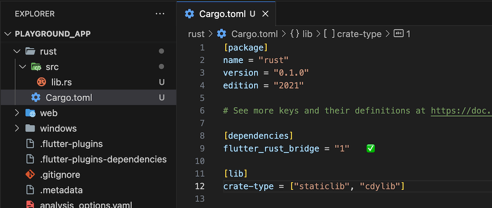

# Rust Code

---

In the following subchapters we'll prepare the Rust Code for each example. We will only discuss the changes in the `Cargo.toml` and `api.rs` files.

---

## Initial Situation

This is the situation upon which we are basing our starting point.

<figure style="margin:0;"><figcaption style="font-size: 0.8em;text-align:center;"><p>Rust - Initial Situation</p></figcaption></figure>

## Preparation

1. As usual, create an empty file called `api.rs`, at the same level as `lib.rs`.

2. Include it as module in `lib.rs`:

   ```rust, ignore
   mod api;
   ```

## New: Checks using _cargo build_

In the next subchapters, we will test individually for each example whether our library can be cross-compiled to the target platforms Android, macOS, and iOS.

This way, we can independently test the correctness of the dependencies in `Cargo.toml`, and the paths and the syntax of our Rust Code in `api.rs`, regardless of the Flutter build process.

<a href="../../overview/cross-compiling.html?highlight=cargo%20build#how-to-manually-cross-compile-to-a-target-of-your-choice" target="_blank">👉 &nbsp; How to manually cross-compile to a target of your choice</a>

To examine the various targets, you should navigate from _playground_app_ root directory to the _rust_ directory:

```
cd rust
```

Then, within the _rust_ directory, excute the following commands.

### Android

If you haven't already, install the `cargo-ndk` command using:

```
cargo install cargo-ndk
```

I only check the ABI _arm64-v8a_.

```
cargo ndk -t arm64-v8a build
```

### macOS

```
cargo build --target aarch64-apple-darwin
```

### iOS Simulator or iOS Device

```
cargo build --target aarch64-apple-ios-sim
```

```
cargo build --target aarch64-apple-ios
```

