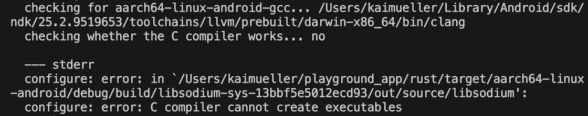
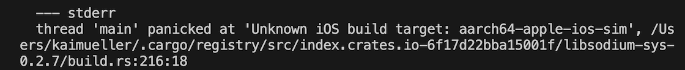

# Example 3

---

Rust adjustments for Example "Create Wallet Account". 2023-08-20: INTERMEDIATE VERSION - NEEDS TO BE REVIEWED.

---

## What adjustments do I need to make in Rust?

In summary, here are the steps you need to take to create the API function.

### Cargo.toml

Let's try to use the `iota-client` from `iota-wallet`. So first, comment out the dependency:

```toml
# iota-client = { version = "2.0.1-rc" }
```

Second, add this crate to the existing dependencies:

```toml
[dependencies]
iota-wallet = { version = "1.0.0-rc" }
```

By checking `Cargo.lock` you can determine the real downloaded versions. At the time of writing this tutorial section (June 2023) we are using iota-wallet version v1.0.0-rc.6. Please refer to [Crates.io](https://crates.io/crates/iota-wallet/versions) to get more information about the current versions.

But how can you determine if this version supports the Shimmer network?
After adding and saving the library in `Cargo.toml_` check the `Cargo.lock` file. Look for the `iota-client` version included. If it's a v2 version, then it's compatible for Shimmer. For more information, refer to [Stardust and Chrysalis Versions](../../overview/iota-libraries/library-versions.html#stardust-and-chrysalis-versions) documentation.

### api.rs - Used Paths

Comment out the usage of `iota_client::Client`:

```rust,ignore
//use iota_client::Client;
```

Instead, we are using the _Client_ from `iota_wallet::iota_client::Client`:

```rust,ignore
use iota_wallet::{
    iota_client::Client,  // <- Let's use this one
    iota_client::constants::SHIMMER_COIN_TYPE,
    ClientOptions,
    account_manager::AccountManager,
    secret::{stronghold::StrongholdSecretManager as WalletStrongholdSecretManager},
    secret::{SecretManager as WalletSecretManager}
};
use std::{env, fs, path::PathBuf};
```

> In Rust you can shorten several lines, e.g.
>
> ```
> use iota_wallet::iota_client::Client;
> use iota_wallet::ClientOptions;
> use iota_wallet::account_manager::AccountManager;
> ```
>
> by using curly brackets:
>
> ```
> use iota_wallet::{
>   iota_client::Client,
>   ClientOptions,
>   account_manager::AccountManager
> };
> ```

### api.rs - Struct _WalletInfo_

This struct bundles various wallet information. Through code generation of the Flutter-Rust-Bridge, the struct is translated into a Flutter class and becomes part of the `bridge_definitions.dart` file.

Therefore, it is not necessary to explicitly create it in Flutter! On the other hand, this means that the code generator needs to be executed once for the class to be seamlessly used in Flutter without any errors.

```rust,ignore
#[derive(Debug, Clone)]
pub struct WalletInfo {
    pub alias: String,
    pub mnemonic: String,
    pub stronghold_password: String,
    pub stronghold_filepath: String,
    pub last_address: String
}
```

### api.rs - Function _create_wallet_account()_

There is a lot to talk about here. But first, let's start with the source code.

```rust,ignore
#[allow(dead_code)]
pub fn create_wallet_account(network_info: NetworkInfo, wallet_info: WalletInfo) -> Result<String> {
    let rt = Runtime::new().unwrap();
    rt.block_on(async {

        let node_url = network_info.node_url;
        let stronghold_password = wallet_info.stronghold_password;
        let stronghold_filepath = wallet_info.stronghold_filepath;

        // Create the needed directory according to the given path
        let mut path_buf = PathBuf::new();
        path_buf.push(&stronghold_filepath);
        let path = PathBuf::from(path_buf);
        fs::create_dir_all(path).ok();

        // THIS NEXT STEP IS CRUCIAL:
        // Point the "current working directory" to the given path
        env::set_current_dir(&stronghold_filepath).ok();

        // Create the Rust file for the stronghold snapshot file
        let mut path_buf_snapshot = PathBuf::new();
        path_buf_snapshot.push(&stronghold_filepath);
        path_buf_snapshot.push("wallet.stronghold");
        let path_snapshot = PathBuf::from(path_buf_snapshot);

        let mut secret_manager = WalletStrongholdSecretManager::builder()
            .password(&stronghold_password)
            .build(path_snapshot)?;

        // Storing the mnemonic is ONLY REQUIRED THE FIRST TIME
        // calling it TWICE THROWS AN ERROR
        secret_manager.store_mnemonic(wallet_info.mnemonic).await?;

        // Create a ClientBuilder (= client_options in wallet.rs)
        // See wallet.rs:
        // -> src/lib.rs
        // -> line "pub use iota_client::ClientBuilder as ClientOptions"
        let client_options = ClientOptions::new().with_node(&node_url)?;

        // Create the account manager with the secret_manager
        // and client_options (= ClientBuilder).
        // The Client itself is created in the AccountManagerBuilder's finish() method.
        // See wallet.rs:
        // -> src/account_manager/builder.rs
        // -> line "let client = client_options.clone().finish()?;"
        let manager = AccountManager::builder()
           .with_secret_manager(WalletSecretManager::Stronghold(secret_manager))
           .with_client_options(client_options)
           .with_coin_type(SHIMMER_COIN_TYPE)
           .finish()
          .await?;

        // Create a new account
        let _account = manager
            .create_account()
            .with_alias((&wallet_info.alias).to_string())
            .finish()
            .await?;

        Ok("Wallet Account was created successfully.".into())
    })
}
```

The two structs passed as input parameters contain data from Flutter that is needed to create the wallet. These include the node URL, the mnemonics, the Wallet Alias, the Stronghold Password, and the directory path where both the wallet's database and the Stronghold Snapshot file will be stored.

In the first part of the function, we need to create a _PathBuf_. It is commonly used when dealing with file I/O operations and working with file systems in Rust.

_PathBuf_ is a type that represents a platform-dependent path. It is used to manipulate and work with file paths in a convenient and cross-platform manner. PathBuf provides various methods for path manipulation, such as joining paths, appending components, and resolving relative paths.

**The crucial part of working with paths in our library is that we change the _current working directory_ to our specific path for the database and snapshot file. By doing so, we can perform file operations relative to that directory or access files located in that specific path.**

In the next part of the function, we create a _Stronghold Secret Manager_ that is initialized with our Stronghold password and mnemonics. We have chosen to use Stronghold in our wallet for secure storage and management of sensitive information.

The StrongholdSecretManager uses advanced encryption techniques to protect the stored data and provides secure access methods for retrieving and using the secrets when required. It offers features like encryption, decryption, secure key generation, and secure storage of cryptographic material.

Our goal of creating a wallet account is achieved through the _Account Manager_. The Account Manager provides a set of functionalities and APIs to manage multiple accounts within a wallet. It allows us to create, modify, and interact with individual accounts, such as generating addresses, sending transactions, and retrieving account information.

The Account Manager is configured with our Stronghold Secret Manager and the Client "Options". ClientOptions is nothing more than the ClientBuilder in the original iota-client. Keep this in mind!

Once we have created the Account Manager, there is only one step left, which is creating a new Account for the given wallet Alias. The account's Alias serves as a name or identifier for the account within the wallet.

By creating a new Account, we establish a distinct entity within the wallet to manage specific funds, transactions, and associated addresses. This step enables us to organize and track different accounts within the wallet application effectively.

Behind the scenes, when creating the Stronghold Secret Manager, the snapshot file is generated. Additionally, when creating the Account Manager, a RocksDB database is created.

It is worth noting that the use of RocksDB has previously caused issues between different target platforms with older versions of wallet.rs. Let's see if this problem still persists. In the next section, I will attempt to build the library for all platforms and investigate if any conflicts arise.

## Checks using _cargo build_

---

> **There are issues when cross-compiling to Android and iOS Simulator.**
>
> Please also refer to the corresponding video.

---

### Android

Since the latest Android NDK version 25 is being used, I have been encountering issues compiling the _libsodium-sys_ library (v0.2.7) on macOS (M1 chip). This problem did not exist with the previous NDK version 22, which I was using in January.

<figure style="margin:0;"><figcaption style="font-size: 0.8em;text-align:center;"><p>Cross-compilation error - Android</p></figcaption></figure>

It's possible that you may _not_ encounter this issue if you use a different hosting operating system. If you manage to successfully compile libsodium-sys on your host system, consider yourself fortunate.

**Fix**

Since I haven't identified the root cause of the issue, I am currently unable to propose a specific solution or fix.

**Workaround**

As a temporary workaround, I can suggest building the _libsodium.so_ library for each target individually and including it in our target Rust library. This can be achieved by utilizing the SODIUM_LIB_DIR and SODIUM_SHARED environment variables, as described in the libsodium-sys documentation. I will elaborate on this approach in the upcoming subsection [Libsodium library for Android](libsodium.md).

### iOS Simulator

The compilation fails because there is an unknown build target in _libsodium-sys_ build script:

<figure style="margin:0;"><figcaption style="font-size: 0.8em;text-align:center;"><p>Cross-compilation error - iOS</p></figcaption></figure>

The fact that the _libsodium-sys_ project is marked as deprecated is unfortunate since it limits the opportunity to address and resolve the issue within the repository. See [Sodiumoxide's documentation](https://github.com/sodiumoxide/sodiumoxide#readme):

_"[DEPRECATED]
This project has reached the end of its development as a cryptographic library for rust. Feel free to browse the code, and feel free to use it, but it will not see any more updates (unless a security issue arises, those will be fixed)."_

**Fix**

One potential solution could be to add a target to the `build.rs` file within the _libsodium-sys_ folder. However, since the repository is not actively maintained, implementing this fix is currently not possible. As a suggestion, I proposed that the Stronghold team could consider forking the repository and taking up maintenance responsibilities. You can find more information about this suggestion here:

<a href="https://github.com/iotaledger/stronghold.rs/discussions/310" target="_blank">👉 &nbsp; Stronghold Discussion - Portability and reliance on libsodium</a>

**Workaround**

To utilize Stronghold for iOS, the only viable workaround at the moment is to compile the code and employ your **iOS Device** as a test device. Unfortunately, the Simulator cannot be utilized due to the aforementioned problem.
