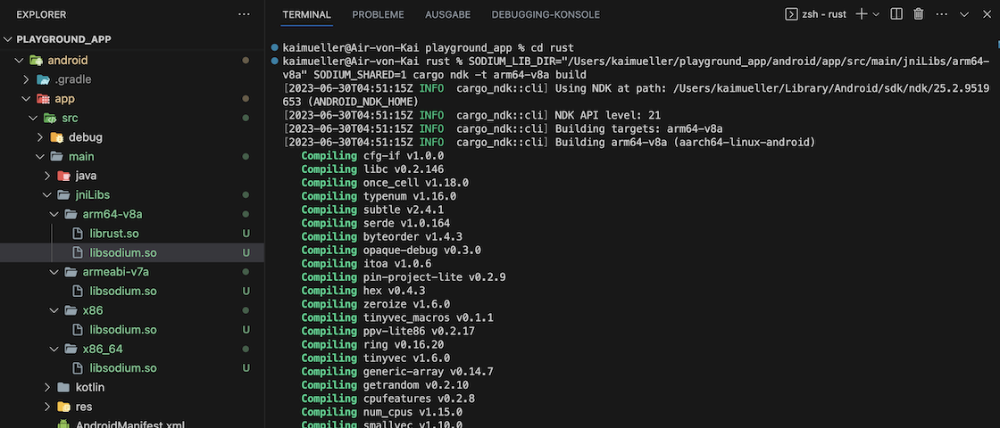

# Libsodium library for Android

---

Please refer to this chapter to learn about a **Workaround for Android** that can be used **if you wish to utilize Stronghold AND if you have problems creating libsodium**.

---

The _libsodium_ library is a widely used library for cryptography, offering a variety of functions for encryption, decryption, hashing, signatures, and more.

_libsodium-sys_ is a Rust wrapper around the _libsodium_ library. It provides the necessary Rust bindings and FFI (Foreign Function Interface) declarations to link and interact with the _libsodium_ library from Rust code.

**_libsodium-sys_ is a dependency of the _stronghold-runtime_ crate.**

### GitHub Repositories

<a href="https://github.com/jedisct1/libsodium" target="_blank">👉 &nbsp; GitHub Repo - libsodium</a>

<a href="https://github.com/sodiumoxide/sodiumoxide" target="_blank">👉 &nbsp; GitHub Repo - libsodium-sys</a>

## Challenge

In general, managing dependencies can be tricky, particularly when your project relies on multiple dependencies and you need to cross-compile it for various targets.

The utilization of the deprecated _libsodium-sys_ project in Stronghold poses such a challenge. It came up that it is a time-intensive show-stopper and places a significant burden on the developer's life.

> It's not enjoyable to search for workarounds and complicate workflows with special rules. Unfortunately, encountering such situations is quite common when aiming to support a wide range of target platforms.

## Workaround

These are the three steps:

In Step 1, create the `libsodium.so` library file for the desired Android target, here e.g. ABI _arm64-v8a_ (which is target _aarch64-linux-android_).

In Step 2, copy the created `libsodium.so` into a project folder and test the build.

In Step 3, include the library in Android's build process within Flutter by defining SODIUM_LIB_DIR and SODIUM_SHARED environment variables.

### Step 1: Create libsodium.so

> Isn't it pathetic that one has to create the library at all !?
>
> Before proceeding with Step 1 yourself, please note that I provide a download for a prebuilt library (created on macOS) for each of the possible ABIs with the following links. However, it is important to mention that I provide **no warranty** for its contents or functionality:
>
> [arm64-v8a/libsodium.so](../../../assets/download/arm64-v8a/libsodium.so)
>
> [armeabi-v7a/libsodium.so](../../../assets/download/armeabi-v7a/libsodium.so)
>
> [x86/libsodium.so](../../../assets/download/x86/libsodium.so)
>
> [x86_64/libsodium.so](../../../assets/download/x86_64/libsodium.so)
>
> If the prebuilt libraries work, you can skip the rest of Step 1.

---

You'll need to clone the libsodium repository in a new IDE project.

```
git clone https://github.com/jedisct1/libsodium.git
```

You will need to install some tools on your macOS:

a) [Homebrew](https://brew.sh)

Check with `brew --version` if you can skip the installation. If already installed, a version is returned. Otherwise install _Homebrew_ with the command:

```
/bin/bash -c "$(curl -fsSL https://raw.githubusercontent.com/Homebrew/install/HEAD/install.sh)"
```

b) autoconf

Check with `autoconf --version` if you can skip the installation. If already installed, a version is returned. Otherwise install _autoconf_ with the command:

```
brew install autoconf
```

c) automake

Check with `automake --version` if you can skip the installation. If already installed, a version is returned. Otherwise install _automake_ with the command:

```
brew install automake
```

---

Once you've setup everything, you can navigate into the "libsodium-master" directory and execute:

```
./autogen.sh -s
```

This will create the `configure` file. The next command will create the library for the ABI _arm64-v8a_:

```
./dist-build/android-armv8-a.sh
```

The console output tells you where you can find the `libsodium.so`: It's located in the folder "libsodium-android-armv8-a+crypto/lib/".

You will need to repeat the last command for each ABI/target accordingly.

### Step 2: Copy the libsodium.so file and test the build

Copy the created library and paste it into a directory of your choice. Personally, I utilize the folder "android/app/src/main/jniLibs/\<ABI\>/", where all libraries are stored together in the appropriate ABI directory for libs, see the image below.

Now, I recommend to test the **playground_app** build in Terminal by setting the following environment variables before executing the commands. Please replace "_/path/to/library_" with the correct directory path you have chosen (do NOT append "_libsodium.so_" at the end of the path).

Make a test build by executing:

```
SODIUM_LIB_DIR="/path/to/library" SODIUM_SHARED=1 cargo ndk -t arm64-v8a build
```

e.g.

```
SODIUM_LIB_DIR="/Users/yourname/playground_app/android/app/src/main/jniLibs/arm64-v8a" SODIUM_SHARED=1 cargo ndk -t arm64-v8a build
```

<figure style="margin:0;border: 1px solid green;"><figcaption style="font-size: 0.8em;text-align:center;"><p style="margin: 4px 0 7px 0;">Successful test of cross-compilation for Android arm64-v8a</p></figcaption></figure>

### Step 3: Update build.gradle

In the aforementioned test, we defined the variables SODIUM_LIB_DIR and SODIUM_SHARED within the command line. However, these definitions will not persist.

To ensure proper setup for usage in Flutter, you need to make adjustments to the `android/app/build.gradle` file, see below (once again, replace "_/path/to/library_" with the actual directory path you have selected).

```
        ...
        environment ANDROID_NDK_HOME: "$ANDROID_NDK"
        environment SODIUM_LIB_DIR: "/path/to/library"
        environment SODIUM_SHARED: 1
        commandLine 'cargo', 'ndk',
        ...
```

---

> **Be aware**: At this point, I am anticipating the [Android setup](../../building-for-android.md)!

---

In _android/app/build.gradle_, fix error:

```
Replace GradleException by FileNotFoundException
```

In _android/app/build.gradle_, add at the bottom:

```
[
        Debug: null,
        Profile: '--release',
        Release: '--release'
].each {
    def taskPostfix = it.key
    def profileMode = it.value
    tasks.whenTaskAdded { task ->
        if (task.name == "javaPreCompile$taskPostfix") {
            task.dependsOn "cargoBuild$taskPostfix"
        }
    }
    tasks.register("cargoBuild$taskPostfix", Exec) {
        workingDir "../../rust"  // <-- ATTENTION: CHECK THE CORRECT FOLDER!!!
        environment ANDROID_NDK_HOME: "$ANDROID_NDK"
        environment SODIUM_LIB_DIR: "/Users/yourname/playground_app/android/app/src/main/jniLibs/arm64-v8a" // <-- ATTENTION: CHECK THE CORRECT FOLDER!!!
        environment SODIUM_SHARED: 1
        commandLine 'cargo', 'ndk',
                // the 2 ABIs below are used by real Android devices
                // '-t', 'armeabi-v7a',
                '-t', 'arm64-v8a',
                // the below 2 ABIs are usually used for Android simulators,
                // add or remove these ABIs as needed.
                // '-t', 'x86',
                // '-t', 'x86_64',
                '-o', '../android/app/src/main/jniLibs', 'build'
        if (profileMode != null) {
            args profileMode
        }
    }
}
```
