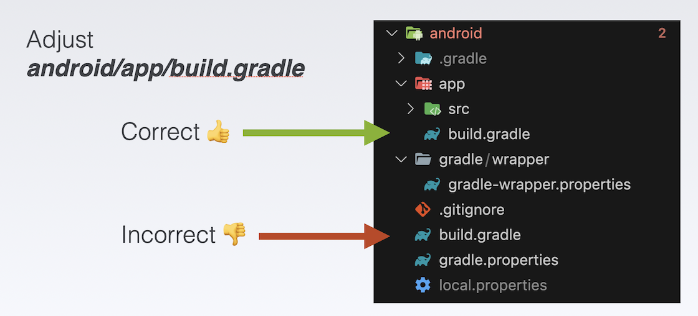

# Building for Android

---

Listing some pitfalls and completing the remaining steps for Android.

---

## Android Setup

To install the `cargo-ndk` command use:

```
cargo install cargo-ndk
```

In _android/app/build.gradle_, fix error:

```
Replace GradleException by FileNotFoundException
```

In _android/app/build.gradle_, add at the bottom:

```
[
        Debug: null,
        Profile: '--release',
        Release: '--release'
].each {
    def taskPostfix = it.key
    def profileMode = it.value
    tasks.whenTaskAdded { task ->
        if (task.name == "javaPreCompile$taskPostfix") {
            task.dependsOn "cargoBuild$taskPostfix"
        }
    }
    tasks.register("cargoBuild$taskPostfix", Exec) {
        workingDir "../../rust"  // <-- ATTENTION: CHECK THE CORRECT FOLDER!!!
        environment ANDROID_NDK_HOME: "$ANDROID_NDK"
        commandLine 'cargo', 'ndk',
                // the 2 ABIs below are used by real Android devices
                // '-t', 'armeabi-v7a',
                '-t', 'arm64-v8a',
                // the below 2 ABIs are usually used for Android simulators,
                // add or remove these ABIs as needed.
                // '-t', 'x86',
                // '-t', 'x86_64',
                '-o', '../android/app/src/main/jniLibs', 'build'
        if (profileMode != null) {
            args profileMode
        }
    }
}
```

## Pitfalls and Solutions

What is the purpose of the section above in _build.gradle_?

Well, it is intended to ensure that Rust is recompiled when the app is launched. To make it all work, you need to pay special attention to the following things.

---

1. Adjust the correct _build.gradle_ file: `android/app/build.gradle` <figure style="margin:0;"><figcaption style="font-size: 0.8em;text-align:center;"><p>Adjust the correct file</p></figcaption></figure>

---

2. Include all the targets you need. Recap the chapter about targets required for Android development in [Cross-Compiling](../overview/cross-compiling.md). Please note that every target you add will consume disk space, and it will take a considerable amount of time to compile when you launch the app for the first time.

   In the case above I only included the ABI _arm64-v8a_ from my Android Emulator. The other targets are commented out.

---

3.  Make sure that the workingDir refers to the correct crate package.

    `workingDir "../../rust" // <-- ATTENTION: CHECK THE CORRECT FOLDER!!!`

    In my tutorial, I consistently use "rust" as the crate name - in the command `cargo new --lib rust`.

---

4. To ensure successful compilation, we have installed cargo-ndk as mentioned earlier. In order to utilize it, it is crucial to correctly define the constant **ANDROID_NDK** path. The recommended approach is to include the path in the _~gradle/gradle.properties_ file.

   On **macOS** I have added this value: <figure style="margin:0;"><figcaption style="font-size: 0.8em;text-align:center;"><p>Add ANDROID_NDK path</p></figcaption></figure>

---

## Completing the Android App

### Generate the Dart Interface

Use this command (you need to be in the root of your project):

```
flutter_rust_bridge_codegen \
--rust-input rust/src/api.rs \
--dart-output ./lib/bridge_generated.dart \
--dart-decl-output ./lib/bridge_definitions.dart \
--wasm
```

### Include the library

Create a file `ffi.dart` and paste this content. As you can see it returns the _api_ variable.

```
// This file initializes the dynamic library and connects it with the stub
// generated by flutter_rust_bridge_codegen.

import 'dart:ffi';

import 'bridge_generated.dart';
import 'bridge_definitions.dart';
export 'bridge_definitions.dart';

// Re-export the bridge so it is only necessary to import this file.
export 'bridge_generated.dart';
import 'dart:io' as io;

const _base = 'rust';

// On MacOS, the dynamic library is not bundled with the binary,
// but rather directly **linked** against the binary.
final _dylib = io.Platform.isWindows ? '$_base.dll' : 'lib$_base.so';

final Rust api = RustImpl(io.Platform.isIOS || io.Platform.isMacOS
    ? DynamicLibrary.executable()
    : DynamicLibrary.open(_dylib));
```

Wherever you intend to utilize the library functions, import the ffi.dart file into your Dart code. The exposed API function(s) can then be invoked by utilizing the returned `api` variable.

### Video

Follow the video for the remaining steps.

<iframe 
    class="video"  
    src="https://www.youtube.com/embed/P0pAXl5HvOc" 
    title="Building a Simple App for SHIMMER - finalize the ANDROID part" 
    frameborder="0" 
    allow="accelerometer; autoplay; clipboard-write; encrypted-media; gyroscope; picture-in-picture; web-share" 
    allowfullscreen>
</iframe>
