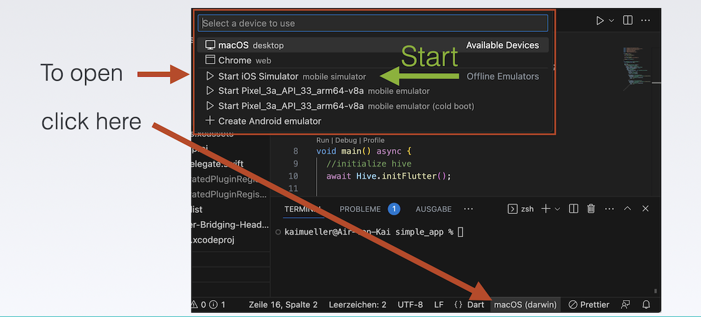

# Building for iOS

---

Completing the remaining steps for iOS. After successfully creating macOS, building the iOS version is relatively straightforward.

---

## iOS Setup

An common step for macOS / iOS is needed: creating an Xcode project **inside of the Rust library project folder** (_rust/_). This can be done using the `cargo-xcode` command.

1. To install the `cargo-xcode` command use:

   ```
   cargo install cargo-xcode
   ```

2. After the installation of the command, create the Rust Xcode project. **Make sure to be in the _rust/_ directory**. From the project's root folder you may switch into the right directory:

   ```
   cd rust
   ```

   ```
   cargo xcode
   ```

   ```
   cd ..
   ```

## Completing the iOS App

{{#include ../building-without-iota/flutter-and-rust/frb-example-app/ios-instructions.md:11:21}}

### Starting the iOS Simulator in VS Code

**Option 1**

<figure style="margin:0;"><figcaption style="font-size: 0.8em;text-align:center;"><p>Start iOS Simulator</p></figcaption></figure>

**Option 2**

As a shortcut, use the terminal and execute:

```
open -a simulator
```

### Video

Follow the video for the remaining steps.

<iframe 
    class="video"  
    src="https://www.youtube.com/embed/-dXodEDAL_Q" 
    title="Building a Simple App for SHIMMER - finalize the iOS part" 
    frameborder="0" 
    allow="accelerometer; autoplay; clipboard-write; encrypted-media; gyroscope; picture-in-picture; web-share" 
    allowfullscreen>
</iframe>
