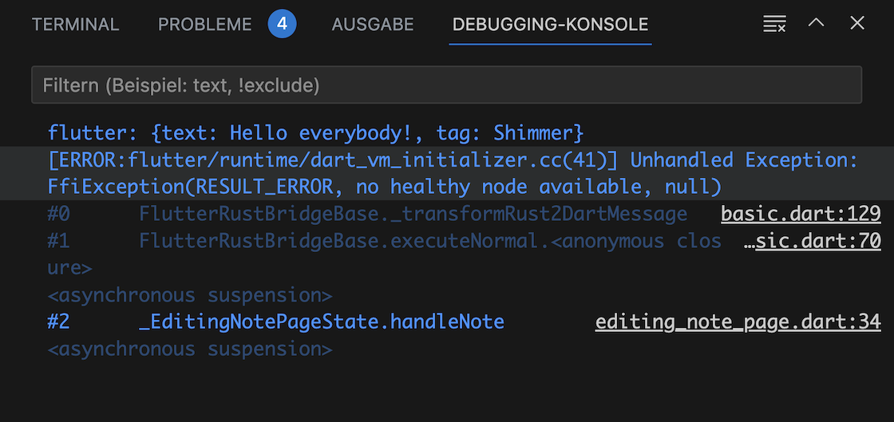
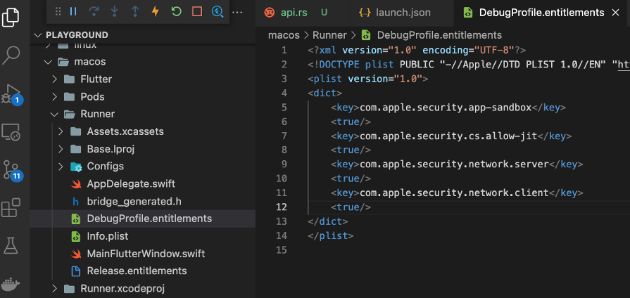

# Building for macOS

---

Listing some pitfalls and completing the remaining steps for macOS.

---

## macOS Setup

An common step for macOS / iOS is needed: creating an Xcode project **inside of the Rust library project folder** (_rust/_). This can be done using the `cargo-xcode` command.

1. To install the `cargo-xcode` command use:

   ```
   cargo install cargo-xcode
   ```

2. After the installation of the command, create the Rust Xcode project. Make sure to be in the _rust/_ directory. From the project's root folder you may switch into the right directory:

   ```
   cd rust
   ```

   ```
   cargo xcode
   ```

   ```
   cd ..
   ```

3. This step is for **macOS only** because the macOS app uses the _dynamic_ library:

   Open up that `rust/rust.xcodeproj` file with Xcode and select the root item _rust_, at the left pane on top.
   Select the Target _rust-cdylib_ and the _Build Settings_ tab. Here, search for _Dynamic Library Install Name Base_ and change the value into `$(TARGET_BUILD_DIR)`.

## Pitfalls and Solutions

---

1. Make sure that you are REALLY in the `rust/` directory (where `Cargo.toml` is located) when executing the `cargo xcode` command.

---

2. When macOS cannot locate the dynamic library:

   This might happen due to cargo-xcode version v1.5.0. To prevent this, execute the third step above. Make sure that you have selected the Target for the dynamic library, called _rust-cdylib_. It enables an macOS executable to properly locate dynamic `*.dylib` library files in the package. Do NOT select _rust-staticlib_ !

   FYI, there is an alternative solution described in the tutorial section [macOS Instructions](../building-without-iota/flutter-and-rust/frb-example-app/macos-instructions.md) at the bottom.

---

3. The error message **no healthy node available**, or **SocketException: Connection failed** is encountered when making API calls:

   <figure style="margin:0;"><figcaption style="font-size: 0.8em;text-align:center;"><p>No healthy node available</p></figcaption></figure>

   macOS applications are sandboxed by default. If you come across this error message, you need to add the network.client [entitlement](https://docs.flutter.dev/platform-integration/macos/building#entitlements-and-the-app-sandbox) to `macOS/Runner/DebugProfile.entitlements`:

   ```
   <key>com.apple.security.network.client</key>
   <true/>
   ```

   <figure style="margin:0;"><figcaption style="font-size: 0.8em;text-align:center;"><p>Solution for Sandbox Problem</p></figcaption></figure>

---

## Completing the macOS App

{{#include ../building-without-iota/flutter-and-rust/frb-example-app/macos-instructions.md:11:21}}

### Video

Follow the video for the remaining steps.

<iframe 
    class="video"  
    src="https://www.youtube.com/embed/t13Ya6jPCNw" 
    title="Building a Simple App for SHIMMER - finalize the MACOS part" 
    frameborder="0" 
    allow="accelerometer; autoplay; clipboard-write; encrypted-media; gyroscope; picture-in-picture; web-share" 
    allowfullscreen>
</iframe>
