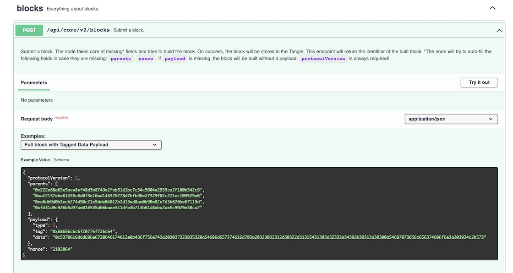
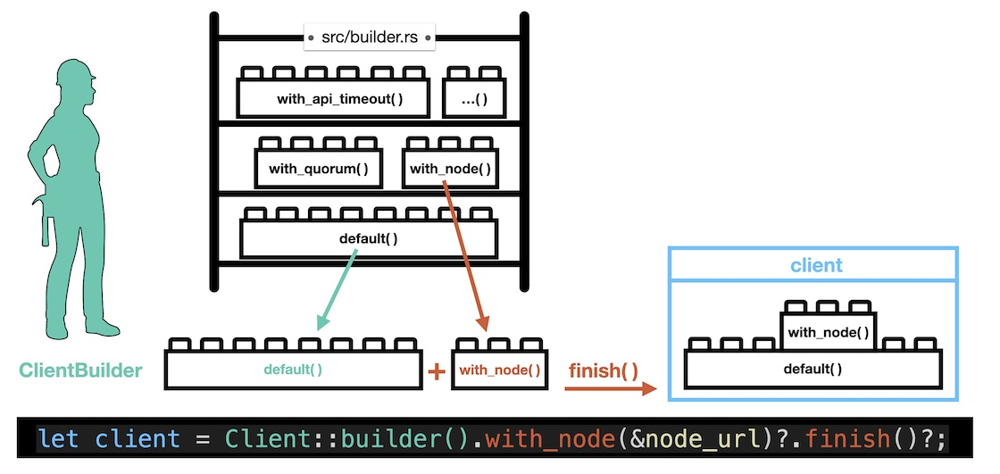

# Core API and iota.rs

---

Seamless Connection: Utilize iota-client for easy integration with Core API of the node, to access the tangle.

---

In this chapter, I will demonstrate how I utilize an official example from `iota-client` as a template to create a function for my own Rust API.

## Context

As a developer, you are accustomed to querying REST APIs. The Shimmer and IOTA nodes provide such APIs. At a higher level, the library crate `iota-client` supports us as Rust developers by encapsulating certain calls and exposing them as functions. This relationship has already been shown in the movie clip "How everything works together" starting from minute 2:53.

In the video you can see the Swagger page of a node with its endpoints. Then it is demonstrated that you could make individual endpoint calls using Postman.

**Ultimately, the iota-client of iota.rs takes over the task to communicate with the node's API.**

<iframe 
    class="video"  
    src="https://www.youtube.com/embed/P0Kh0DSaddA?start=172" 
    title="Core API and iota.rs" 
    frameborder="0" 
    allow="accelerometer; autoplay; clipboard-write; encrypted-media; gyroscope; picture-in-picture; web-share" 
    allowfullscreen>
</iframe>

<a href="https://editor.swagger.io/?url=https://raw.githubusercontent.com/iotaledger/tips/main/tips/TIP-0025/core-rest-api.yaml" target="_blank">👉 &nbsp; IOTA Core REST API</a>

The structure of a block including a tag and a message is displayed when you expand the accordion with the POST endpoint `/api/core/v2/blocks`.

<figure style="margin:0;"><figcaption style="font-size: 0.8em;text-align:center;"><p>Block with tagged data payload</p></figcaption></figure>

## Posting a Block into the tangle

To post a block of this kind using the features provided by the `iota-client` crate, we can utilize the example _client/examples/block/004_example_tagged_data.rs_ as a template. Let's first try it out.

<iframe 
    class="video"  
    src="https://www.youtube.com/embed/JeLW9HzKvXI" 
    title="Running Rust examples" 
    frameborder="0" 
    allow="accelerometer; autoplay; clipboard-write; encrypted-media; gyroscope; picture-in-picture; web-share" 
    allowfullscreen>
</iframe>

Here's the source code:

```rust,ignore
// iota.rs -> client/examples/block/004_example_tagged_data.rs

// Copyright 2021 IOTA Stiftung
// SPDX-License-Identifier: Apache-2.0

//! This example sends a block with a tagged data payload.
//! Run: `cargo run --example block_tagged_data --release -- [NODE URL]`.

use iota_client::{block::payload::Payload, Client, Result};

#[tokio::main]
async fn main() -> Result<()> {
    // Take the node URL from command line argument or use one from env as default.
    let node_url = std::env::args().nth(1).unwrap_or_else(|| {
        // This example uses dotenv, which is not safe for use in production.
        dotenv::dotenv().ok();
        std::env::var("NODE_URL").unwrap()
    });

    // Create a client with that node.
    let client = Client::builder().with_node(&node_url)?.finish()?;

    // Create and send the block with tag and data.
    let block = client
        .block()
        .with_tag(b"Hello".to_vec())
        .with_data(b"Tangle".to_vec())
        .finish()
        .await?;

    println!("{block:#?}\n");

    if let Some(Payload::TaggedData(payload)) = block.payload() {
        println!(
            "Tag: {}",
            String::from_utf8(payload.tag().to_vec()).expect("found invalid UTF-8")
        );
        println!(
            "Data: {}",
            String::from_utf8(payload.data().to_vec()).expect("found invalid UTF-8")
        );
    }

    println!(
        "\nBlock with tag and data sent: {}/block/{}",
        std::env::var("EXPLORER_URL").unwrap(),
        block.id()
    );

    Ok(())
}
```

> If you run the example _block_tagged_data_ using the command line with argument _[NODE_URL]_, e.g. by
>
> `cargo run --example block_tagged_data --release -- "https://api.shimmer.network"`
>
> then you will get an error message indicating that the EXPLORER_URL is missing. This is because the environment variables have not been loaded. To fix that, include `dotenv::dotenv().ok();` in the line before the last `println!` command.

### Understanding the code

The two important lines in the code above are the ones for

1. creating a client instance that can operate and exchange data with the tangle using a node, and
2. generating the block, which includes sending the block to the Tangle in the finish method.

I want to exemplify how a client instance is created in `iota-client`. A static method of the `Client` struct first creates a `ClientBuilder`. The builder allows dynamic configuration of the client by chaining multiple methods to override default values. Only when the `finish()` method is called, the client instance is returned from the builder.

<figure style="margin:0;"><figcaption style="font-size: 0.8em;text-align:center;"><p>ClientBuilder used to configure a client instance </p></figcaption></figure>

> The principle used for creating instances with builders is frequently employed in `iota-client`, such as with the `Node_Manager`, `Blocks` (used in the code above), or `Addresses`. It's like the builder taking Lego blocks from a storage shelf and assembling them together.

The next important code line is:

```rust,ignore
// Create and send the block with tag and data.
    let block = client
        .block()
        .with_tag(b"Hello".to_vec())
        .with_data(b"Tangle".to_vec())
        .finish()
        .await?;
```

At first, a ClientBlockBuilder is created by calling the function `client.block()`. This function can be found in `client/src/api/block_builder/high_level.rs`.

> If you wonder why this `client` function is not defined in the `client.rs` file let me remind you that in Rust, **you can provide implementations for your struct throughout the crate!** This language feature is used in _iota.rs_.

By utilizing the _with\_\*_ functions in `client/src/api/block_builder/mod.rs` a tag and a data payload are added to the block.

The function `finish()` examines the block configuration. As a tag is included, the `finish_tagged_data()` function is called next, and finally forwards to `finish_block()`. This last function not only creates a block instance but it also posts the block to the node api and the tangle using `client.post_block_raw()`. Do you find the definition for this `post` function? Tipp: there's another `impl Client {...}` in `client/src/node_api/core/routes.rs`.

> In my view, whenever the `finish()` method is invoked, blocks are _invariably_ sent to the tangle. Hence, there is no need for any additional `client.post_block()` functions to be called. Therefore, in my opinion, the explicit call mentioned in **the Wiki description of [Post a Data Block](https://wiki.iota.org/shimmer/iota.rs/how_tos/post_block/) is incorrect**:
>
> ```rust,ignore
>     // Create the block.
>     let block = client.block().finish().await?;
>     // Post the block.
>     let block_id = client.post_block(&block).await?;  // <-- Why !?
> ```

## Transforming the example into an API function

The question addressed here is: How can I create a public function in my own Rust API that is exposed to Flutter through our cross-compiled library?

There are some peculiarities in the official example.

- The example contains an _async main_ function.
- NODE_URL and EXPLORER_URL are retrieved either from the .env file or from the command line.
- The result is printed in the console.

So, how can we convert it into our API function?

At first, we should replace the `main()` function by a method to be exposed, let's say:

```rust,ignore
pub fn publish_tagged_data_block(...) {
    ...
}
```

It's an absolute must to make the function public, otherwise, it won't be exposed to the outside world.

Next up, our function needs a little something extra. It should accept parameters for the tag and the message. And in return, it should gracefully provide you with the blockId. So, let's add some flavor to our function:

```rust,ignore
pub fn publish_tagged_data_block(tag: String, message: String) -> Result<String> {
    ...
}
```

Ah, decisions, decisions! While we could add the node_url as input parameter to our function, I've decided to take matters into my own hands. I'll go ahead and hard code this URL, based on the assumption we made in our [User Story](whats-the-result.md).

```rust,ignore
pub fn publish_tagged_data_block(tag: String, message: String) -> Result<String> {
    let node_url: String = String::from("https://api.shimmer.network");

    ...
}
```

Inside the function, we need to establish a similar structure to the `#[tokio::main]` statement shown in the example. The Flutter-Rust-Bridge User Guide has published an article discussing this specific topic, which can be found at the following link: [Async in Rust](https://cjycode.com/flutter_rust_bridge/article/async_in_rust.html). Based on my experience, I recommend adopting approach 2, where we explicitly create a new Tokio runtime and use its `block_on` function to execute the future until it finishes its execution. This approach has proven to provide a reliable and effective solution.

> **What is Tokio?**
>
> Oh, the confusion! Let's clear things up! While "Tokio" might sound like the capital of Japan, it's actually an _asynchronous runtime_ for Rust. Just like Tokyo is bustling with activity, Tokio handles the execution of asynchronous tasks in your program. It ensures that your API requests are executed asynchronously, so your program doesn't sit there twiddling its thumbs. With Tokio, you get a whole package of features and abstractions, including support for Rust's `async/await` syntax and futures, making your asynchronous code more readable and approachable.

So, let's make some adjustments to the code:

```rust,ignore
pub fn publish_tagged_data_block(tag: String, message: String) -> Result<String> {
    let node_url: String = String::from("https://api.shimmer.network");

    let rt = Runtime::new().unwrap();
    rt.block_on(async {
        ...
    })
}
```

Don't forget to add the following dependencies to `Cargo.toml`:

```rust,ignore
[dependencies]
tokio = { version = "1.28.2", features = ["full"] }
anyhow = { version = "1.0.71" }
```

Now we're almost done. It's time to add the core functionalities which are the two lines to create the client and the block, and to send it.

```rust,ignore
pub fn publish_tagged_data_block(tag: String, message: String) -> Result<String> {
    let node_url: String = String::from("https://api.shimmer.network");

    let rt = Runtime::new().unwrap();
    rt.block_on(async {
        // Create a client with that node.
        let client = Client::builder().with_node(&node_url)?.finish()?;

        // Create and send the block with tag and data.
        let block = client
            .block()
            .with_tag(tag.into_bytes())
            .with_data(message.into_bytes())
            .finish()
            .await?;

        ...
    })
}
```

To convert a Rust String into a vector of byte literals (Vec<u8>), you can use the `String::into_bytes` method.

The only missing part is returning the block_id as String, so we try this:

```rust,ignore
pub fn publish_tagged_data_block(tag: String, message: String) -> Result<String> {
    let node_url: String = String::from("https://api.shimmer.network");

    let rt = Runtime::new().unwrap();
    rt.block_on(async {
        // Create a client with that node.
        let client = Client::builder().with_node(&node_url)?.finish()?;

        // Create and send the block with tag and data.
        let block = client
            .block()
            .with_tag(tag.into_bytes())
            .with_data(message.into_bytes())
            .finish()
            .await?;

        let block_id:BlockId = block.id();

        Ok(block_id.to_string())
    })
}
```

`Block` and `BlockId` are defined in package `types` of iota.rs, in the folder `types/src/block`. To avoid that the compiler complains, you need to add the related paths to your `api.rs`.

## Rust code for your Simple App

In summary, here are the steps you need to take to create an API within your Rust library project, which is located within your Flutter project.

### Cargo.toml

Add these libraries to the existing ones.

```rust,ignore
[dependencies]
iota-client = { version = "2.0.1-rc.7", default-features = false, features = [ "tls" ] }

tokio = { version = "1.28.2", features = ["full"] }
anyhow = { version = "1.0.71" }
```

### api.rs

```rust,ignore
use iota_client::{block::BlockId, Client};
use tokio::runtime::Runtime;
use anyhow::Result;

pub fn publish_tagged_data_block(tag: String, message: String) -> Result<String> {
    let node_url: String = String::from("https://api.shimmer.network");

    let rt = Runtime::new().unwrap();
    rt.block_on(async {
        // Create a client with that node.
        let client = Client::builder().with_node(&node_url)?.finish()?;

        // Create and send the block with tag and data.
        let block = client
            .block()
            .with_tag(tag.into_bytes())
            .with_data(message.into_bytes())
            .finish()
            .await?;

        let block_id:BlockId = block.id();

        Ok(block_id.to_string())
    })
}
```

### lib.rs

```rust,ignore
mod api;
```
