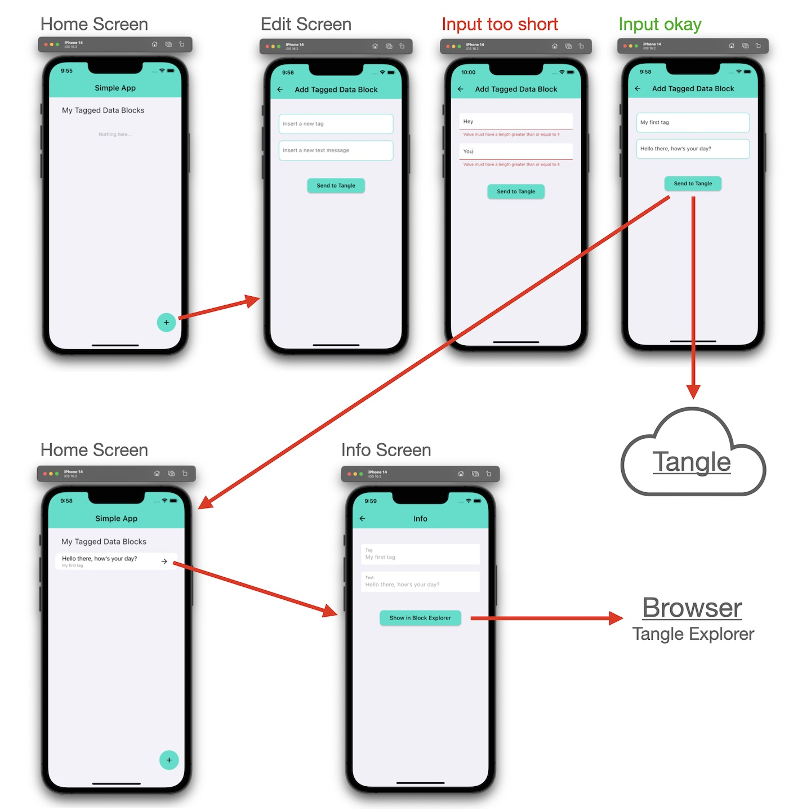

# What's the result?

---

Our target is to create a simple app to send a data message to the tangle, using the iota-client.

---

## Video

<iframe 
    class="video"  
    src="https://www.youtube.com/embed/9irdEV_v4_A" 
    title="ADOPTION can start NOW - Building a SIMPLE APP for SHIMMER" 
    frameborder="0" 
    allow="accelerometer; autoplay; clipboard-write; encrypted-media; gyroscope; picture-in-picture; web-share" 
    allowfullscreen>
</iframe>

## Let's write a User Story

As a user, I want to use an app to create a message and tag it, so that I can then send it to the tangle. I also want to be able to find my tag and message in the tangle in order to check if the data was sent correctly.

Acceptance Criteria:

1. The app should provide a user-friendly interface for creating and sending messages.
2. The app should allow me to enter the content of the message.
3. The app should have a field where I can add a tag to the message.
4. The app should have a button to send the message and the tag to the tangle.
5. Message and tag are sent as _Block with Tagged Data Payload_.
6. The app should store the tag, message and block id.
7. The app should provide a list of the sent tagged data blocks.
8. The app should allow to open the tangle explorer for a selected list item.

Note: It is assumed that the user is using the Shimmer Network.

## Describing the UI and Screen Flow

An image speaks louder than a thousand words...

<figure style="margin:0;border: 1px solid green;"><figcaption style="font-size: 0.8em;text-align:center;">
Screen flow of simple app
</figcaption></figure>

## Github Repository

You will find the complete source code from the video in this repository:

<a href="https://github.com/iota-for-flutter/simple_app_complete" target="_blank">👉 &nbsp; Repository - Simple App complete</a>
