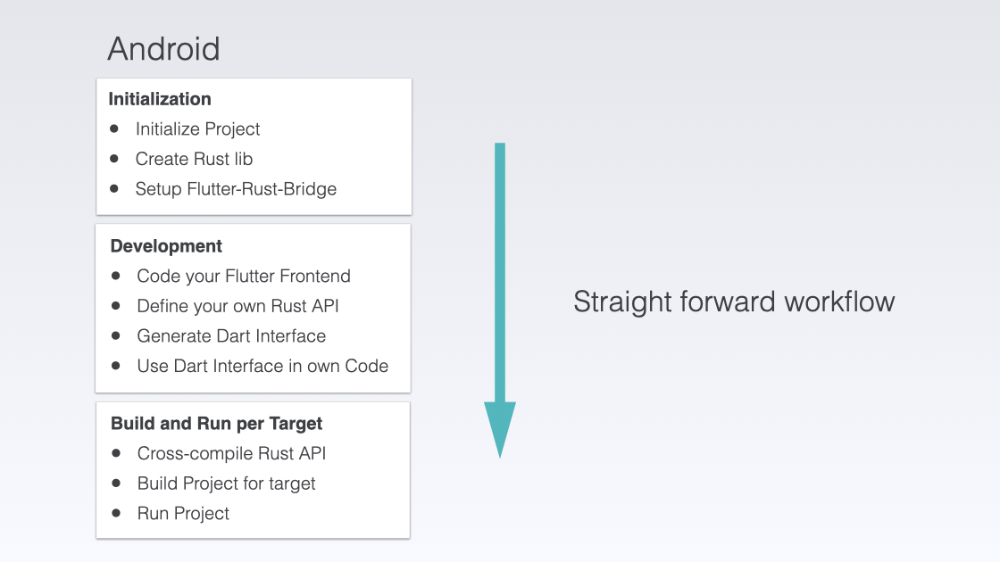
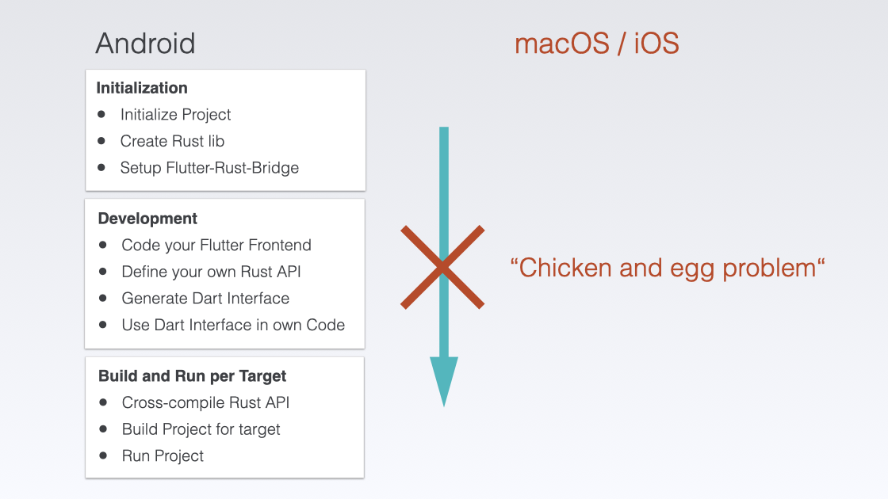
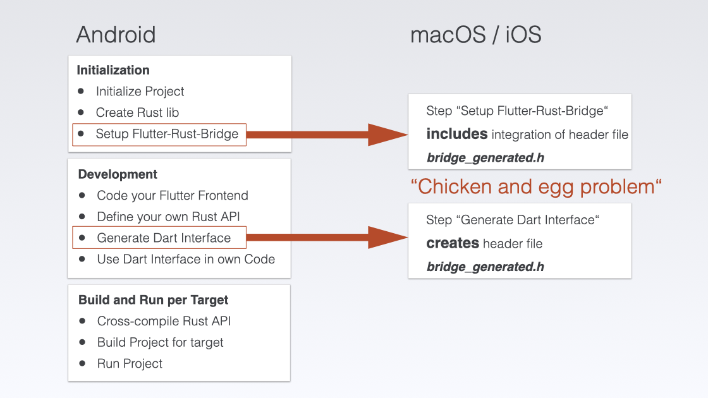
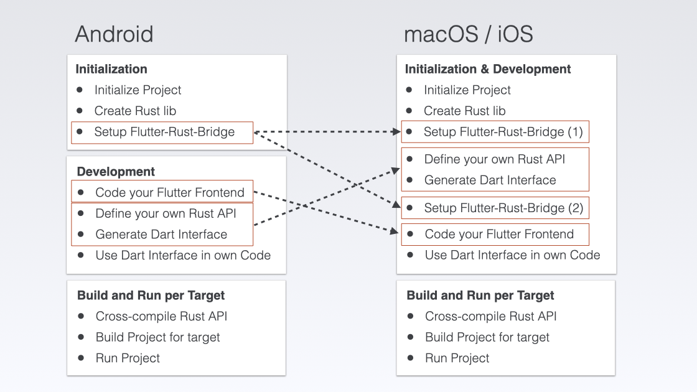
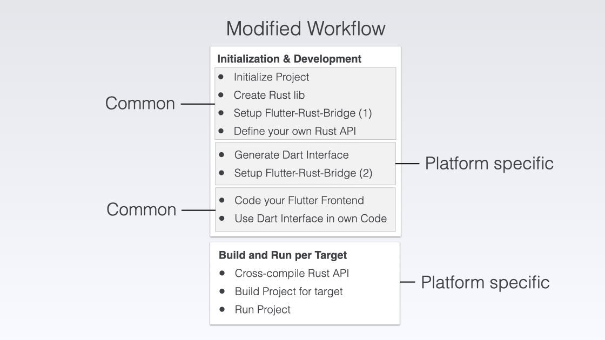

# Flutter Rust Bridge (FRB) Template App

---

FRB Template App - Integrating Rust with Flutter.

---

I would like to showcase the _Flutter Rust Bridge Template_ app in this chapter. It's from one of the main contributors of the Flutter Rust Bridge, Viet Dinh.

<a href="https://github.com/Desdaemon/flutter_rust_bridge_template" target="_blank">👉 &nbsp; Flutter Rust Bridge Template on Github</a>

This chapter is intended as an additional exercise to become more acquainted with integrating Rust into a Flutter project, without the added complexity of integrating with IOTA.

**Additionally, this chapter will cover the configuration steps for macOS and iOS, and as a consequence, it will introduce a modified workflow.**

I will start this project from scratch and only take the necessary code from the FRB repository.

###

## From the "straight forward" to a "modified" workflow

Remember the workflow used in the introduction chapter <a href="../../../overview/how-everything-works-together">How everything works together</a>.

<figure style="margin:0;border: 1px solid green;"><figcaption style="font-size: 0.8em;text-align:center;">
All steps of the workflow
</figcaption></figure>

You can simply list all the steps one after the other in a straight forward workflow.

<figure style="margin:0;border: 1px solid green;"><figcaption style="font-size: 0.8em;text-align:center;">
Straight forward workflow
</figcaption></figure>

This works for Android.

<figure style="margin:0;border: 1px solid green;"><figcaption style="font-size: 0.8em;text-align:center;">
Android: straight forward workflow
</figcaption></figure>

When working on macOS and iOS, you may encounter a _Chicken and Egg_ problem, which is **not a serious issue** but may result in error messages that we would like to avoid.

<figure style="margin:0;border: 1px solid green;"><figcaption style="font-size: 0.8em;text-align:center;">
Straight forward workflow doesn't work for macOS / iOS
</figcaption></figure>

The issue at hand is that the setup for FRB requires configuring a C header file that contains a list of all the exported symbols from the Rust library. However, this header file does not yet exist during the setup process. It will only be generated later when the Dart interface is generated.

<figure style="margin:0;border: 1px solid green;"><figcaption style="font-size: 0.8em;text-align:center;">
Chicken and egg problem
</figcaption></figure>

To resolve this issue, I combine the Initialization and Development steps.

<figure style="margin:0;border: 1px solid green;"><figcaption style="font-size: 0.8em;text-align:center;">
Combination of Initialization and Development steps
</figcaption></figure>

The Step about _Setting up the Flutter Rust Bridge_ is now separated into two parts.

<figure style="margin:0;border: 1px solid green;"><figcaption style="font-size: 0.8em;text-align:center;">
Modified workflow
</figcaption></figure>

I will be following the _modified workflow_ in the upcoming subchapters. There are platform specific instructions for setting up the FRB on Android, macOS, and iOS. However, there are also some general steps that apply to all target platforms, which I will cover before and after the specific subchapters.

To create the FRB example app successfully, it's important to follow each subchapter in order, starting from the beginning and moving forward.
