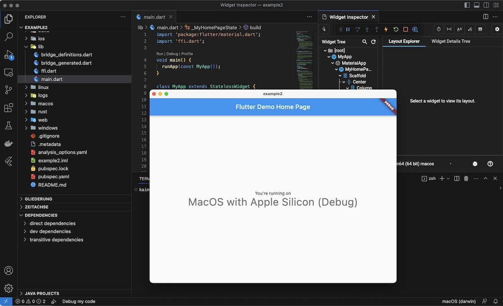
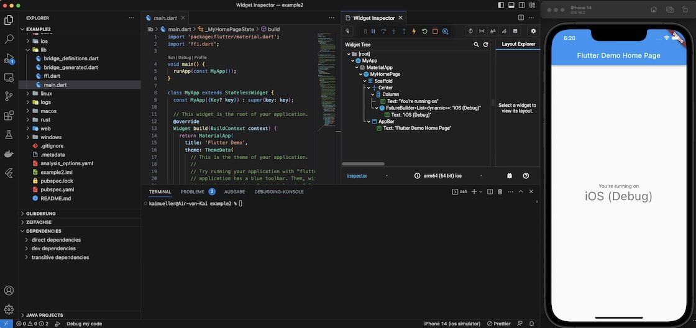

# Part 7: Build and Run

---

FRB Template App: Applying the **<a href="../frb-example-app">modified Workflow</a>**.

---

All the necessary steps have been completed. If you're unsure about how to build and run the app for different targets, please refer to the launch instructions provided in <a href="../../flutter-only.md">Flutter only</a>.

## Build and run on Android

<figure style="margin:0;border: 1px solid green;">
<a href="../../../assets/run_android.jpg" target="_blank">
<figcaption style="font-size: 0.8em;text-align:center;">
Run on Android (click to enlarge)
</figcaption>
</a>
</figure>

## Build and run on macOS

<figure style="margin:0;border: 1px solid green;">
<a href="../../../assets/run_macos.jpg" target="_blank">
<figcaption style="font-size: 0.8em;text-align:center;">
Run on macos (click to enlarge)
</figcaption>
</a>
</figure>

## Build and run on iOS

<figure style="margin:0;border: 1px solid green;">
<a href="../../../assets/run_ios.jpg" target="_blank">
<figcaption style="font-size: 0.8em;text-align:center;">
Run on iOS (click to enlarge)
</figcaption>
</a>
</figure>
