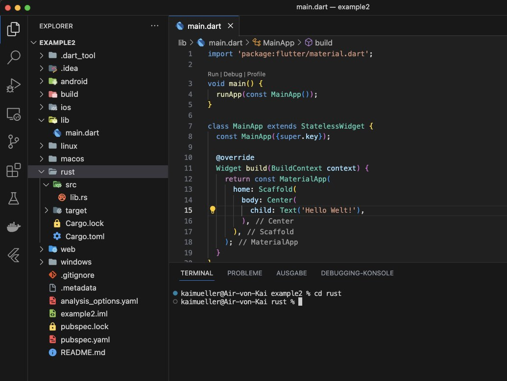
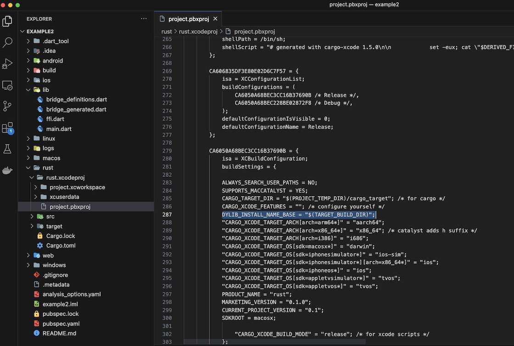

# Part 3: Common macOS/iOS specific instructions

---

FRB Template App: Applying the **<a href="../frb-example-app">modified Workflow</a>**.

---

## Common macOS and iOS steps

An common step for macOS / iOS is needed: creating an Xcode project **inside of the Rust library project folder** (_rust/_). This can be done using the `cargo-xcode` command.

This Cargo subcommand is used to generate all Xcode project files for Rust projects. It will also create a _build rule_ that will be used to create a dynamic and a static library from the Rust library code in Xcode's build step. If you don't remember, take a look back and read the section <a href="../../fundamentals/xcode/essentials.md">Xcode Essentials</a>.

To install the `cargo-xcode` command use:

```
cargo install cargo-xcode
```

After the installation of the command, create the Rust Xcode project. Make sure to be in the _rust/_ directory. From the project's root folder you may switch into the right directory:

```
cd rust
```

```
cargo xcode
```

```
cd ..
```

<figure style="margin:0;">
<a href="../../../assets/create_rust_xcodeproj_before.jpg" target="_blank">
<figcaption style="font-size: 0.8em;text-align:center;"><p>Before building the Rust Xcode Project (click to enlarge)</p></figcaption>
</a>
</figure>

> In this picture puzzle, you need to find the differences between two images. First, carefully examine the "before" image above ⬆️ - take note of all the details - and then look at the "after" image below ⬇️ and try to identify the differences.

<figure style="margin:0;">
<a style="width:50%" href="../../../assets/create_rust_xcodeproj_after.jpg" target="_blank">
<figcaption style="font-size: 0.8em;text-align:center;"><p>After building the Rust Xcode Project (click to enlarge)</p></figcaption>
</a>
</figure>

###

---

## WORKAROUND WORKAROUND WORKAROUND

When you have installed the **version 1.5.0** from `cargo-xcode`, Flutter will not be able to find the dynamic library. You'll get an error like this:

```
Launching lib/main.dart on macOS in debug mode...
--- xcodebuild: WARNING: Using the first of multiple matching destinations:
{ platform:macOS, arch:arm64, id:00008103-001251441A62001E }
{ platform:macOS, arch:x86_64, id:00008103-001251441A62001E }
Building macOS application...
dyld[64001]: Library not loaded: /usr/local/lib/rust.dylib
  Referenced from: <29A02B41-EAF9-315B-977F-429B4DD80404> /Users/kaimueller/Documents/iota_for_flutter/example2/build/macos/Build/Products/Debug/example2.app/Contents/MacOS/example2
  Reason: tried: '/usr/local/lib/rust.dylib' (no such file), '/System/Volumes/Preboot/Cryptexes/OS/usr/local/lib/rust.dylib' (no such file), '/usr/local/lib/rust.dylib' (no such file), '/usr/lib/rust.dylib' (no such file, not in dyld cache)
Error waiting for a debug connection: The log reader stopped unexpectedly, or never started.
Error launching application on macOS.
```

Here's the solution:

<figure style="margin:0;">
<a style="width:50%" href="https://github.com/fzyzcjy/flutter_rust_bridge/issues/870" target="_blank">
<figcaption style="font-size: 0.8em;text-align:center;"><p>Workaround for "rust.dylib (no such file)" - click to go to Issue 870</p></figcaption>
</a>
</figure>

1. In VS Code, open file _rust/rust.xcodeproj/project.pbxproj_.
2. Search for the 2 lines with the text `CARGO_XCODE_FEATURES = "";`
3. Insert a new line after each of these lines and insert
   ```
   DYLIB_INSTALL_NAME_BASE = "$(TARGET_BUILD_DIR)";
   ```
