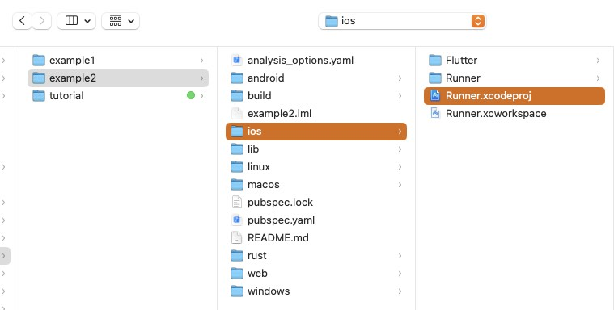
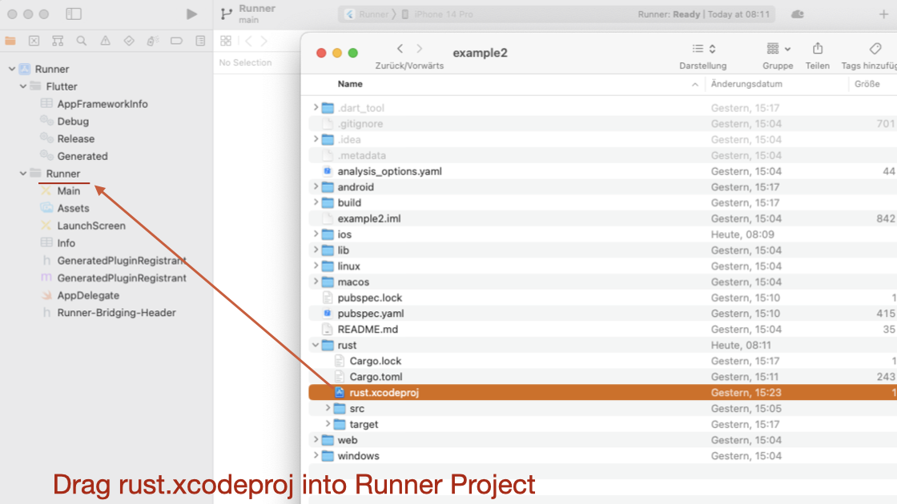
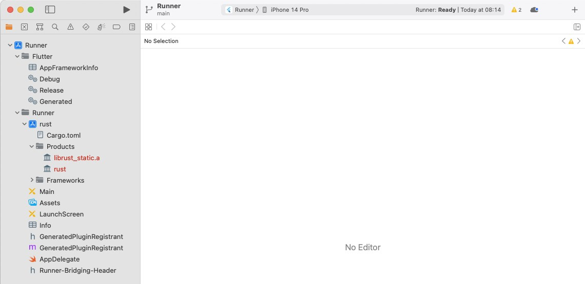
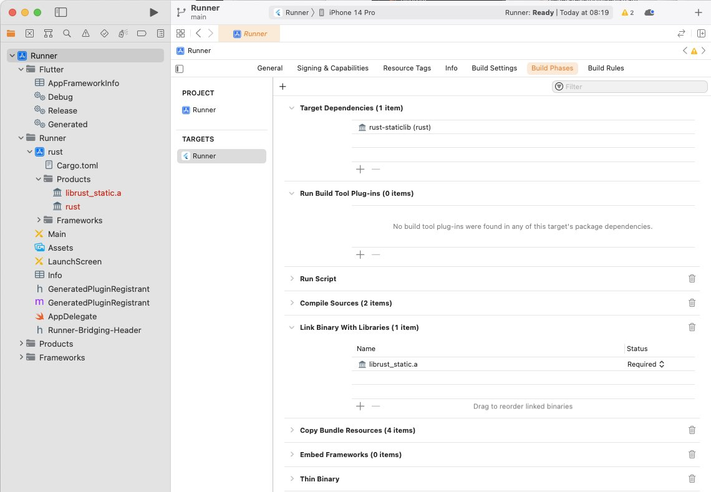

# Part 5: iOS specific instructions

---

FRB Template App: Applying the **<a href="../frb-example-app">modified Workflow</a>**.

---

## iOS steps

### Generate the Dart Interface

Our next task is to create the generated code. This will also copy the C header file `bridge_generated.h` into the folder _ios/Runner/_. Use this command (you need to be in the root of your project):

```
flutter_rust_bridge_codegen \
--rust-input rust/src/api.rs \
--dart-output ./lib/bridge_generated.dart \
--dart-decl-output ./lib/bridge_definitions.dart \
--c-output ios/Runner/bridge_generated.h
```

### Create the subproject

How is a subproject created in Xcode?

Simply open the _ios/Runner.xcodeproj_ in Xcode, open the _rust/_ directory in Finder and drag the _rust.xcodeproj_ into the Runner folder. The next images will illustrate the steps.

<figure style="margin:0;border: 1px solid green;">
<figcaption style="font-size: 0.8em;text-align:center;"><p style="margin: 4px 0 7px 0;">Open <i>Runner.xcodeproj</i></p></figcaption>
</figure>

<figure style="margin:0;border: 1px solid green;">
<figcaption style="font-size: 0.8em;text-align:center;"><p style="margin: 4px 0 7px 0;">Drag the file <i>rust.xcodeproj</i> into the Runner Project</p></figcaption>
</figure>

<figure style="margin:0;border: 1px solid green;">
<figcaption style="font-size: 0.8em;text-align:center;"><p style="margin: 4px 0 7px 0;">The new subproject</p></figcaption>
</figure>

### Adjust the Runner Target's _Build Phases_

<a href="https://cjycode.com/flutter_rust_bridge/integrate/ios_linking.html" target="_blank">For iOS, FRB recommends to include the static library.</a>

a) In Runner Target's _Build Phase_ -> _Target Dependencies_:

Click on "+" and select `rust-staticlib`.

b) In Runner Target's _Build Phase_ -> _Link Binary with Libraries_:

Click on "+" and select `librust_static.a`.

<figure style="margin:0;border: 1px solid green;">
<figcaption style="font-size: 0.8em;text-align:center;"><p style="margin: 4px 0 7px 0;">Adjusted Build Phase</p></figcaption>
</figure>

### Adjust the _Runner-Bridging-Header.h_ file

Switch to Visual Studio Code and open the file `ios/Runner/Runner-Bridging-Header.h` to add our generated header file `bridge_generated.h`.

Add the line:

```
#import "bridge_generated.h"
```

The content should look like:

```
#import "GeneratedPluginRegistrant.h"
#import "bridge_generated.h"
```

### Adjust the `AppDelegate.swift` file

In Visual Studio Code, open the file `ios/Runner/AppDelegate.swift`. We need to call the function _dummy_method_to_enforce_bundling()_ (from FRB) somewhere to avoid that Xcode handles our library as dead code.

Add:

```
let dummy = dummy_method_to_enforce_bundling()
print(dummy)
```

Your file should look like:

```
import UIKit
import Flutter

@UIApplicationMain
@objc class AppDelegate: FlutterAppDelegate {
  override func application(
    _ application: UIApplication,
    didFinishLaunchingWithOptions launchOptions: [UIApplication.LaunchOptionsKey: Any]?
  ) -> Bool {
    let dummy = dummy_method_to_enforce_bundling()
    print(dummy)
    GeneratedPluginRegistrant.register(with: self)
    return super.application(application, didFinishLaunchingWithOptions: launchOptions)
  }
}
```
