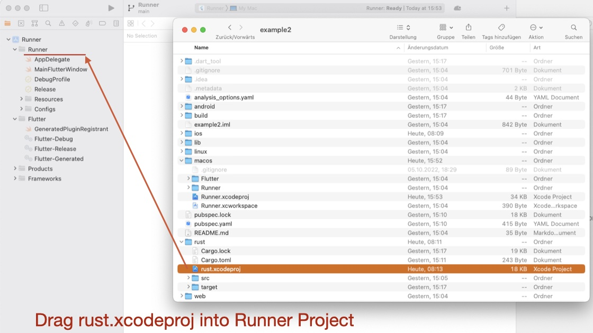

# Part 4: macOS specific instructions

---

FRB Template App: Applying the **<a href="../frb-example-app">modified Workflow</a>**.

---

## macOS steps

### Generate the Dart Interface

Our next task is to create the generated code. This will also copy the C header file `bridge_generated.h` into the folder _macos/Runner/_. Use this command (you need to be in the root of your project):

```
flutter_rust_bridge_codegen \
--rust-input rust/src/api.rs \
--dart-output ./lib/bridge_generated.dart \
--dart-decl-output ./lib/bridge_definitions.dart \
--c-output macos/Runner/bridge_generated.h
```

### Create the subproject

How is a subproject created in Xcode?

Simply open the _macos/Runner.xcodeproj_ in Xcode, open the _rust/_ directory in Finder and drag the _rust.xcodeproj_ into the Runner folder. The next images will illustrate the steps.

<figure style="margin:0;">
<figcaption style="font-size: 0.8em;text-align:center;"><p>Open <i>Runner.xcodeproj</i></p></figcaption>
</figure>

<figure style="margin:0;">
<figcaption style="font-size: 0.8em;text-align:center;"><p>Drag the file <i>rust.xcodeproj</i> into the Runner Project</p></figcaption>
</figure>

<figure style="margin:0;">
<figcaption style="font-size: 0.8em;text-align:center;"><p>The new subproject</p></figcaption>
</figure>

### Adjust the Runner Target's _Build Phases_

<a href="https://cjycode.com/flutter_rust_bridge/integrate/ios_linking.html" target="_blank">For macOS, FRB recommends to include the dynamic library.</a>

a) In Runner Target's _Build Phase_ -> _Target Dependencies_:

Click on "+" and select `rust-cdylib`.

b) In Runner Target's _Build Phase_ -> _Link Binary with Libraries_:

Click on "+" and select `rust.dylib`.

<figure style="margin:0;">
<figcaption style="font-size: 0.8em;text-align:center;"><p>Adjusted <i>Build Phases</i></p></figcaption>
</figure>

### Adjust the Runner Target's _Build Settings_

Start typing "Objective-C Bridging Header" in the filter... the hard-to-find setting is in the _Swift Compiler - General_ section of the settings.

As value, insert:

```
Runner/bridge_generated.h
```

<figure style="margin:0;">
<figcaption style="font-size: 0.8em;text-align:center;"><p>Adjusted <i>Build Settings</i></p></figcaption>
</figure>

### Adjust _Minimum Deployments_

To ensure that your app can run on your host computer and Xcode version, you may only be able to support newer macOS versions. To set the minimum supported macOS version for your app, go to the _General_ tab and select macOS version `13.1` as the _Minimum Deployments_ target.

<figure style="margin:0;">
<figcaption style="font-size: 0.8em;text-align:center;"><p>Adjusted <i>Minimum Deployment</i></p></figcaption>
</figure>

### Adjust the `AppDelegate.swift` file

Switch to Visual Studio Code and open the file `macos/Runner/AppDelegate.swift`. We need to call the function _dummy_method_to_enforce_bundling()_ (from FRB) somewhere to avoid that Xcode handles our library as dead code.

Add:

```
dummy_method_to_enforce_bundling()
```

Your file should look like:

```
import Cocoa
import FlutterMacOS

@NSApplicationMain
class AppDelegate: FlutterAppDelegate {
  override func applicationShouldTerminateAfterLastWindowClosed(_ sender: NSApplication) -> Bool {
    dummy_method_to_enforce_bundling()
    return true
  }
}
```

###

---

## Just for your information

When it comes to building the libraries, you might be curious about the process. When you use the `cargo-xcode` command to create the Rust Xcode project, it also installs build rules. These build rules tell Xcode how to create the libraries during the build process. So, when Xcode builds the application, it first builds the subproject and then follows the build rules to create the necessary libraries.

> **Look twice!** It's not the target of the Runner Project, but the target of the Rust subproject!

<figure style="margin:0;">
<a href="../../../assets/xcode/macos_build-rules.jpg" target="_blank">
<figcaption style="font-size: 0.8em;text-align:center;"><p>Build rules generated by <i>cargo-xcode</i> (click to enlarge)</p></figcaption>
</a>
</figure>

## Problem: Flutter doesn't find the dynamic library

When you have installed the **version 1.5.0** from `cargo-xcode` (as you can see in the _Build rules_ image above), Flutter will not be able to find the dynamic library. You'll get an error like this:

```
Launching lib/main.dart on macOS in debug mode...
--- xcodebuild: WARNING: Using the first of multiple matching destinations:
{ platform:macOS, arch:arm64, id:00008103-001251441A62001E }
{ platform:macOS, arch:x86_64, id:00008103-001251441A62001E }
Building macOS application...
dyld[64001]: Library not loaded: /usr/local/lib/rust.dylib
  Referenced from: <29A02B41-EAF9-315B-977F-429B4DD80404> /Users/kaimueller/Documents/iota_for_flutter/example2/build/macos/Build/Products/Debug/example2.app/Contents/MacOS/example2
  Reason: tried: '/usr/local/lib/rust.dylib' (no such file), '/System/Volumes/Preboot/Cryptexes/OS/usr/local/lib/rust.dylib' (no such file), '/usr/local/lib/rust.dylib' (no such file), '/usr/lib/rust.dylib' (no such file, not in dyld cache)
Error waiting for a debug connection: The log reader stopped unexpectedly, or never started.
Error launching application on macOS.
```

### Solution 1

Here's a first solution:

<figure style="margin:0;">
<a style="width:50%" href="https://github.com/fzyzcjy/flutter_rust_bridge/issues/870" target="_blank">
<figcaption style="font-size: 0.8em;text-align:center;"><p>Workaround for "rust.dylib (no such file)" - click to go to Issue 870</p></figcaption>
</a>
</figure>

1. In VS Code, open file _rust/rust.xcodeproj/project.pbxproj_.
2. Search for the 2 lines with the text `CARGO_XCODE_FEATURES = "";`
3. Insert a new line after each of these lines and insert
   ```
   DYLIB_INSTALL_NAME_BASE = "$(TARGET_BUILD_DIR)";
   ```

### Solution 2

After completing this chapter, another solution emerged.

The alternative solution is outlined in the tutorial's chapter titled _Building a Simple App_, see [Building for macOS](../../../building-a-simple-app/building-for-macos.md).
