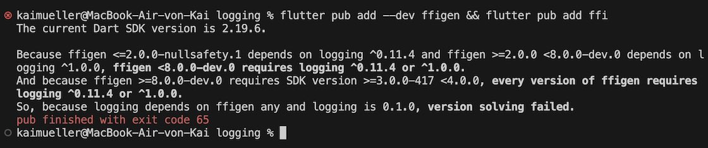

# Resources

---

Watch the video, check the source code and explore the Github Repository.

---

## WARNING: The name of your project matters!

> **Don't name your project "logging"**!
>
> **"logging"** is the name of an **existing** Flutter package (search for it in <a href="https://pub.dev/packages?q=logging" target="_blank">Flutter packages</a>)...\
> ... which is a dependency of the package "ffigen" ...\
> ... which is a dependency of YOUR project!
>
> If your project name was "logging" you would run into serious troubles at some point:
>
> <figure style="margin:0;"></figure>

## Rust Code Snippets

### Cargo.toml

```
[package]
name = "rust"
version = "0.1.0"
edition = "2021"

# See more keys and their definitions at https://doc.rust-lang.org/cargo/reference/manifest.html

[dependencies]
flutter_rust_bridge = "1"

# For the logger
lazy_static = "1.4.0"
log = "0.4.17"
simplelog = "0.12.0"
parking_lot = "0.12.1"
anyhow = "1"

[lib]
crate-type = ["staticlib", "cdylib"]
```

### logger.rs

```
use std::sync::Once;
use std::time::{Duration, SystemTime, UNIX_EPOCH};

use flutter_rust_bridge::StreamSink;
use lazy_static::lazy_static;
use log::{error, info, warn, Log, Metadata, Record};
use parking_lot::RwLock;
use simplelog::*;

use crate::api::LogEntry;

static INIT_LOGGER_ONCE: Once = Once::new();

pub fn init_logger() {

    INIT_LOGGER_ONCE.call_once(|| {
        let level = LevelFilter::Debug;

        assert!(
            level <= log::STATIC_MAX_LEVEL,
            "Should respect log::STATIC_MAX_LEVEL={:?}, which is done in compile time. level{:?}",
            log::STATIC_MAX_LEVEL,
            level
        );

        CombinedLogger::init(vec![
            Box::new(SendToDartLogger::new(level)),
            // Box::new(MyMobileLogger::new(level)),
            // #[cfg(not(any(target_os = "android", target_os = "ios")))]
            TermLogger::new(
                level,
                ConfigBuilder::new()
                    //.set_time_format_str("%H:%M:%S%.3f")
                    //.set_time_format_custom(format_description!("[hour]:[minute]:[second].[subsecond]"))
                    .build(),
                TerminalMode::Mixed,
                ColorChoice::Auto,
            ),
        ])
        .unwrap_or_else(|e| {
            error!("init_logger (inside 'once') has error: {:?}", e);
        });
        info!("init_logger (inside 'once') finished");

        warn!(
            "init_logger finished, chosen level={:?} (deliberately output by warn level)",
            level
        );
    });
}

lazy_static! {
    static ref SEND_TO_DART_LOGGER_STREAM_SINK: RwLock<Option<StreamSink<LogEntry>>> =
        RwLock::new(None);
}

pub struct SendToDartLogger {
    level: LevelFilter,
}

impl SendToDartLogger {
    pub fn set_stream_sink(stream_sink: StreamSink<LogEntry>) {
        let mut guard = SEND_TO_DART_LOGGER_STREAM_SINK.write();
        let overriding = guard.is_some();

        *guard = Some(stream_sink);

        drop(guard);

        if overriding {
            warn!(
                "SendToDartLogger::set_stream_sink but already exist a sink, thus overriding. \
                (This may or may not be a problem. It will happen normally if hot-reload Flutter app.)"
            );
        }
    }

    pub fn new(level: LevelFilter) -> Self {
        SendToDartLogger { level }
    }

    fn record_to_entry(record: &Record) -> LogEntry {
        let time_millis = SystemTime::now()
            .duration_since(UNIX_EPOCH)
            .unwrap_or_else(|_| Duration::from_secs(0))
            .as_millis() as i64;

        let level = match record.level() {
            Level::Trace => Self::LEVEL_TRACE,
            Level::Debug => Self::LEVEL_DEBUG,
            Level::Info => Self::LEVEL_INFO,
            Level::Warn => Self::LEVEL_WARN,
            Level::Error => Self::LEVEL_ERROR,
        };


        let whole_msg = format!("{}", record.args());
        let tag;
        let user_id;
        let user;
        let msg;

        if whole_msg.starts_with("my_domain") {
            let vector: Vec<&str> = whole_msg.split("@@@").collect();
            //Position 1: Domain
            //Position 2: Tag
            tag = format!("{}", vector[1]);
            //Position 3: User-ID
            user_id = format!("{}", vector[2]).to_string();
            //Position 4: User
            user = format!("{}", vector[3]).to_string();
            //Position 5: Message
            msg = format!("{}", vector[4]);
        } else {
            tag = record.file().unwrap_or_else(|| record.target()).to_owned().to_string();
            user_id = "".into();
            user = "".into();
            msg = format!("{}", record.args());
        }

        LogEntry {
            time_millis,
            level,
            tag,
            user_id,
            user,
            msg,
        }
    }

    const LEVEL_TRACE: i32 = 5000;
    const LEVEL_DEBUG: i32 = 10000;
    const LEVEL_INFO: i32 = 20000;
    const LEVEL_WARN: i32 = 30000;
    const LEVEL_ERROR: i32 = 40000;
}

impl Log for SendToDartLogger {
    fn enabled(&self, _metadata: &Metadata) -> bool {
        true
    }

    fn log(&self, record: &Record) {
        let entry = Self::record_to_entry(record);
        if let Some(sink) = &*SEND_TO_DART_LOGGER_STREAM_SINK.read() {
            sink.add(entry);
        }
    }

    fn flush(&self) {
        // no need
    }
}

impl SharedLogger for SendToDartLogger {
    fn level(&self) -> LevelFilter {
        self.level
    }

    fn config(&self) -> Option<&Config> {
        None
    }

    fn as_log(self: Box<Self>) -> Box<dyn Log> {
        Box::new(*self)
    }
}
```

### api.rs

```
use crate::logger;

use anyhow::Result;
use flutter_rust_bridge::StreamSink;

use log::{trace, debug, warn, info, error};

pub struct LogEntry {
    pub time_millis: i64,
    pub level: i32,
    pub tag: String,
    pub user_id: String,
    pub user: String,
    pub msg: String,
}

// Dummy function to fix Rust compiler complaints...
// See https://github.com/fzyzcjy/flutter_rust_bridge/issues/398
// Workaround:
// 1. Save Rust Code
// 2. Execute flutter_rust_bridge_codegen command
// 3. Make any change to Rust code (e.g. add blank) and save again
//    -> next compile is ok
#[allow(dead_code, unused_variables)]
pub fn dummy(a: LogEntry) {}

pub fn rust_set_up() -> String {
    logger::init_logger();
    "Logger was initialized".into()
}

pub fn create_log_stream(s: StreamSink<LogEntry>) -> Result<()> {
    logger::SendToDartLogger::set_stream_sink(s);
    Ok(())
}

pub fn publish_message(message: String) {

    trace!("TRACE   --------------- {}", message );
    debug!("DEBUG   --------------- {}", message );
    warn!("WARNING --------------- {}", message );
    info!("INFO    --------------- {}", message );
    error!("ERROR   --------------- {}", message );

    debug!("my_domain@@@my_tag@@@uuid@@@name@@@This logger message comes from RUST:\n{}", message );

}
```

### lib.rs

```
mod api;
mod logger;
```

## Flutter / Dart Code Snippets

### pubspec.yaml

**Don't just copy & paste the content of pubspec.yaml** \

> You have to adjust the property _name_ in line 1:\
> replace the value _<NAME_OF_YOUR_PROJECT>_ by the name of your project

```
name: <NAME_OF_YOUR_PROJECT>
description: Logging Example App.
publish_to: 'none' # Remove this line if you wish to publish to pub.dev
version: 1.0.0+1

environment:
  sdk: '>=2.19.6 <3.0.0'

dependencies:
  flutter:
    sdk: flutter

  cupertino_icons: ^1.0.2
  ffi: ^2.0.2
  flutter_rust_bridge: ^1.75.2
  freezed_annotation: ^2.2.0
  flutter_chat_ui: ^1.6.6
  file_picker: ^5.3.0
  image_picker: ^0.8.7+4
  open_filex: ^4.3.2
  path_provider: ^2.0.15

dev_dependencies:
  flutter_test:
    sdk: flutter

  flutter_lints: ^2.0.0
  ffigen: ^7.2.11
  build_runner: ^2.3.3
  freezed: ^2.3.3

flutter:

   uses-material-design: true

```

### ffi.dart

```
// This file initializes the dynamic library and connects it with the stub
// generated by flutter_rust_bridge_codegen.

import 'dart:ffi';

import 'bridge_generated.dart';
import 'bridge_definitions.dart';
export 'bridge_definitions.dart';

// Re-export the bridge so it is only necessary to import this file.
export 'bridge_generated.dart';
import 'dart:io' as io;

const _base = 'rust';

// On MacOS, the dynamic library is not bundled with the binary,
// but rather directly **linked** against the binary.
final _dylib = io.Platform.isWindows ? '$_base.dll' : 'lib$_base.so';

final Rust api = RustImpl(io.Platform.isIOS || io.Platform.isMacOS
    ? DynamicLibrary.executable()
    : DynamicLibrary.open(_dylib));
```

### main.dart

```
import 'dart:convert';
import 'dart:io';

import 'package:file_picker/file_picker.dart';
import 'package:flutter/material.dart';
import 'package:flutter/services.dart' show rootBundle;
import 'package:flutter_chat_types/flutter_chat_types.dart' as types;
import 'package:flutter_chat_ui/flutter_chat_ui.dart';
import 'package:http/http.dart' as http;
import 'package:image_picker/image_picker.dart';
import 'package:intl/date_symbol_data_local.dart';
import 'package:mime/mime.dart';
import 'package:open_filex/open_filex.dart';
import 'package:path_provider/path_provider.dart';
import 'package:uuid/uuid.dart';

import 'ffi.dart';

void main() {
  initializeDateFormatting().then((_) => runApp(const MyApp()));
}

class MyApp extends StatelessWidget {
  const MyApp({super.key});

  @override
  Widget build(BuildContext context) => const MaterialApp(
        home: ChatPage(),
      );
}

class ChatPage extends StatefulWidget {
  const ChatPage({super.key});

  @override
  State<ChatPage> createState() => _ChatPageState();
}

class _ChatPageState extends State<ChatPage> {
  List<types.Message> _messages = [];
  final _user = const types.User(id: '82091008-a484-4a89-ae75-a22bf8d6f3ac');

  final _tag = "my_tag";

  @override
  void initState() {
    super.initState();

    _setup();
  }

  @override
  Widget build(BuildContext context) => Scaffold(
        body: Chat(
          messages: _messages,
          onAttachmentPressed: null, //_handleAttachmentPressed,
          onMessageTap: _handleMessageTap,
          onPreviewDataFetched: null, //_handlePreviewDataFetched,
          onSendPressed: _handleSendPressed,
          showUserAvatars: true,
          showUserNames: true,
          user: _user,
        ),
      );

  void _addMessage(types.Message message) {
    setState(() {
      _messages.insert(0, message);
    });
  }

  void _handleAttachmentPressed() {
    showModalBottomSheet<void>(
      context: context,
      builder: (BuildContext context) => SafeArea(
        child: SizedBox(
          height: 144,
          child: Column(
            crossAxisAlignment: CrossAxisAlignment.stretch,
            children: <Widget>[
              TextButton(
                onPressed: () {
                  Navigator.pop(context);
                  _handleImageSelection();
                },
                child: const Align(
                  alignment: AlignmentDirectional.centerStart,
                  child: Text('Photo'),
                ),
              ),
              TextButton(
                onPressed: () {
                  Navigator.pop(context);
                  _handleFileSelection();
                },
                child: const Align(
                  alignment: AlignmentDirectional.centerStart,
                  child: Text('File'),
                ),
              ),
              TextButton(
                onPressed: () => Navigator.pop(context),
                child: const Align(
                  alignment: AlignmentDirectional.centerStart,
                  child: Text('Cancel'),
                ),
              ),
            ],
          ),
        ),
      ),
    );
  }

  void _handleFileSelection() async {
    final result = await FilePicker.platform.pickFiles(
      type: FileType.any,
    );

    if (result != null && result.files.single.path != null) {
      final message = types.FileMessage(
        author: _user,
        createdAt: DateTime.now().millisecondsSinceEpoch,
        id: const Uuid().v4(),
        mimeType: lookupMimeType(result.files.single.path!),
        name: result.files.single.name,
        size: result.files.single.size,
        uri: result.files.single.path!,
      );

      _addMessage(message);
    }
  }

  void _handleImageSelection() async {
    final result = await ImagePicker().pickImage(
      imageQuality: 70,
      maxWidth: 1440,
      source: ImageSource.gallery,
    );

    if (result != null) {
      final bytes = await result.readAsBytes();
      final image = await decodeImageFromList(bytes);

      final message = types.ImageMessage(
        author: _user,
        createdAt: DateTime.now().millisecondsSinceEpoch,
        height: image.height.toDouble(),
        id: const Uuid().v4(),
        name: result.name,
        size: bytes.length,
        uri: result.path,
        width: image.width.toDouble(),
      );

      _addMessage(message);
    }
  }

  void _handleMessageTap(BuildContext _, types.Message message) async {
    if (message is types.FileMessage) {
      var localPath = message.uri;

      if (message.uri.startsWith('http')) {
        try {
          final index =
              _messages.indexWhere((element) => element.id == message.id);
          final updatedMessage =
              (_messages[index] as types.FileMessage).copyWith(
            isLoading: true,
          );

          setState(() {
            _messages[index] = updatedMessage;
          });

          final client = http.Client();
          final request = await client.get(Uri.parse(message.uri));
          final bytes = request.bodyBytes;
          final documentsDir = (await getApplicationDocumentsDirectory()).path;
          localPath = '$documentsDir/${message.name}';

          if (!File(localPath).existsSync()) {
            final file = File(localPath);
            await file.writeAsBytes(bytes);
          }
        } finally {
          final index =
              _messages.indexWhere((element) => element.id == message.id);
          final updatedMessage =
              (_messages[index] as types.FileMessage).copyWith(
            isLoading: null,
          );

          setState(() {
            _messages[index] = updatedMessage;
          });
        }
      }

      await OpenFilex.open(localPath);
    }
  }

  void _handlePreviewDataFetched(
    types.TextMessage message,
    types.PreviewData previewData,
  ) {
    final index = _messages.indexWhere((element) => element.id == message.id);
    final updatedMessage = (_messages[index] as types.TextMessage).copyWith(
      previewData: previewData,
    );

    setState(() {
      _messages[index] = updatedMessage;
    });
  }

  void _handleSendPressed(types.PartialText message) {
    final textMessage = types.TextMessage(
      author: _user,
      createdAt: DateTime.now().millisecondsSinceEpoch,
      id: const Uuid().v4(),
      text: message.text,
    );

    //_addMessage(textMessage);
    _callFfiPublishMessage(message.text);
  }

  void _loadMessages() async {
    final response = await rootBundle.loadString('assets/messages.json');
    final messages = (jsonDecode(response) as List)
        .map((e) => types.Message.fromJson(e as Map<String, dynamic>))
        .toList();

    setState(() {
      _messages = messages;
    });
  }

  //------- STREAMING & LOGGING --------------------------------------------

  types.TextMessage createTextMessage(
      String userId, String user, String newMessage, int timeMillis) {
    final userObject = types.User(
      id: userId,
    );
    final textMessage = types.TextMessage(
      author: userObject,
      createdAt: timeMillis,
      id: const Uuid().v4(),
      text: newMessage,
    );
    return textMessage;
  }

  Future<void> _callFfiPublishMessage(String message) async {
    await api.publishMessage(message: message);
  }

  Future<void> _setup() async {

    String _result = await api.rustSetUp();
    _addMessage(createTextMessage(
        "uuid", "", _result, DateTime.now().millisecondsSinceEpoch));

    api.createLogStream().listen((event) {
      if (event.tag == _tag) {
        _addMessage(createTextMessage(
            event.userId, event.user, event.msg, event.timeMillis));
      } else {
        print(
            'LOG FROM RUST: ${event.level} ${event.tag} ${event.userId} ${event.user} ${event.msg} ${event.timeMillis}');
      }
    });
  }
}

```

## Github Repository

You will find the complete source code from the video in this repository:

<a href="https://github.com/iota-for-flutter/logging_example_app" target="_blank">👉 &nbsp; Repository - Logging Example App</a>
