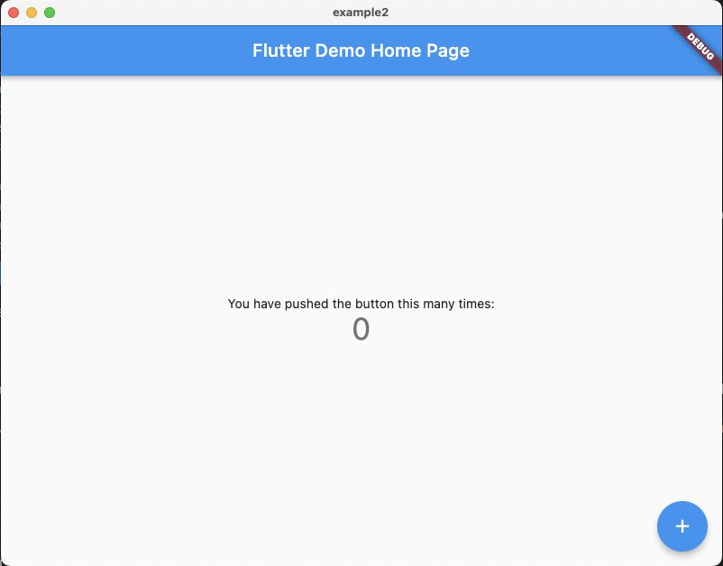
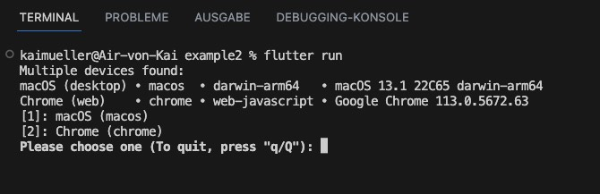
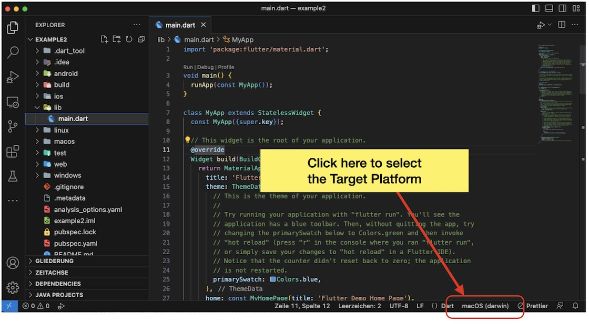
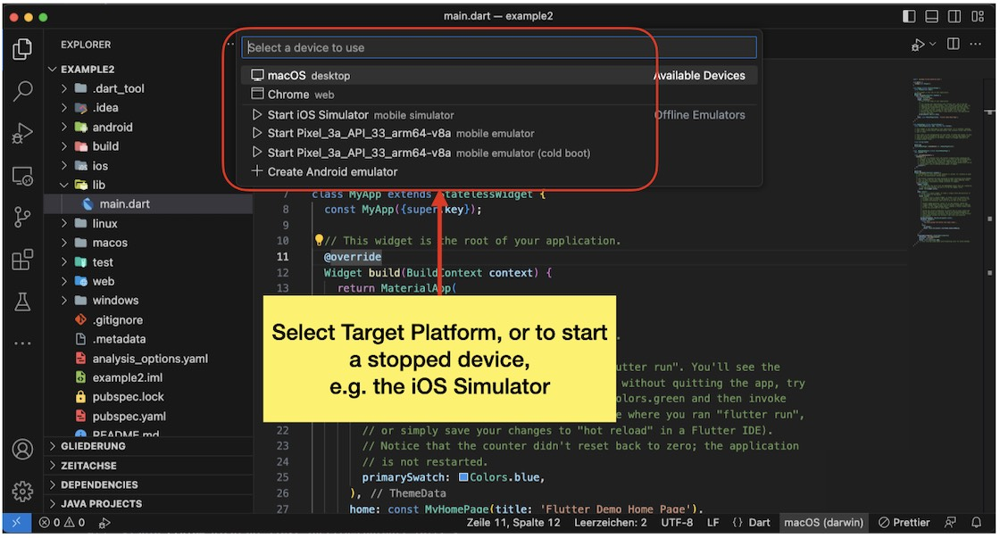
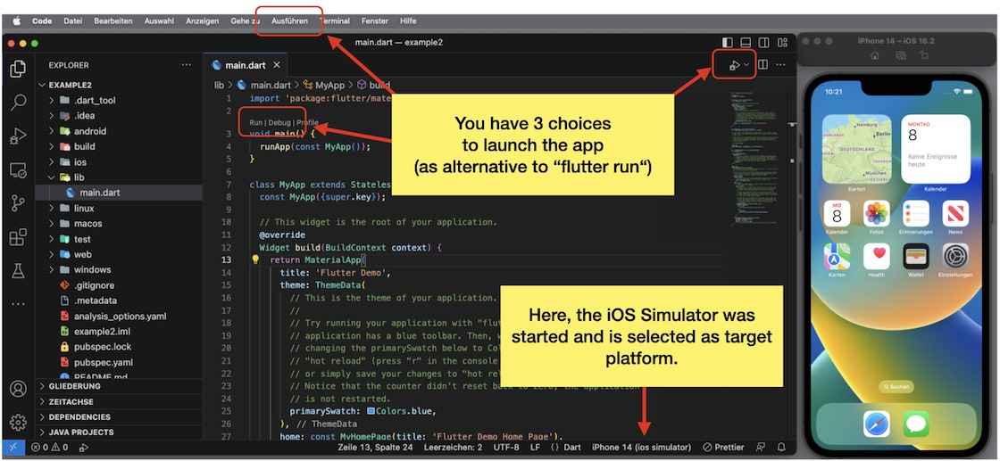
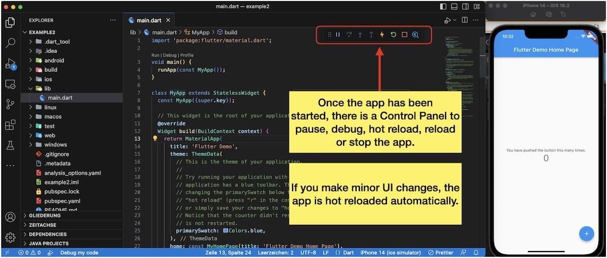

# Flutter only

---

Getting a bit familiar with Flutter Development in Visual Studio Code.

---

## Flutter Standard App

The purpose of this section is to get familiar with Flutter and how to work with it in Visual Studio Code. The _Flutter Default App_ is a small app that consists of only one file (main.dart). This app can be generated quickly, allowing you to practice how to launch the app on different target platforms using Visual Studio.

### Create the _Flutter Standard App_ in your Terminal App

```
flutter create <flutter_project_name>
```

Executing this command will generate a new folder in the current directory that includes all necessary files and subfolders for a Flutter project. The default application is a Counter App, featuring a screen with a number that can be incremented by tapping on a Floating Action Button.

<figure style="margin:0;"><figcaption style="font-size: 0.8em;text-align:center;"><p>Flutter Default App</p></figcaption></figure>

### Open the app in Visual Studio code

a) Switch into the subfolder _flutter_project_name_

```
cd <flutter_project_name>
```

b) Open VS Code by

```
code .
```

> On Windows, the command `code .` should work out of the box.
>
> If not working on Mac, you need to install the 'code' command once:
> Open up VS Code, go to View -> Command Palette (or use the shortcut, see _Keyboard Shortcuts_ below), type 'shell' and search for
> _Shell Command: Install 'code' command in PATH_. Click on it and it will install in seconds.

### Launch the App in different ways

Once Visual Studio Code is open you can launch the app in different ways.

a) By using `flutter run` command:

Open the Terminal in VS Code (see Shortcut below) and type in `flutter run`. If there are several targets, the execution is paused and you need to select the target:

<figure style="margin:0;"><figcaption style="font-size: 0.8em;text-align:center;"><p>Launching app by <i>flutter run</i></p></figcaption></figure>

b) By selecting the Target Platform first, and then by using one of several starting options **(ensure that the _main.dart_ file is open)**:

<figure style="margin:0;"><figcaption style="font-size: 0.8em;text-align:center;"><p>Current Target Platform - click to select another one</p></figcaption></figure>

<figure style="margin:0;"><figcaption style="font-size: 0.8em;text-align:center;"><p>Start and/or select a Target Platform</p></figcaption></figure>

<figure style="margin:0;"><figcaption style="font-size: 0.8em;text-align:center;"><p>Launch Options</p></figcaption></figure>

<figure style="margin:0;"><figcaption style="font-size: 0.8em;text-align:center;"><p>Control Panel</p></figcaption></figure>

When you launch the app using this method, any code changes you make will trigger a hot reload automatically. If you were to use "flutter run", you would need to manually press the "r" key to initiate a hot reload of the app.

## Keyboard Shortcuts (Visual Studio Code)

I find these ones especially practical in my daily use of VS Code to boost my productivity:

<table style="display: flex; justify-content: left;">
<tr><th style="text-align:left;padding:5px 20px;">Function</th><th style="text-align:left;padding:5px 20px;">Windows</th><th style="text-align:left;padding:5px 20px;">Mac</th><th>Usage</th></th></tr>
<tr><td style="white-space:nowrap;vertical-align:top;">Open Files quickly</td><td style="white-space:nowrap;vertical-align:top;">Ctrl + P</td>
<td style="white-space:nowrap;vertical-align:top;">Command + P</td><td style="vertical-align:top;">Use the shortcut and start typing the name of the file...</td></tr>
<tr><td style="white-space:nowrap;vertical-align:top;">Toggle left Sidebar</td><td style="white-space:nowrap;vertical-align:top;">Ctrl + B</td>
<td style="white-space:nowrap;vertical-align:top;">Command + B</td><td></td></tr>
<tr><td style="white-space:nowrap;vertical-align:top;">Toggle Terminal</td><td style="white-space:nowrap;vertical-align:top;">Ctrl + J</td>
<td style="white-space:nowrap;vertical-align:top;">Command + J</td><td></td></tr>
<tr><td style="white-space:nowrap;vertical-align:top;">Multi-Select Cursor</td><td style="white-space:nowrap;vertical-align:top;">Ctrl + D</td>
<td style="white-space:nowrap;vertical-align:top;">Command + D</td><td style="vertical-align:top;">When you need to change all occurences of a function or tag in a file, select one. Then use the short cut to select all and make your changes.</td></tr>
<tr><td style="white-space:nowrap;vertical-align:top;">Copy Line</td><td style="white-space:nowrap;vertical-align:top;">Shift + Alt + Up <br> Shift + Alt + Down</td>
<td style="white-space:nowrap;vertical-align:top;">Option + Shift + Up <br> Option + Shift + Down</td><td style="vertical-align:top;">Click in one line and use the shortcut.</td></tr>
<tr><td style="white-space:nowrap;vertical-align:top;">Open Command Palette</td><td style="white-space:nowrap;vertical-align:top;">Ctrl + Shift + P</td>
<td style="white-space:nowrap;vertical-align:top;">Command + Shift + P</td><td style="vertical-align:top;">Use the shortcut and start typing the command...</td></tr>
</table>

###

## Flutter Tutorial For Beginners In 1 Hour

When I first started exploring Flutter, I found this video to be particularly valuable. In addition to learning about the interplay of widgets and arguments, the tips on practical handling in VS Code were also very helpful to me.

<a href="https://www.youtube.com/watch?v=C-fKAzdTrLU" target="_blank">👉 &nbsp; Flutter Tutorial For Beginners In 1 Hour</a>

## Codelab from Google

As the creator of Flutter and Dart, Google has some excellent resources to make it easy for beginners to get started with Flutter. Here is a codelab that guides developers through the steps, which they can follow in their IDE. Simply click on the button _Start codelab_.

<a href="https://docs.flutter.dev/get-started/codelab" target="_blank">👉 &nbsp; A Codelab to write your first app</a>
