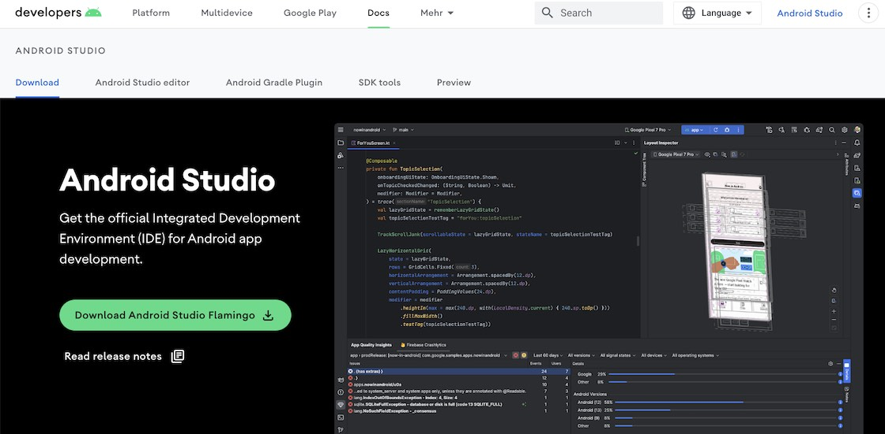

# Android Studio

---

For macOS, Windows and Linux: Get the official Integrated Development Environment (IDE) for Android app development.

---

<figure style="margin:0;border: 1px solid green;">
<a href="https://flutter.dev" target="_blank">
<figcaption style="font-size: 0.8em;text-align:center;">
Android Studio Website 
</figcaption>
</a>
</figure>

We primarily use Android Studio for managing SDKs and virtual devices, building and running apps, as well as for deployment purposes. However, when it comes to actual coding, we'll be using VS Code as our preferred editor.

So - in the context of Flutter - Android Studio is required for its tools used by Flutter under the hood.
