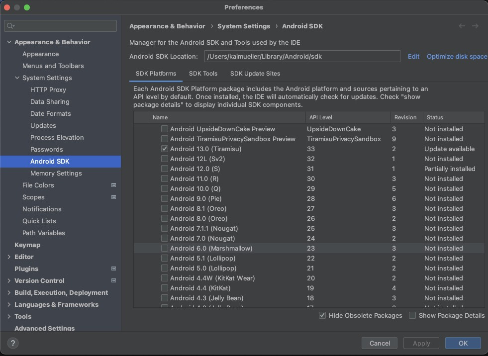
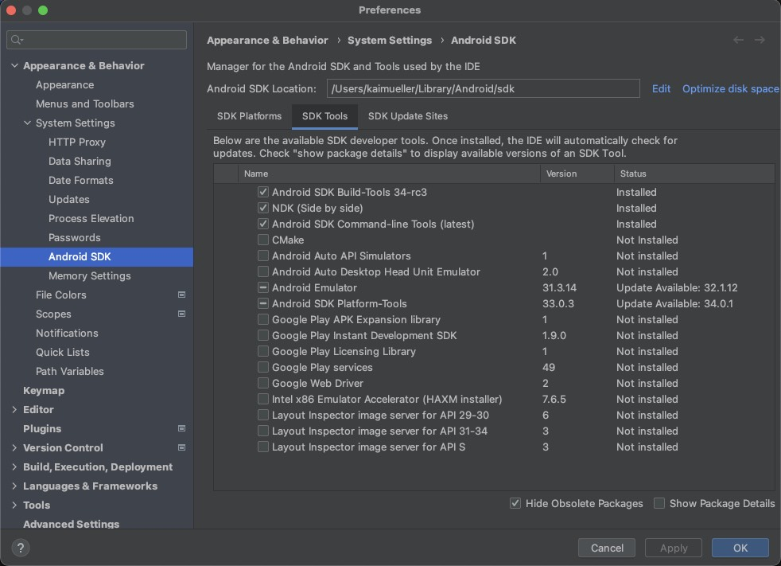
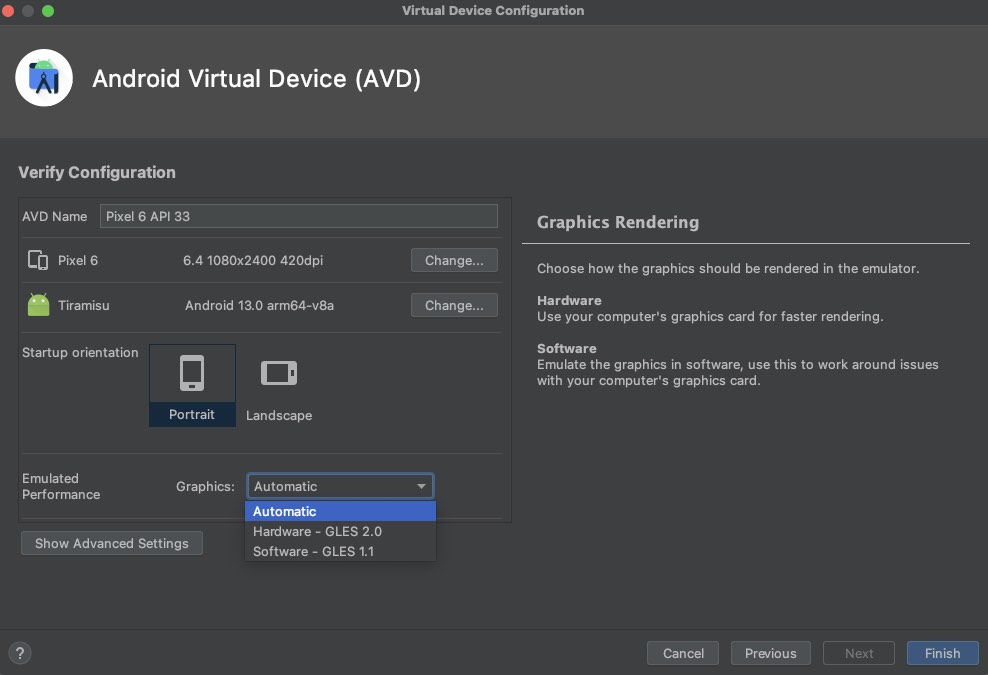
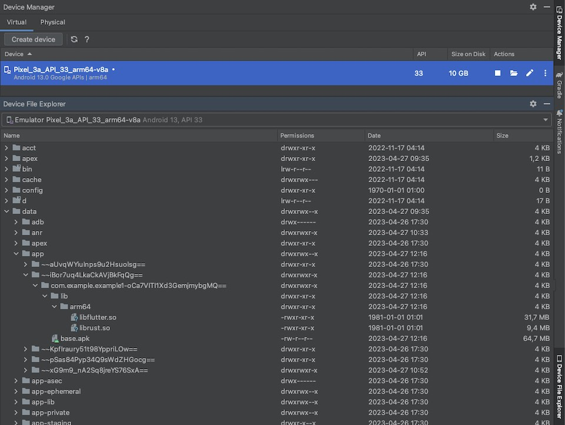

# Essentials

---

Android Studio with the Flutter Framework and the Flutter Rust Bridge.

---

## Managing the SDKs

The _SDK Manager_ is used for managing the software development kit (SDK) components of the Android platform. Its primary purpose is to facilitate the installation, removal, and updating of various SDK packages required for developing Android applications. It allows also to manage and update various _SDK Tools_ that are part of the Android development toolkit, such as the _Android SDK Build Tools_, the _Native Development Kit (NDK)_, and more.

### How to open SDK Manager

Start Android Studio. You can open the _SDK Manager_ in one of the following ways:

- via the "Welcome to Android Studio" Page: \
  If this page is open, there is dropdown menu "More Actions". Open it and select "SDK Manager".
- via the "Tools" Menu: \
  If Android Studio is open, open the "Tools" menu. You will find the item "SDK Manager".
- via the "Settings": \
  Open the "Settings..." in the "Android Studio" menu. \
  In the window, select the "Appearance & Behavior" -> "System Settings" -> "Android SDK" section.

> **Hint**: The Android SDK Location can be found here, too.

### SDK Platforms

To start the development with Flutter use the latest Android SDK Platform.

<figure style="margin:0;">
<figcaption style="font-size: 0.8em;text-align:center;">
SDK Platforms
</figcaption>
</figure>

### SDK Tools

In the second Tab, you can select the _SDK Tools_.

For Flutter development, select:

- Android SDK Build-Tools
- Android SDK Command-line Tools
- Android Emulator
- Android SDK Platform-Tools

To use the Flutter-Rust-Bridge, also select:

- NDK

<figure style="margin:0;">
<figcaption style="font-size: 0.8em;text-align:center;">
SDK Tools
</figcaption>
</figure>

## Managing the Virtual Devices

The Virtual Device Manager is a tool used for managing and creating virtual devices, also known as emulators. Emulators are software-based virtual devices that simulate the hardware and software configurations of real Android devices, allowing developers to test and run their applications without needing physical devices.

### How to open the Virtual Device Manager

Start Android Studio. You can open the _Virtual Device Manager_ in one of the following ways:

- via the "Welcome to Android Studio" Page: \
  If this page is open, there is dropdown menu "More Actions". Open it and select "Virtual Device Manager".
- via the "Tools" Menu: \
  If Android Studio is open, open the "Tools" menu. You will find the item "Device Manager".

### Which Virtual Device?

If you don't have a Virtual Device yet, click on "Create Device".

- Choose a phone, e.g. the "Pixel 6" or "Pixel 3a"
- As system image, choose the one corresponding to the installed Android SDK platform! \
  Keep the _ABI_ in mind, here "arm64-v8a". The _ABI_ information is used to configure the _build.gradle_ file later, in the context of the Flutter-Rust-Bridge configuration.
- For better performance, choose "Hardware - GLES 2.0" for _Graphics_.

<figure style="margin:0;">
<figcaption style="font-size: 0.8em;text-align:center;">
Create a Virtual Device
</figcaption>
</figure>

###

## Device File Explorer

Open the _Virtual Device Manager_ and start your Virtual Device by clicking on the _Play_ button. You'll notice that there is section called "Device File Explorer".

Later on, you can refer to the following location to retrieve information regarding stored files (RockDB, Stronghold Snapshot file) in your application's filesystem.

> **Path to AVD's filesystem**: Root -> data -> data -> {app.id}

<figure style="margin:0;">
<figcaption style="font-size: 0.8em;text-align:center;">
AVD filesystem
</figcaption>
</figure>

> For your information, the location of the cross-compiled Rust library can be found here:
>
> Root -> data -> app -> {temporary folder - use date to find the correct one} -> {app.id} -> lib

<figure style="margin:0;">
<figcaption style="font-size: 0.8em;text-align:center;">
Location of the cross-compiled Rust library <i>librust.so</i>
</figcaption>
</figure>
