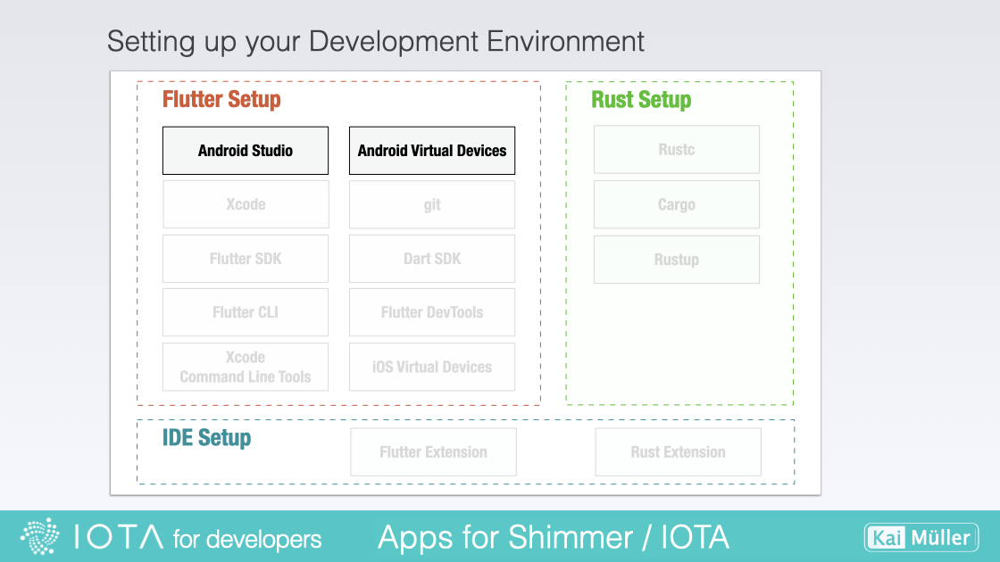

# Set up

---

Installing Android Studio on your system.

---

## Installing Android Studio

<figure style="margin:0;"><figcaption style="font-size: 0.8em;text-align:center;">
Setting up Android Studio
</figcaption></figure>

> Install the latest stable version of Android Studio:
>
> <a href="https://developer.android.com/studio" target="_blank">👉 &nbsp; Download Android Studio</a>

After downloading (several GBs...), install Android Studio:

- On Mac, drag Android Studio into the Applications folder.
- On PC, execute the installer and follow the wizard. Make sure to install also the "Android Virtual Device".

> Avoid Special Characters in your installation path!

Starting Android Studio the first time, a configuration wizard will start. Use "Custom" option, in order to check "Android SDK", an Android SDK Platform like "API 33: Android 13.0 (Tiramisu)" and, if selectable, "Android Virtual Device".

Go on to the next chapter, to get some essentials about the requirements for the development with Flutter and the Flutter Rust Bridge.
