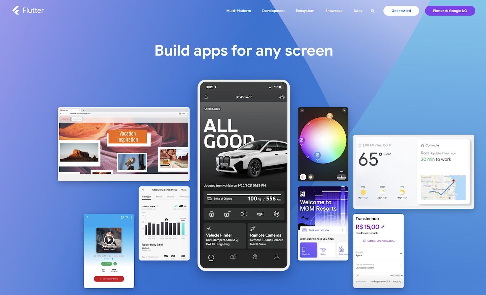
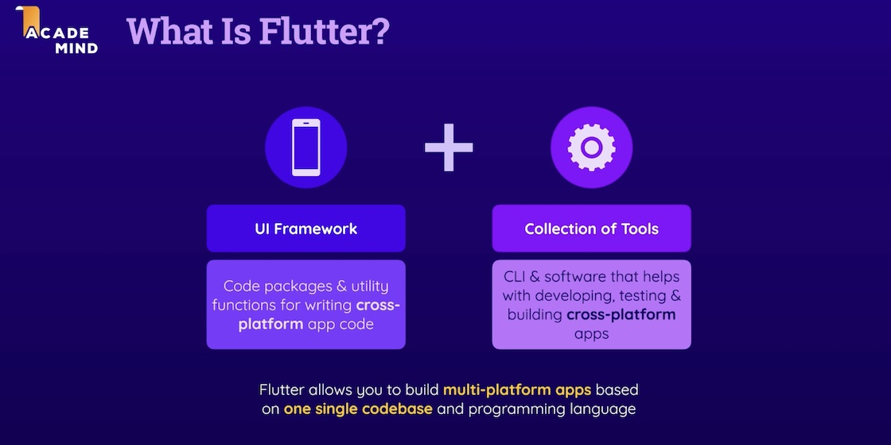
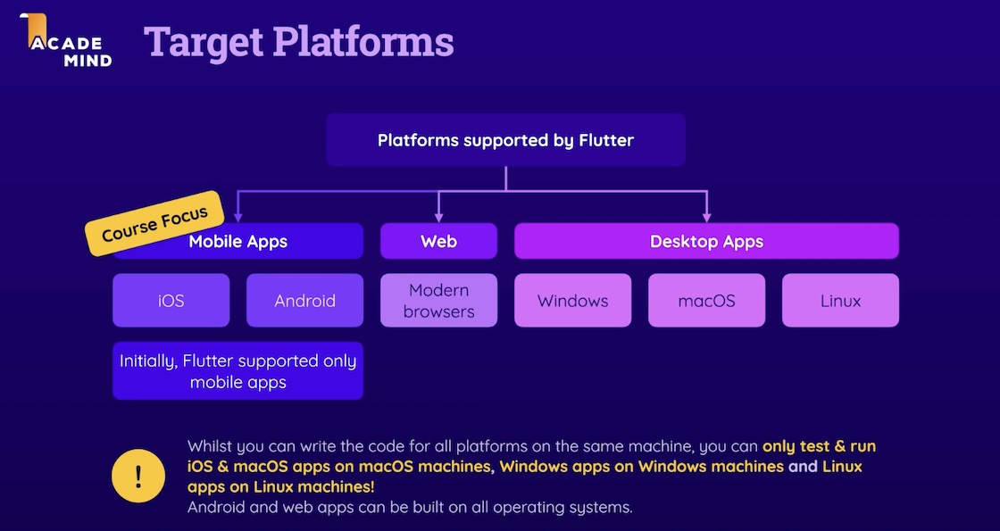

# Flutter

---

Building Cross-Platform Apps with Simplicity

---

<figure style="margin:0;border: 1px solid green;">
<a href="https://flutter.dev" target="_blank">
<figcaption style="font-size: 0.8em;text-align:center;">
Flutter Website 
</figcaption>
</a>
</figure>

Flutter, developed by Google, aims to provide developers with a unified codebase to build cross-platform applications that can be deployed on various targets. Originally designed to support mobile devices, Flutter has expanded its reach to include desktop platforms such as macOS, Windows, and Linux, as well as browser applications.

<figure style="margin:0;border: 1px solid green;">
<a href="https://acad.link/flutter" target="_blank">
<figcaption style="font-size: 0.8em;text-align:center;">
Courtesy of Academind / Maximilian Schwarzmüller
</figcaption>
</a>
</figure>

At its core, Flutter consists of two main components: the UI Framework and a Collection of Tools. The UI Framework encompasses a rich set of code packages that empower developers to create visually appealing user interfaces. The collection of tools, on the other hand, enables the transformation of a single codebase into machine code capable of running on diverse platforms.

<figure style="margin:0;border: 1px solid green;">
<a href="https://acad.link/flutter" target="_blank">
<figcaption style="font-size: 0.8em;text-align:center;">
Courtesy of Academind / Maximilian Schwarzmüller
</figcaption>
</a>
</figure>

Flutter uses Dart as programming language. It's important to note that while you can write Dart code for all platforms using Flutter, there are specific requirements for building and testing applications on different targets. Building apps for iOS/macOS necessitates a macOS computer with XCode installed, while building and running Windows apps requires a Windows machine, and the same goes for Linux. However, developing Android and browser apps can be done on any host machine, as Android Studio is compatible with multiple operating systems.
