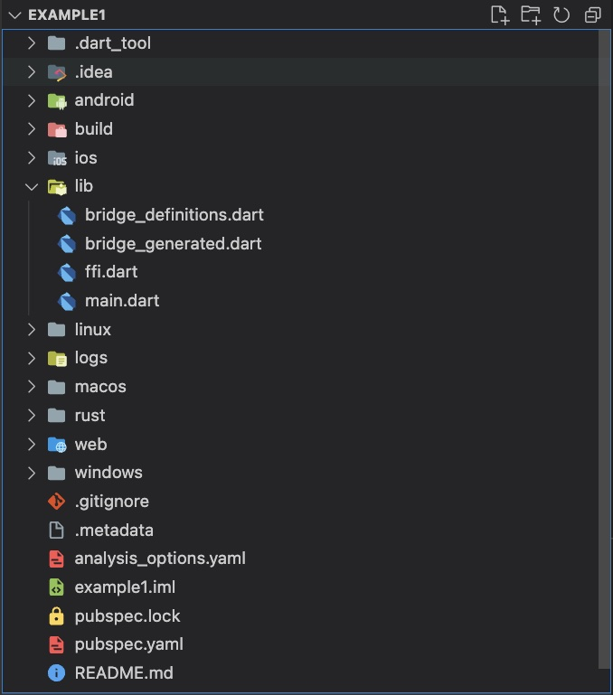
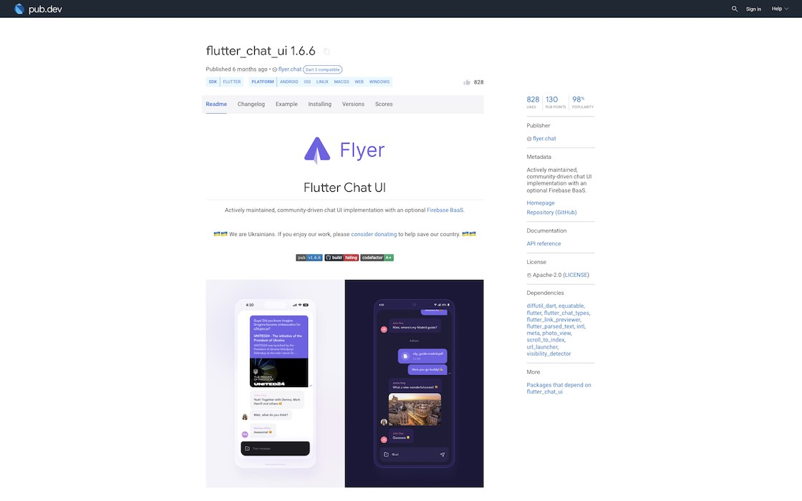

# Essentials

---

A glimpse into the project basics.

---

## Project structure

A typical Flutter project follows a specific structure that organizes the various components and resources of the application. Here is a description of the common project structure in a Flutter project:

**android**: This directory contains the Android-specific files and configurations for the Flutter project. It includes the Android manifest file, Gradle build scripts, and other resources specific to the Android platform.

**ios**: This directory holds the iOS-specific files and configurations. It includes the Xcode project, property list files, and other resources specific to iOS development.

**lib**: The lib directory is where the main Dart code for the Flutter application resides. It contains the main.dart file, which serves as the entry point for the application. Additionally, you can organize your code into multiple files or directories within the lib directory to improve code modularity and maintainability.

**macos**: This directory holds the macOS-specific files and configurations. It includes the Xcode project, property list files, and other resources specific to macOS development.

**test**: The test directory is used for writing unit tests and integration tests for your Flutter application. It typically contains test files and directories to organize your test code.

**assets**: The assets directory is where you can store static files such as images, fonts, and other resources required by your application. These files can be accessed using Flutter's asset management system.

**pubspec.yaml**: The pubspec.yaml file is a YAML-formatted configuration file that defines the project's metadata, dependencies, and assets. It specifies the required packages, version constraints, and additional resources like fonts or images.

<figure style="margin:0;border: 1px solid green;"><figcaption style="font-size: 0.8em;text-align:center;"><p style="margin: 4px 0 7px 0;">Project Structure</p></figcaption></figure>

## Packages

Packages ("Plugins") refer to pre-built libraries or modules that developers can use to add specific functionalities or features to their Flutter applications. They are created by the Flutter community, as well as by the official Flutter team at Google, and they help streamline the development process by providing ready-to-use code solutions for common tasks.

<a href="https://pub.dev/" target="_blank">👉 &nbsp; The official package repository for Dart and Flutter apps.</a>

### Example: Flutter Chat UI

In my "MQTT Chat App" project, I utilized the "Flutter Chat UI" package to swiftly integrate a chat user interface and interactive functionality with just a single installation instruction!

<figure style="margin:0;border: 1px solid green;">
<a href="https://pub.dev/packages/flutter_chat_ui" target="_blank">
<figcaption style="font-size: 0.8em;text-align:center;"><p style="margin: 4px 0 7px 0;">Package example: Flutter Chat UI</p></figcaption>
</a>
</figure>

## Package Manager & Configuration file

The Package Manager is used to manage dependencies, define project metadata, configure project-specific settings and facilitate the development workflow.

<table style="display: flex; justify-content: left;">
<tr>
<th style="text-align:left;padding:5px 20px;"></th>
<th style="text-align:left;padding:5px 20px;">Flutter / Dart</th>
<th style="text-align:left;padding:5px 20px;opacity:0.5;">Rust</th>
<th style="text-align:left;padding:5px 20px;opacity:0.5;">JavaScript / Node.js</th>
</tr>
<tr>
<td style="white-space:nowrap;vertical-align:top;"><b>Package Manager</b></td>
<td style="white-space:nowrap;vertical-align:top;">Pub</td>
<td style="white-space:nowrap;vertical-align:top;opacity:0.5;">Cargo</td>
<td style="white-space:nowrap;vertical-align:top;opacity:0.5;">npm</td>
</tr>
<tr>
<td style="white-space:nowrap;vertical-align:top;"><b>Configuration File</b></td>
<td style="white-space:nowrap;vertical-align:top;">pubspec.yaml</td>
<td style="white-space:nowrap;vertical-align:top;opacity:0.5;">Cargo.toml</td>
<td style="white-space:nowrap;vertical-align:top;opacity:0.5;">package.json</td>
</tr>
<tr>
<td style="white-space:nowrap;vertical-align:top;"><b>Package Repository</b></td>
<td style="white-space:nowrap;vertical-align:top;">https://pub.dev</td>
<td style="white-space:nowrap;vertical-align:top;opacity:0.5;">https://crates.io</td>
<td style="white-space:nowrap;vertical-align:top;opacity:0.5;">https://npmjs.org</td>
</tr></table>

###

> To add a package/plugin use the command:
>
> `flutter pub add <package>`

Once the package is installed, you'll find a list entry in the _pubspec.yaml_ file, as dependency.

### Example: pubspec.yaml of MQTT Chat App

```
name: mqttchat
description: A new Flutter project.
publish_to: "none" # Remove this line if you wish to publish to pub.dev
version: 1.0.0+1

environment:
  sdk: ">=2.19.0 <3.0.0"

dependencies:
  flutter:
    sdk: flutter

  cupertino_icons: ^1.0.2
  ffi: ^2.0.1
  flutter_rust_bridge: ^1.61.1
  freezed_annotation: ^2.2.0
  flutter_chat_ui: ^1.6.6
  ...
  uuid: ^3.0.7
  shared_preferences: ^2.0.17

dev_dependencies:
  flutter_test:
    sdk: flutter

  flutter_lints: ^2.0.0
  ffigen: ^7.2.4
  build_runner: ^2.3.3
  freezed: ^2.3.2

flutter:
  uses-material-design: true

  assets:
    - assets/messages.json
    - assets/smr.png
```

## Creating a project

> **Very important hints**
>
> 1. Don't use special characters or blanks (use "\_" instead) as project name and in your absolute project path!
>
> 2. Don't name your project like an existing public package! It could lead to circular dependencies. See the <a href="../../building-without-iota/flutter-and-rust/logging-example-app/resources.md">Logging Example App -> Resources</a> section as example.

To create an "empty" app use the command:

`flutter create --empty <project_name>`

To create Flutter's "default" app use the command:

`flutter create <project_name>`
