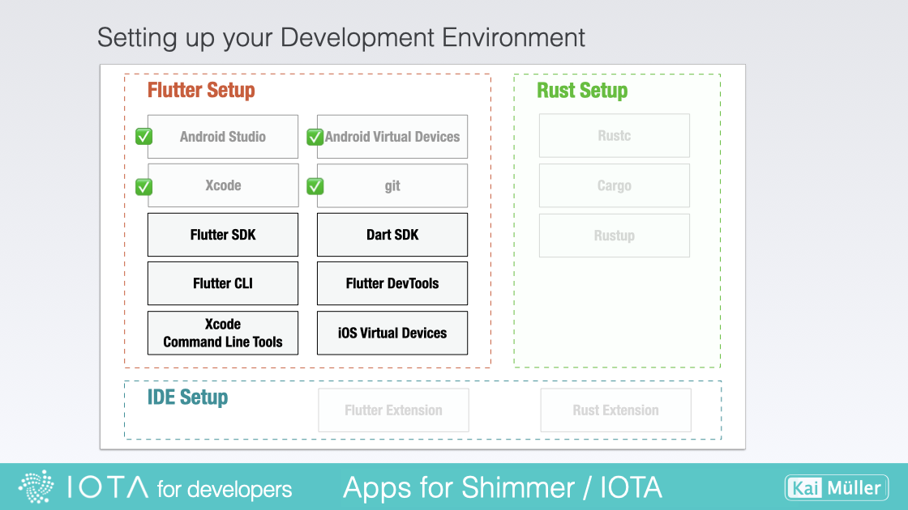
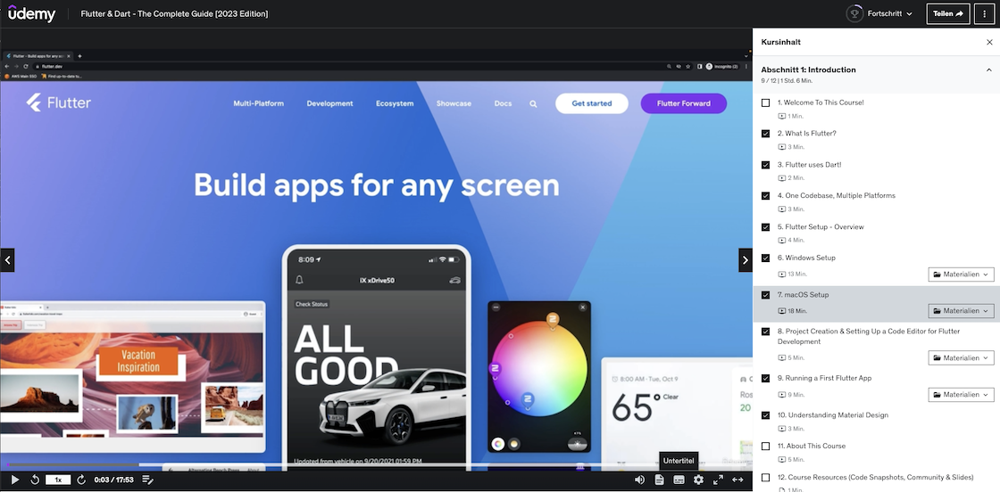

# Set up

---

Installing and upgrading Flutter on your system.

---

## Installing Flutter

<figure style="margin:0;"><figcaption style="font-size: 0.8em;text-align:center;">
Setting up Flutter
</figcaption></figure>

> For the most accurate and up-to-date installation instructions, please refer to the official guide:
>
> <a href="https://docs.flutter.dev/get-started/install" target="_blank">👉 &nbsp; Flutter Website - Get Started - Install Flutter</a>
>
> Avoid Special Characters and Blanks in your installation path!

When installing Flutter, it's important to note the differences between Mac and Windows systems. One of the system requirements is having Git installed, as Flutter utilizes it for installation and updates. On Windows, Git needs to be installed separately. However, on Mac, Git is conveniently included in Xcode. For a smooth installation experience, it is recommended to install Xcode before Flutter on Mac systems.

> **Mac Users**
>
> Even if you already have Xcode installed, go through the installation guide and check each step! For example, don't forget to add the Xcode Command-line tools.
>
> Side notes
>
> - To find out which shell you are using: `echo $SHELL`
> - To toggle hidden directories and files: `command + shift + .`

###

### Installation Tipp

If you're more inclined to watch an installation video, I've got a fantastic recommendation for you: I highly recommend checking out the tutorials by Maximilian Schwarzmüller from Academind.

> Now, let me make one thing clear — I'm not affiliated with Academind, and they definitely haven't slipped me any advertising cash (unfortunately). But I genuinely appreciate Max's work and the crystal-clear instructions he provides.

So, I wholeheartedly encourage you to check out his tutorial about _Flutter & Dart ("The complete guide [2023 Edition]")_ and see for yourself. Don't just take my word for it, folks! Discover the wonders of Flutter installation with Max's delightful guidance. There are **several free videos**: amongst others you'll find a guide about the _**macOS Setup**_ and one about the _**Windows Setup**_!

<figure style="margin:0;">
<a href="https://acad.link/flutter" target="_blank">
<figcaption style="font-size: 0.8em;text-align:center;">
Courtesy of Academind / Maximilian Schwarzmüller
</figcaption>
</a>
</figure>

###

## Upgrading Flutter

> As a general recommendation, I suggest deleting the `build` and `target` folders after upgrading the Flutter version.

To upgrade the Flutter SDK use this command:

`flutter upgrade`

To upgrade to the latest compatible versions of all the dependencies listed in the pubspec.yaml file, use the _flutter pub_ command:

`flutter pub upgrade`

Use this link for more information:

<a href="https://docs.flutter.dev/release/upgrade" target="_blank">👉 &nbsp; Flutter Docs - Stay up to date - Upgrade</a>

###

## Useful commands

- To find out where your Flutter SDK is located:

  `which flutter` or `where flutter`

- To find out which Flutter Version is installed:

  `flutter --version`

- To check the Flutter related tools on your working environment:

  `flutter doctor`
