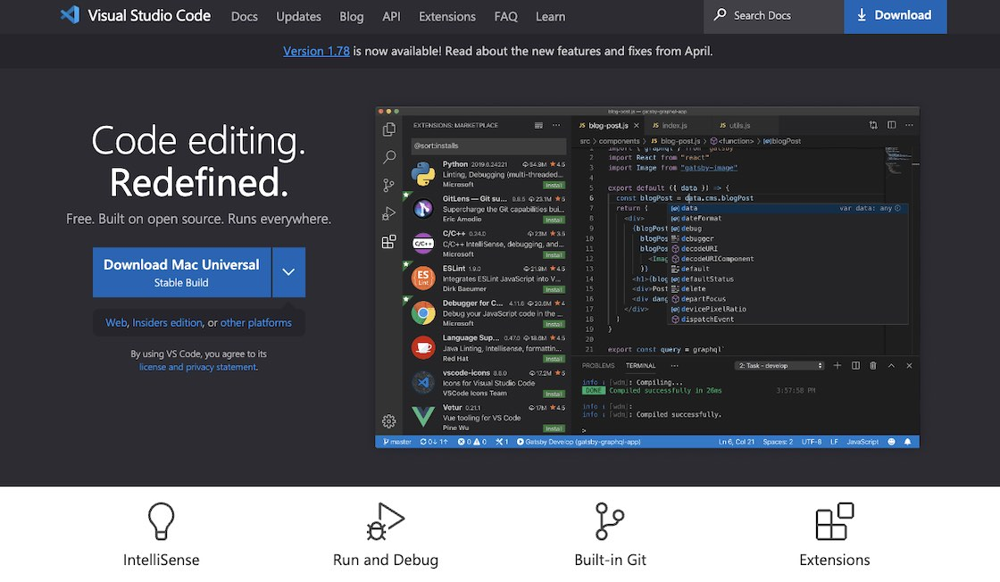

# IDE: Visual Studio Code

---

In _IOTA for Flutter_ I'm using Visual Studio Code as IDE. But Flutter is a friendly framework that plays well with other editors too!

---

<figure style="margin:0;">
<a href="https://code.visualstudio.com/" target="_blank">
<figcaption style="font-size: 0.8em;text-align:center;">
Visual Studio Code Website
</figcaption>
</a>
</figure>

> To use a different editor, please refer to Flutter's website and the different tabs provided:
>
> <a href="https://docs.flutter.dev/get-started/editor?tab=vscode" target="_blank">👉 &nbsp; Set up an editor</a>
