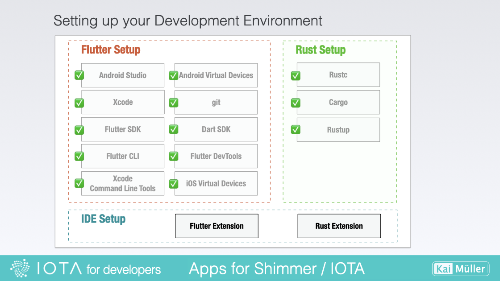
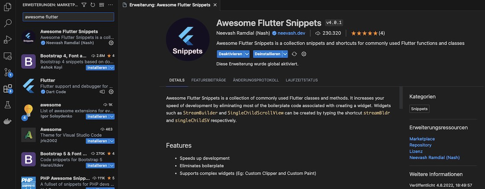
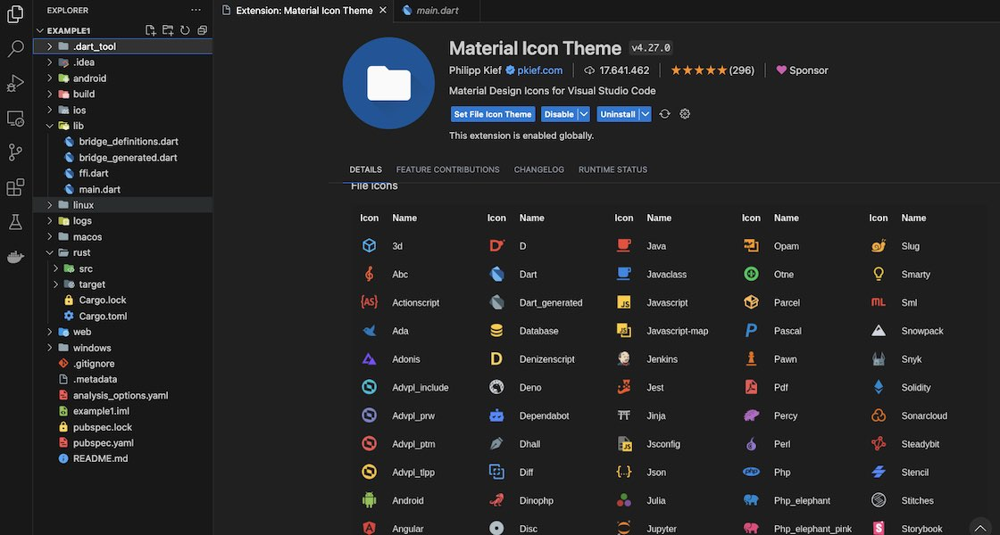

# Set up

---

Installing Visual Studio Code on your system.

---

## Installing VS Code

<figure style="margin:0;border: 1px solid green;"><figcaption style="font-size: 0.8em;text-align:center;">
Setting up Visual Studio Code
</figcaption></figure>

> Install the latest stable version of VS Code:
>
> <a href="https://code.visualstudio.com/Download" target="_blank">👉 &nbsp; Download VS Code</a>

The installation of extensions is optional and often a matter of personal work style. Below, I have listed a sample selection of extensions.

###

### Flutter Extension

I recommend to install the _Flutter_ Extension for VS Code. Read the section "Install the Flutter and Dart plugins" and follow the instructions:

<a href="https://docs.flutter.dev/get-started/editor?tab=vscode" target="_blank">👉 &nbsp; Set up an editor - Install the Flutter and Dart plugins</a>

Additionally I have installed the _Awesome Flutter Snippets_ extension:

<figure style="margin:0;border: 1px solid green;"><figcaption style="font-size: 0.8em;text-align:center;">
Extension <i>Awesome Flutter Snippets</i>
</figcaption></figure>

###

### Rust Extension

I am also using the _rust-analyzer_ Extension for VS Code. Read the section "Install the rust-analyzer extension" and follow the instructions:

<a href="https://code.visualstudio.com/docs/languages/rust" target="_blank">👉 &nbsp; Rust in Visual Studio Code</a>

### Others

The _Material Icon Theme_ extension provides pretty icons. It's up to you...

<figure style="margin:0;border: 1px solid green;"><figcaption style="font-size: 0.8em;text-align:center;">
Extension <i>Material Icon Theme</i>
</figcaption></figure>
