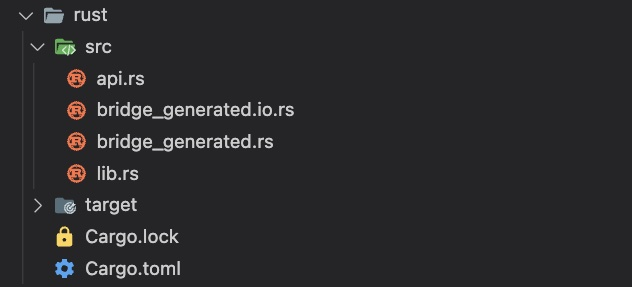
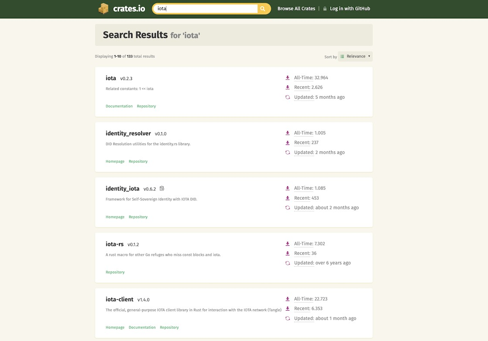

# Essentials

---

A glimpse into the project basics.

---

In the course of our Flutter-Rust project, when creating a Rust library with an API, we generate a Rust _Package_. For larger projects like the IOTA Libraries, the source code can be further organized using another Rust feature called _Workspace_. The complete organizational structure is explained in more detail in the separate chapter titled [Rust Project Structure](../../overview/iota-libraries/rust-project-structure.md).

## Package structure

A Rust Library Project includes the following elements:

**src**: This directory serves as the main location for the library's source code.

- **lib.rs**: The `lib.rs` file acts as the entry point. It acts as a central module where you can declare and organize the public items (functions, structs, enums, traits, etc.) that are intended to be accessible to other crates (projects) that depend on the library. These items are marked with the pub visibility keyword to make them visible outside of the library's crate.
- Additional source code files and subdirectories can be organized within the src directory to maintain a modular and organized codebase.

  > In the context of Flutter, Rust and the Flutter Rust Bridge, we organize the structure in the following way: The public functions and structs that are intended to be exposed in the API are code in the file `api.rs`. This file is then integrated as module into the `lib.rs` file.

**target**: This directory serves as the build location for the library. It will be automatically created once the `cargo build` command is used. In this directory, your storage space vanishes into thin air like a magical bunny in a hat! You can remove it whenever you like - but: Deleting comes at the expense of time. During the first build, all necessary resources are loaded, which takes time. If the directory exists, all subsequent builds are faster.

**Cargo.toml**: The Cargo.toml file acts as the manifest for the library project, defining metadata such as the package name, version, dependencies, and build configurations.

**Cargo.lock**: This file is an automatically generated file. When you build a Rust project using Cargo, it resolves the dependencies specified in the _Cargo.toml_ manifest file and generates the _Cargo.lock_ file. This file includes the specific versions of each dependency and their transitive dependencies that were resolved during the build process.

<figure style="margin:0;"><figcaption style="font-size: 0.8em;text-align:center;">
Project Structure
</figcaption></figure>

## Crates

A _Crate_ acts as a unit of code organization and encapsulation, providing a way to manage and share code functionality.

Crates can also have dependencies on other crates, allowing them to utilize external code and libraries. The dependencies are declared in the Cargo.toml file of the crate, under the [dependencies] section.

> In our context, the wallet.rs library (crate name: "iota-wallet") library includes the iota.rs library (crate name: "iota-client"), amongst others.

---

<a href="https://crates.io" target="_blank">👉 &nbsp; The Rust community's crate registry</a>

---

### Example: Search for "IOTA" crates

<figure style="margin:0;"><figcaption style="font-size: 0.8em;text-align:center;">
Search Result for "IOTA" crates
</figcaption></figure>

## Package Manager & Configuration file

The Package Manager is used to manage dependencies, define project metadata, configure project-specific settings and facilitate the development workflow.

<table style="display: flex; justify-content: left;">
<tr>
<th style="text-align:left;padding:5px 20px;"></th>
<th style="text-align:left;padding:5px 20px;opacity:0.5;">Flutter / Dart</th>
<th style="text-align:left;padding:5px 20px;">Rust</th>
<th style="text-align:left;padding:5px 20px;opacity:0.5;">JavaScript / Node.js</th>
</tr>
<tr>
<td style="white-space:nowrap;vertical-align:top;"><b>Package Manager</b></td>
<td style="white-space:nowrap;vertical-align:top;opacity:0.5;">Pub</td>
<td style="white-space:nowrap;vertical-align:top;">Cargo</td>
<td style="white-space:nowrap;vertical-align:top;opacity:0.5;">npm</td>
</tr>
<tr>
<td style="white-space:nowrap;vertical-align:top;"><b>Configuration File</b></td>
<td style="white-space:nowrap;vertical-align:top;opacity:0.5;">pubspec.yaml</td>
<td style="white-space:nowrap;vertical-align:top;">Cargo.toml</td>
<td style="white-space:nowrap;vertical-align:top;opacity:0.5;">package.json</td>
</tr>
<tr>
<td style="white-space:nowrap;vertical-align:top;"><b>Package Repository</b></td>
<td style="white-space:nowrap;vertical-align:top;opacity:0.5;">https://pub.dev</td>
<td style="white-space:nowrap;vertical-align:top;">https://crates.io</td>
<td style="white-space:nowrap;vertical-align:top;opacity:0.5;">https://npmjs.org</td>
</tr></table>

###

> To add a package/crate use the command:
>
> `cargo add <crate_name>`
>
> **I use the alternative way to include a crate**:
>
> Simply add it directly to the [dependencies] section of the _Cargo.toml_ manifest file.

## Rustup and Toolchains

<a href="https://rust-lang.github.io/rustup/index.html" target="_blank">👉 &nbsp; The Rustup documentation</a>

Rustup is a version manager that allows you to easily install, manage, and switch between different toolchains.

A toolchain refers to a specific version of the Rust compiler and associated tools that are used to compile, build, and manage projects. It includes the Rust compiler itself, the standard library, and other essential components required for Rust development.

Having multiple toolchains allows developers to work with different Rust language features, test compatibility across versions, and ensure their code works as intended in different Rust environments.

The Terminal command

`rustup show`

provides an overview of the Rust installation details, such as the installed toolchains, the currently active toolchain, and the associated components like cross-compiling targets.

## Creating a new Rust Library Project

> **Important**: Before you create the new project ensure that you are in the correct folder. To create the Rust Library Project for _IOTA for Flutter_, the Flutter Project must exist, and your Terminal prompt needs to be in the root directory of the Flutter Project.

To create the Rust Library Project, execute the command:

`cargo new --lib <crate_name>`

I always use the crate name _rust_. In that case, a new subfolder _rust_ is created.
