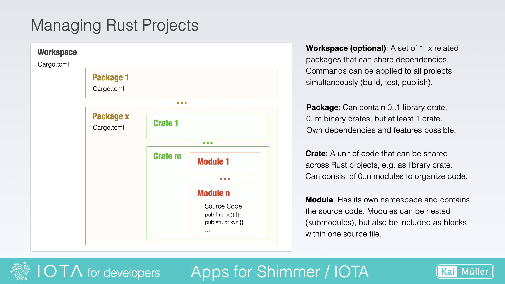
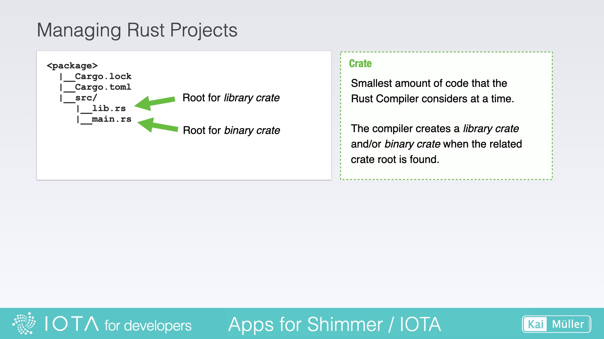
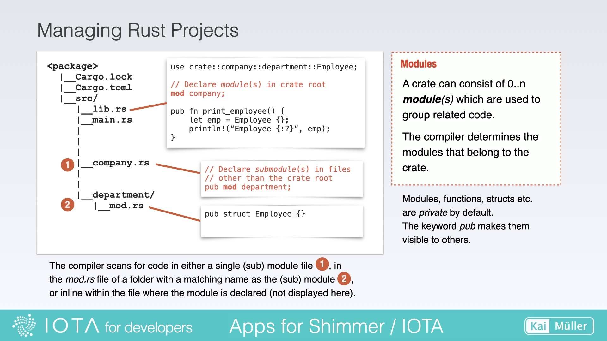
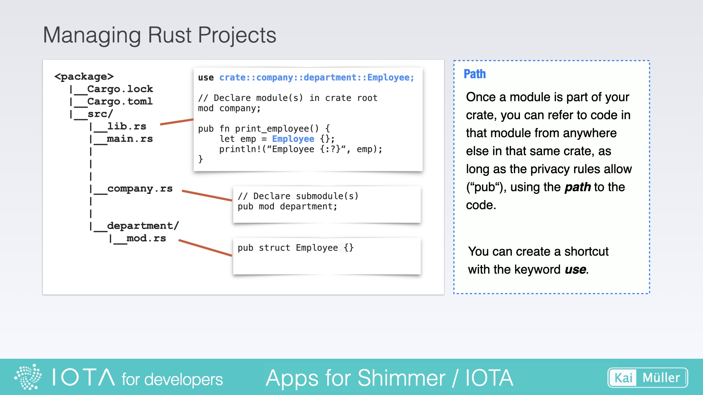

# Project Structure

---

Code's organization: Learn the basics of Rust's _module system_ to analyze a project.

---

## Workspace and Packages

A _Workspace_ is a feature provided by Cargo (Rust's package manager and build tool) that allows you to manage multiple related _Packages_ within a single directory. Workspaces are optional.

By organizing packages as part of a workspace, you can share dependencies, coordinate builds, and simplify the development and testing of interconnected projects.

Workspace and packages each have their own Cargo.toml file.

<figure style="margin:0;"><figcaption style="font-size: 0.8em;text-align:center;"><p>Rust Project Structure</p></figcaption></figure>

## Crates

A _Crate_ is a self-contained unit of code that encapsulates a set of functionality, typically organized into modules, structs, enums, traits, and functions. This unit of code can be shared, imported, and used in other codebases.

Crates can be published to the Rust community's _Crate Registry_, allowing developers to include them as dependencies in their projects:

> <a href="https://crates.io/" target="_blank">👉 &nbsp; The Rust community’s Crate Registry (https://crates.io/)</a>
>
> Hint: Search for the keyword _iota_ in the
> registry to get a list of IOTA related crates.

There are two types of crates: _library crates_ expose public functions or items , and _binary crates_ which are executable programs. A package can contain the source code of one or several crates.

<figure style="margin:0;"><figcaption style="font-size: 0.8em;text-align:center;"><p>Crates</p></figcaption></figure>

## Modules

A _Module_ is a way to organize and group related code within a crate. It allows for logical separation and encapsulation of functionality, helping to keep code organized and maintainable.

<figure style="margin:0;"><figcaption style="font-size: 0.8em;text-align:center;"><p>Modules</p></figcaption></figure>

### Declaring and defining a module

There is a distinction between declaring and defining a module.

**Declaring a module**: Declaring a module is the process of creating a module and specifying its name and structure. It is done using the `mod` keyword, followed by the module name and a block of code that defines the contents of the module. When you declare a module, **you are essentially creating a namespace** and organizing code within that namespace. You can declare modules in the same file or in separate files, and you can nest modules within other modules.

**Defining a module**: Defining a module involves implementing the functionality and providing the actual code within the declared module. It includes writing functions, structs, traits, and other items that make up the module's implementation. When you define a module, you are filling it with the necessary code and logic to perform specific tasks or provide certain functionality.

Here's an example to illustrate the difference:

```rust,ignore
// Declaration of a module named "department" (here: inline within a file)
pub mod department {
    // Definition of a struct within the module
    pub struct Employee {
        // struct fields
    }

    // Definition of a function within the module
    pub fn list_employees() {
        // function implementation
    }
}

// Usage
fn main() {
    // Accessing the defined module and its items
    let employee = department::Employee {};
    department::list_employees();
}
```

## Paths

A _Path_ refers to the location of a module or item (e.g. structs, enums, functions) within the project's directory structure. It represents the hierarchical structure of directories and subdirectories.

The `use` keyword in Rust is used to bring items from a module or crate into scope, allowing them to be accessed without fully qualifying their paths. It provides a way to conveniently reference items by their short names instead of using their full paths every time.

The requirement, however, is that the used modules and items are public (indicated by the keyword `pub`).

<figure style="margin:0;"><figcaption style="font-size: 0.8em;text-align:center;"><p>Paths</p></figcaption></figure>

In Rust, _paths_ and _namespaces_ are interrelated concepts that help organize and reference code elements. For example:

```rust,ignore
// Declaration of the modules (here: inline within a file)
mod company {
    pub mod department {
        pub fn list_employees() {
            // Function implementation
        }
    }
}

// Usage
fn main() {
    company::department::list_employees();
}
```

---

And here are some official links:

<a href="https://doc.rust-lang.org/book/ch07-00-managing-growing-projects-with-packages-crates-and-modules.html" target="_blank">👉 &nbsp; Rust documentation - Managing Growing Projects with Packages, Crates, and Modules</a>

<a href="https://doc.rust-lang.org/book/ch14-03-cargo-workspaces.html" target="_blank">👉 &nbsp; Rust documentation - Cargo Workspaces</a>

<a href="https://doc.rust-lang.org/reference/visibility-and-privacy.html#pubin-path-pubcrate-pubsuper-and-pubself" target="_blank">👉 &nbsp; Rust reference - Visibility and Privacy</a>

---

## What else is good to know?

In Rust, the **implementation** of structs **can be split into different files** to improve code organization and maintainability. This allows you to separate different aspects of the struct's implementation, such as methods, associated functions, and trait implementations, into separate files.

However, it's important to note that **a struct itself can only be defined in a single file**. This ensures that the struct has a single, unambiguous definition within your project.

**File 1: employee.rs**

```rust,ignore
// employee.rs

pub struct Employee {
    pub name: String,
    pub age: u32,
    pub position: String,
}

impl Employee {
    pub fn new(name: String, age: u32, position: String) -> Self {
        Employee {
            name,
            age,
            position,
        }
    }

    pub fn display_info(&self) {
        println!("Name: {}, Age: {}, Position: {}", self.name, self.age, self.position);
    }
}
```

**File 2: employee_utils.rs**

```rust,ignore
// employee_utils.rs

impl Employee {
    pub fn calculate_salary(&self) -> u32 {
        // Calculation logic goes here
        5000
    }
}

```
