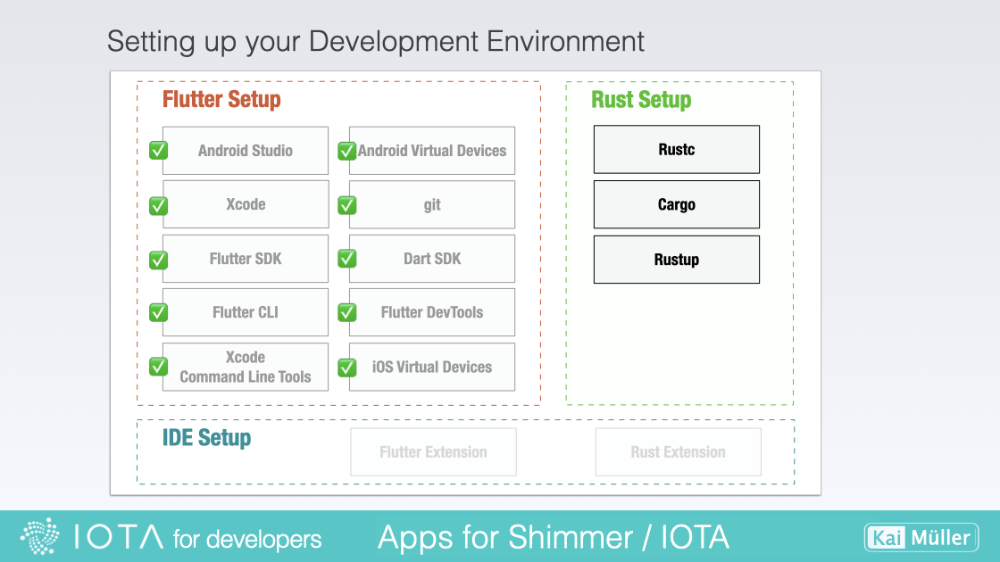

# Set up

---

Installing Rust on your system.

---

## Installing Rust

<figure style="margin:0;border: 1px solid green;"><figcaption style="font-size: 0.8em;text-align:center;">
Setting up Rust
</figcaption></figure>

> Quickly set up your Rust development environment:
>
> <a href="https://www.rust-lang.org/tools/install" target="_blank">👉 &nbsp; Install Rust</a>
>
> Alternatively, use the "Getting started" website:
>
> <a href="https://www.rust-lang.org/learn/get-started" target="_blank">👉 &nbsp; Rust - Getting started</a>

When installing Rust, the recommended approach is to use **rustup**, a versatile tool that serves as both an installer and version manager for Rust.

With rustup, you gain access to a comprehensive toolset that enhances your Rust development experience. It includes **rustc**, the rust compiler responsible for translating your Rust code into executable binaries or libraries.

**Cargo**, another essential component, is the Rust package manager. It also simplifies dependency management, project building, testing, and more, serving as a valuable asset in your Rust workflow.

rustup also offers rustfmt and clippy. rustfmt is a source code formatter that ensures consistent and elegant formatting in your Rust codebase. On the other hand, clippy is a Rust linter that helps identify potential issues and provides helpful suggestions to improve your code.

So, everything starts with installing rustup.

On macOS, Linux, or another Unix-like OS, to download rustup and install Rust, run the following in your terminal, then follow the on-screen instructions.

`curl --proto '=https' --tlsv1.2 -sSf https://sh.rustup.rs | sh`

### Was the installation successful?

Open a _new_ shell and type the following:

`rustc --version`

If there is a meaningful output displaying `rustc <version>` then the installation was successful.

## Updating Rust

Rust updates very frequently. If you have installed Rustup some time ago, chances are your Rust version is out of date. Get the latest version of Rust by running:

`rustup update`
