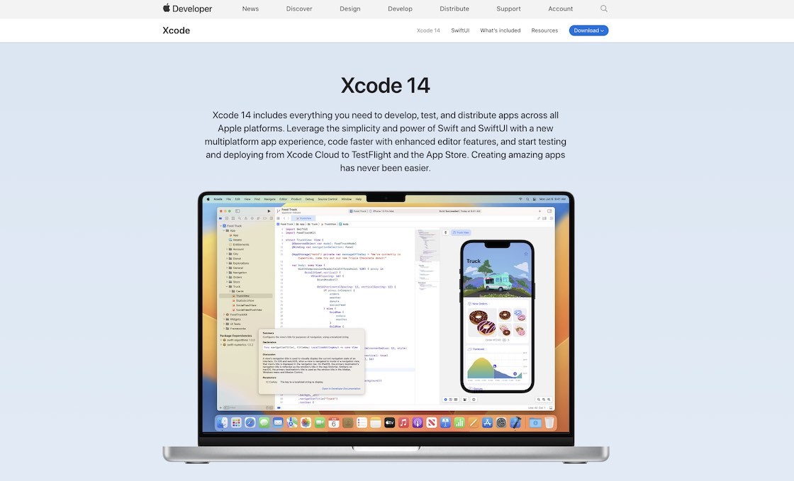

# Xcode

---

For macOS only: Apple's Integrated Development Environment (IDE) for iOS, macOS, watchOS, and tvOS Applications.

---

<figure style="margin:0;border: 1px solid green;">
<a href="https://developer.apple.com/xcode/" target="_blank">
<figcaption style="font-size: 0.8em;text-align:center;">
Xcode Website
</figcaption>
</a>
</figure>

Similar to the usage of Android Studio, we use Xcode for managing virtual devices, building and running apps, as well as for deployment purposes. However, when it comes to actual coding, we'll be using VS Code as our preferred editor.

So - in the context of Flutter - Xcode is required for its tools used by Flutter under the hood.

> **Important note**
>
> During the work with certain IOTA libraries and the _Flutter Rust Bridge_, it was sometimes necessary to launch the app directly from Xcode. In certain situations, it deviated from the usual procedure of starting the app with "flutter run" and instead required a workaround through Xcode.
