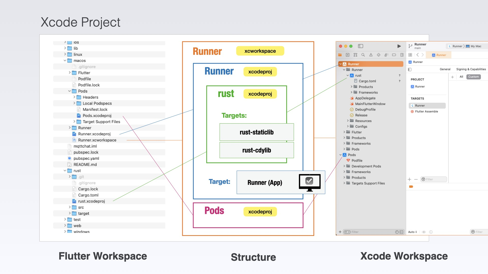
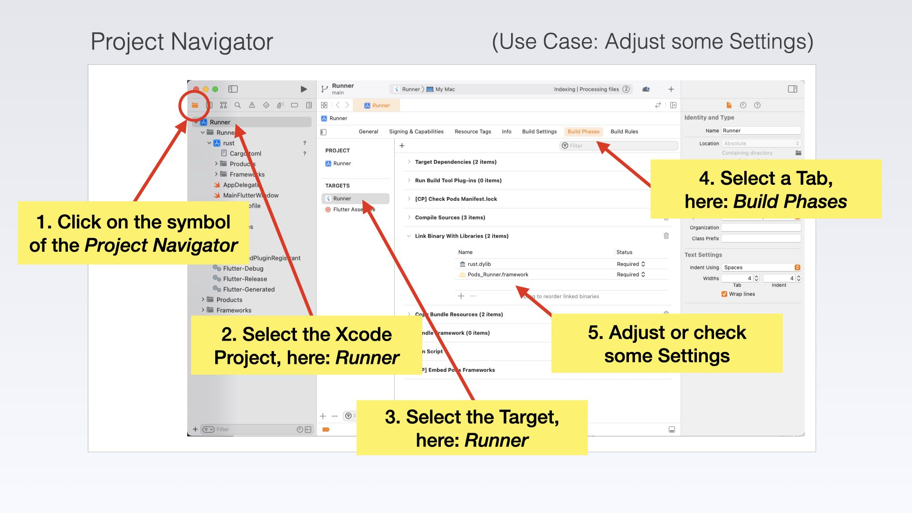
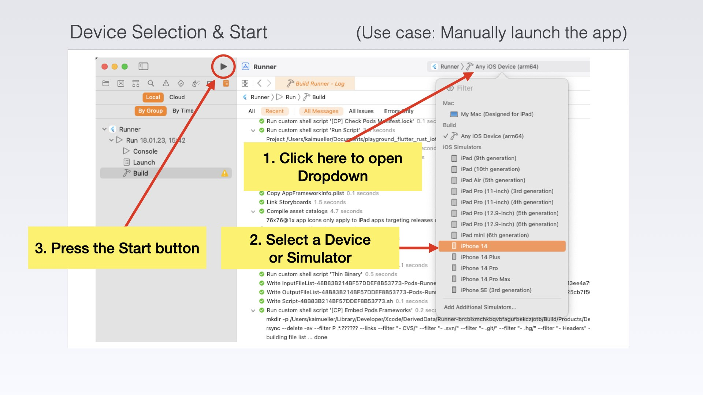
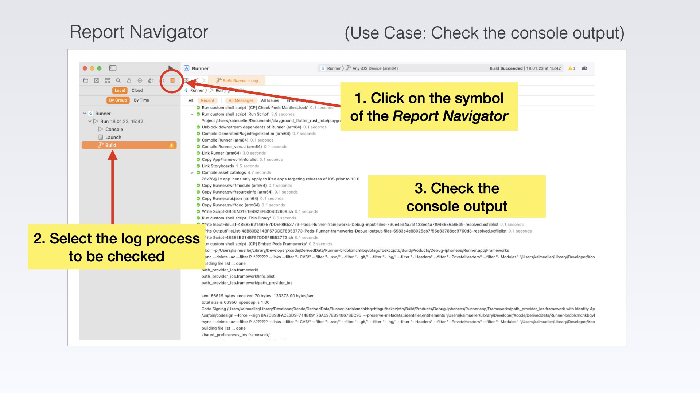

# Essentials

---

Xcode: Where Complexity Unfolds, Humor Helps Break the Mold.

---

At first glance, Xcode resembles an airplane cockpit: Overwhelming and seemingly impossible to navigate. But here's the thing: You don't need to fiddle with most of the settings.

Flutter has taken care of generating the Xcode project for you. As for the second Xcode project for the Rust library (mentioned below), that's created by cargo-xcode.

So, don't worry! All you need to do is grasp a few essential concepts and locate some helpful resources to find your way around. And hey, who knows, maybe you'll even learn to enjoy the Xcode experience, despite its initial complexity!

## Project structure

A Xcode project follows a specific structure that organizes the various files and resources used to build an macOS or iOS application.

**Project File**: A project file with the extension _.xcodeproj_ or _.xcworkspace_ serves as the entry point for the Xcode project. It contains information about the project settings, build configurations, and references to all the project files.

- The **_.xcodeproj_** file is the traditional project file used in Xcode. It represents a single Xcode project and is used for organizing and building a single target, such as an iOS app, extension, or framework. It contains project settings, build configurations, and references to all the project files specific to that target.
- The **_.xcworkspace_** file, on the other hand, is used when you have multiple Xcode projects or multiple targets that depend on each other. It is a workspace file that can include one or more _.xcodeproj_ files and their associated targets. The _.xcworkspace_ file acts as a container that allows you to work on and build multiple projects or targets together in a unified workspace.

**Targets**: An Xcode project can have one or more targets. Each target represents a distinct product, such as the main app, extensions, or test suites. Targets contain the necessary build settings, dependencies, and references to source files.

**Source Code**: The source code files are organized within groups or folders. The default group is typically named after the project and contains the main application's source code files. Additional groups can be created to organize code files into logical categories or features.

**Frameworks and Libraries**: Xcode projects often use external frameworks and libraries to extend functionality or reuse code. These dependencies are managed within the project and are listed in the "Frameworks and Libraries" section. They can be system frameworks, third-party libraries, or custom frameworks.

> In the Flutter/Rust context, the Rust Code is a separate Xcode Project which is included as "subproject" into the main project. This Xcode Project is created by the tool _cargo-xcode_.

**Configuration Files**: Configuration files, such as `Info.plist`, contain essential metadata about the application, including its bundle identifier, version, required device capabilities, and permissions.

**Build Settings**: Xcode provides an interface to configure build settings for the project and individual targets. These settings control compiler flags, optimization settings, code signing, deployment targets, and various other project-specific configurations.

<figure style="margin:0;border: 1px solid green;">
<a href="../../assets/xcode/xcode_project.jpg" target="_blank">
<figcaption style="font-size: 0.8em;text-align:center;">
Xcode Project (click to enlarge)
</figcaption>
</a>
</figure>

The interaction of this structure, composed of multiple Xcode projects, becomes more apparent when we build applications for macOS resp. iOS in the practical chapters.

At this stage, it's worth mentioning that there exists a dedicated Rust Xcode project _rust.xcodeproj_. This project is created during an initialization step of the _Flutter Rust Bridge_ for macOS or iOS. It includes a script ("Build Rule") that serves the purpose of generating a static or dynamic library and integrating it into the build process of the main Xcode project _Runner.xcodeproj_ for the app.

###

## Static and dynamic libraries

Static and dynamic libraries are both forms of code libraries, but they differ in how they are linked and loaded into an application.

**Static Libraries**:

- A static library, also known as a static link library, is a compiled set of object code that is **linked directly into an executable at the time of compilation**. The library code becomes part of the final executable binary.
- When an application is built with a static library, **all the library code is copied into the resulting binary**. This means that the application becomes self-contained and doesn't rely on the presence of the library during runtime.
- **Static libraries are typically denoted by file extensions like .a (on macOS and iOS) or .lib (on Windows)**. They provide a way to distribute pre-compiled code that can be linked with multiple applications without needing to distribute the library separately.

**Dynamic Libraries**:

- A dynamic library, also called a shared library or dynamic link library (DLL), is a separate binary file containing compiled code that **can be loaded and linked by multiple applications at runtime**.
- Unlike static libraries, dynamic libraries **are not copied into the application binary**. Instead, the application references the dynamic library and loads it dynamically during runtime.
- Dynamic libraries offer advantages such as code sharing among multiple applications and the ability to update the library independently without recompiling the applications that depend on it.
- **Dynamic libraries are usually denoted by file extensions like .dylib (on macOS and iOS) or .dll (on Windows)**.

###

## IDE Basics

### Project Navigator

Click on the leftmost symbol in the left pane. This will activate the _Project Navigator_. It can be used to configure project settings or adjust the project structure, such as adding libraries or other Xcode projects (by dragging them into the workspace).

<figure style="margin:0;border: 1px solid green;">
<a href="../../assets/xcode/xcode_ide.001.jpg" target="_blank">
<figcaption style="font-size: 0.8em;text-align:center;">
Project Navigator (click to enlarge)
</figcaption>
</a>
</figure>

### Device or Simulator Selection / Launch the app manually

Normally, Flutter automatically builds and launches the macOS/iOS app. It uses the preselected device (if connected to your Mac) or Simulator.

You can switch the device by selecting a different one from the drop-down menu.

In some cases, you may need to manually start your app instead of using Flutter. In such cases, use the Play button.

<figure style="margin:0;border: 1px solid green;">
<a href="../../assets/xcode/xcode_ide.002.jpg" target="_blank">
<figcaption style="font-size: 0.8em;text-align:center;">
Device Selection and Start App (click to enlarge)
</figcaption>
</a>
</figure>

### Report Navigator

<figure style="margin:0;border: 1px solid green;">
<a href="../../assets/xcode/xcode_ide.003.jpg" target="_blank">
<figcaption style="font-size: 0.8em;text-align:center;">
Report Navigator (click to enlarge)
</figcaption>
</a>
</figure>
