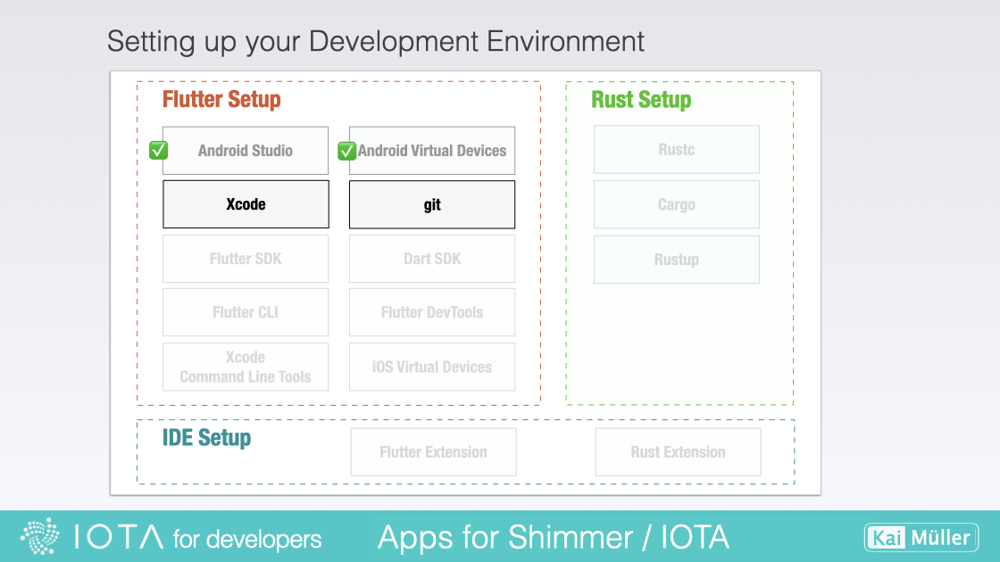

# Set up

---

Installing Xcode on your system.

---

## Installing Xcode

<figure style="margin:0;"><figcaption style="font-size: 0.8em;text-align:center;">
Setting up Xcode
</figcaption></figure>

> Download (several GBs...) and install the latest stable version of Xcode using one of these sources:
>
> <a href="https://itunes.apple.com/us/app/xcode/id497799835" target="_blank">👉 &nbsp; Xcode in Mac App Store</a>
>
> <a href="https://developer.apple.com/xcode/" target="_blank">👉 &nbsp; Xcode Web Download</a>
