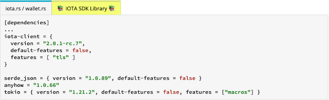
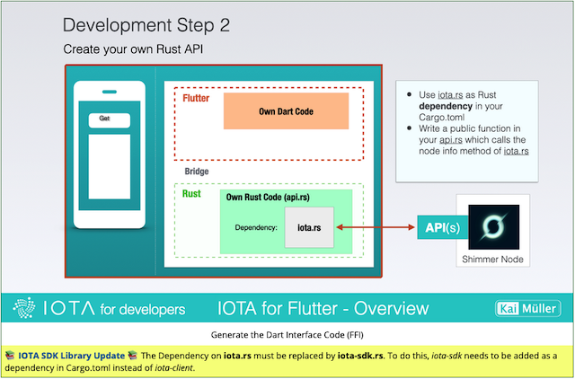

# 💡 READ ME !

---

IOTA SDK = iota.rs + wallet.rs

---

## About this Tutorial

The tutorial was written between April 2023 and February 2024. The contents come together to form a whole, namely: texts and images on this homepage, the source code on Github, and the videos on Youtube.

All information therein refered to the latest Rust libraries from IOTA during the mentioned period: iota.rs (client library/wrapper for IOTA node's API), wallet.rs (including Stronghold), and identity.rs. Only in the chapter about the Playground App did I use the IOTA SDK.

## The IOTA SDK

<a href="https://github.com/iotaledger/iota-sdk" target="_blank">👉 &nbsp; IOTA SDK Library</a>

Around the same time as the tutorial (April 2023), the IOTA Foundation began writing a new library called the **IOTA SDK**. This library combines client and wallet functionalities, leading to **iota.rs** and **wallet.rs** libraries being considered deprecated.

According to the IOTA Foundation, the IOTA SDK is the library to be used from now on. While the IOTA Foundation has created a sensible consolidation, this fact poses a problem for me.

## What should happen with the Tutorial?

In short: I don't want to tear apart the contents of the tutorial. It would be confusing if the information shown in the video no longer matched the texts of the tutorial or the source code on GitHub.

Texts could be relatively easily replaced. On the other hand, it's too much work to recreate all images and videos.

> Side Note: The chapter on the Playground App already contains content (texts, images, videos, code) about the new IOTA SDK.

So, another solution is needed to keep the tutorial current. And to do that, it's necessary to understand the impact of a different Rust library.

## What does a new Rust Library mean for the Tutorial?

In essence, not as much as one might think.

**The focus and purpose of the tutorial are not to detail IOTA's Rust libraries. The core of the tutorial is: how to use them in an app or what workflow to follow to create apps with Flutter and Rust.**

**The specific libraries used are secondary.**

Of course, there are IOTA-specific issues because third-party libraries like _rocksdb_ (for the wallet) and _libsodium_ (for Stronghold) are used. However, these issues do not change with the IOTA SDK and are discussed in this tutorial.

The most significant difference, in my opinion, is in the Rust source code. Here, the module structure, access to individual functions, or sometimes even the naming has changed.

The IOTA SDK provides the same Rust examples as the predecessor libraries iota.rs and wallet.rs. Since my Rust code largely uses IOTA's official examples, it's possible to compare the Rust code of the examples.

## Tutorial Update

To ensure the tutorial's relevance regarding the IOTA SDK, I consider the following specific measures sensible:

- The original version of the tutorial remains intact.
- Alongside the Rust code for iota.rs and wallet.rs, I provide a version for the IOTA SDK v1.1.4: A separate tab for the IOTA SDK Library is included at the respective places, revealing a separate content with the IOTA SDK code. Note the yellow tab in this example:
<figure style="margin:0;margin-left:40px;"></figure>

- Only if necessary, the texts are updated from the original page. Example: I renamed the page "Core API and iota.rs" to "Core API and IOTA's Rust library".
- There is an update notice below an image if it contains iota.rs or wallet.rs-specific content that needs to be abstracted with the IOTA SDK. Note the yellow caption in this example:
<figure style="margin:0;margin-left:40px;"></figure>

- The source code on GitHub remains unchanged.
- The videos on YouTube remain unchanged.

---

> **I will gradually implement these measures over the course of the coming weeks.**

---
