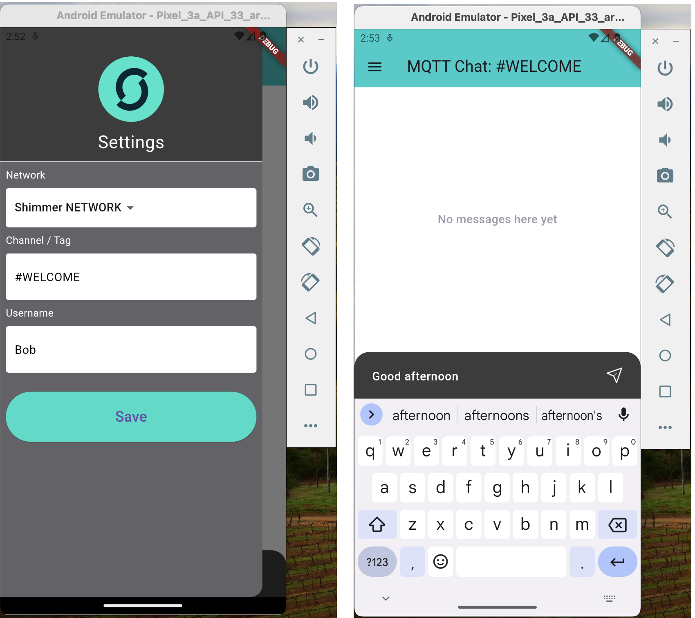
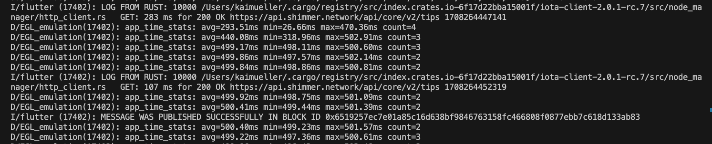
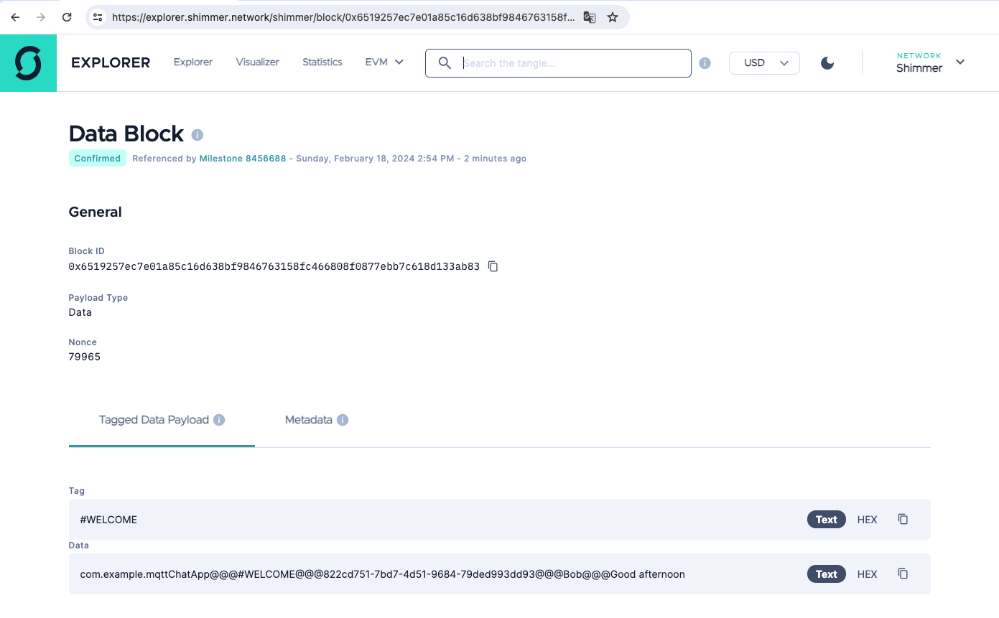
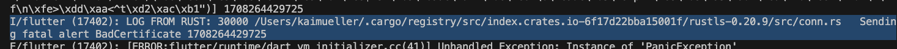

# Android

---

Usually, Android is my buddy. Unfortunately, not in this case.

---

## Try it out

<figure style="margin:0;"><figcaption style="font-size: 0.8em;text-align:center;">
At the beginning, everything seems normal.
</figcaption></figure>

In the log file, you can see that the message was sent: "MESSAGE WAS PUBLISHED SUCCESSFULLY IN BLOCK ID ..."

<figure style="margin:0;"><figcaption style="font-size: 0.8em;text-align:center;">
Logged as sent
</figcaption></figure>

And it's also traceable in the tangle explorer:

<figure style="margin:0;"><figcaption style="font-size: 0.8em;text-align:center;">
Proof in the Tangle Explorer
</figcaption></figure>

## What's wrong?

A tiny little thing trips us up. It's nestled in the log file as an error message:

<figure style="margin:0;"><figcaption style="font-size: 0.8em;text-align:center;">
Bad Certificate
</figcaption></figure>

Android seems to have some qualms about the certificate, which is why it's not allowing the connection to the MQTT server via rustls.

I've searched for any settings in Android that could fix it. For instance, I tried to establish the server's certificate as trusted within the Android app. I also experimented with different nodes using various certificates. The number of attempts I've made is numerous, and after a long time, it's hard for me to describe them all.

> **At this point, I'd like to hand over the task to you guys. If you manage to find a solution for Android, I'd appreciate it if you could send me a description of your approach.**
>
> Either leave a description as a comment under the YouTube video **[MQTT Chat App for SHIMMER/IOTA using Flutter and Rust (iota-client.rs)](https://www.youtube.com/watch?v=VpCgMRtabC8)**, or send me a message on Twitter (X) at **[@dj_kaiota](https://twitter.com/dj_kaiota)**. Thank you!
