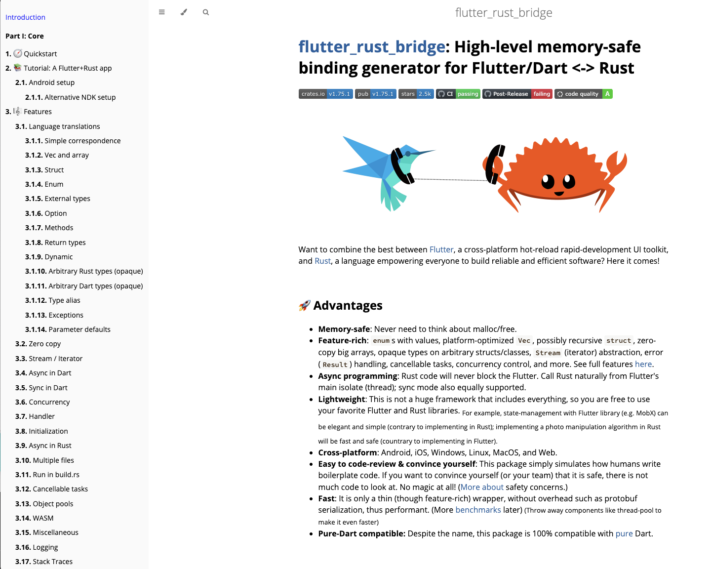

# About

---

Bridging the gap: The power of _Flutter Rust Bridge_

---

## Flutter Rust Bridge

The _Flutter Rust Bridge_ serves as the foundation for the "IOTA for Flutter" project. I was glad to have found this solution for the glueing task, with extensive documentation. There may be other alternatives out there, but I didn't look further because the _Flutter Rust Bridge_ met my needs. The scope and features are so vast that I haven't even explored them all myself.

###

<figure style="margin:0;"><figcaption style="font-size: 0.8em;text-align:center;">
User Guide of the Flutter Rust Bridge
</figcaption></figure>

One of the selection criteria was the project's open-source nature and the fact that it is an active project. From my impression, regular updates ensure that the _Flutter Rust Bridge_ stays up to date.

Additionally, it was important to me that I found support when I had questions. I received friendly and helpful answers, which was reassuring. It's great to know that there are dedicated individuals willing to help and facilitate the development process.

For developers embarking on the IOTA for Flutter journey, the GitHub page of the _Flutter Rust Bridge_ is a valuable resource. Whether you have questions or can support others with your knowledge, it's a place to turn to.

> **How Does _IOTA for Flutter_ differ from _Flutter Rust Bridge_?**
>
> While the workflow of _IOTA for Flutter_ utilizes the _Flutter Rust Bridge_ as its foundation, it offers distinct advantages through its context-specific content centered around Shimmer and IOTA. The focus of _IOTA for Flutter_ is to enhance the application and installation process, which has sometimes proven to be challenging. By addressing these difficulties, _IOTA for Flutter_ aims to provide a smoother and more user-friendly experience.

What further convinced me is the power of the project itself: the _Flutter Rust Bridge_ is packed with features! It's like a treasure chest waiting to be explored. I haven't discovered all its possibilities yet, and that's something for you to explore as well.

For example, IOTA for Flutter has not yet utilized the capability to create multiple API files, to run Flutter Unit tests or the integration of the command runner just, which could potentially optimize the workflow, among other things.

All in all, the _Flutter Rust Bridge_ has become the indispensable tool for this project. I'm grateful to have found a solution that perfectly fits our needs and simplifies the development process.
