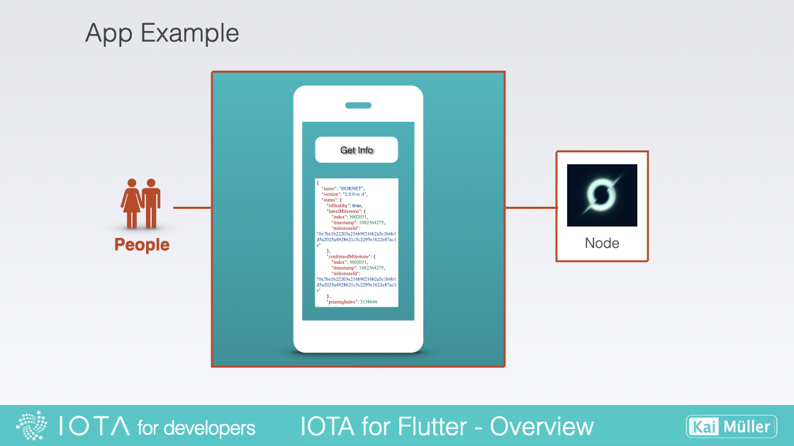
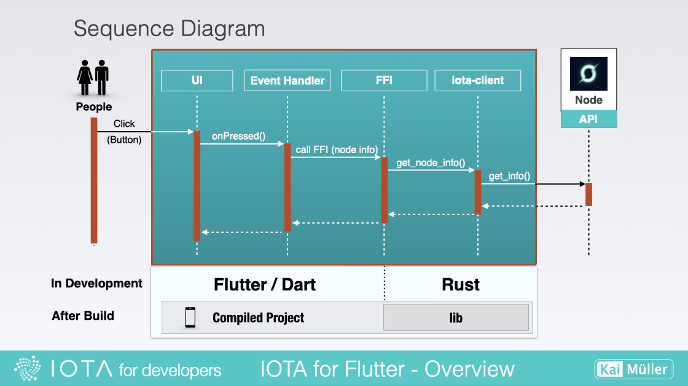

# 💡 How everything works together

---

The Big Picture

---

In this next section, I'll provide an overview of the workflow involved in integrating Flutter, Rust, and IOTA. This will give you a better understanding of what a developer needs to do in order to successfully connect these technologies and create an app using the Flutter-Rust-Bridge.

<iframe 
    class="video"  
    src="https://www.youtube.com/embed/P0Kh0DSaddA" 
    title="YouTube video player" 
    frameborder="0" 
    allow="accelerometer; autoplay; clipboard-write; encrypted-media; gyroscope; picture-in-picture; web-share" 
    allowfullscreen>
</iframe>

## Understanding the Workflow

Take a simple example: An app with just a button and a text field. When the user clicks the button, it should establish a connection to a Shimmer node and retrieve information about it. This information will then be displayed in the text field.

<figure style="margin:0;"><figcaption style="font-size: 0.8em;text-align:center;">
Example: User gets node info on button click
</figcaption></figure>

### App Processes

Within the application itself, the following occurs: in the frontend, when the button is clicked, it triggers its handler. This handler utilizes a method provided by the Foreign Function Interface (FFI). FFI is a mechanism that enables programming languages to call functions from libraries written in a different language. In the context of Flutter and Rust, FFI facilitates communication between the Flutter frontend and the Rust backend. Essentially, the button handler invokes a Rust method. This method then forwards the request to a function in the IOTA Rust library, which retrieves the desired information from the node. The information is then relayed back using the same pathway.

<figure style="margin:0;"><figcaption style="font-size: 0.8em;text-align:center;">
Sequence Diagram
</figcaption></figure>

### Various Stages

During the **Development Phase** (see above), this means that the UI and handlers are written in the Dart programming language, while the backend functions are implemented in Rust. This separation allows for leveraging the strengths of both languages: Dart for the frontend user interface and interactivity, and Rust for robust backend functionality and integration with libraries like IOTA.

During the **Build Phase** (see above), the Rust code is compiled into a library that is then incorporated into the Flutter app. The entire codebase is compiled into machine code that can be executed on the target platform. This process ensures that the Rust functionality seamlessly integrates with the Flutter app, allowing for efficient and effective execution on the desired platform.
