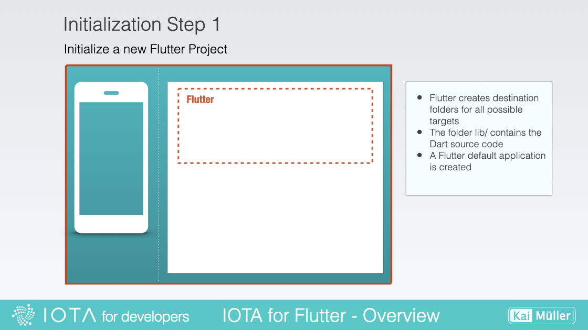
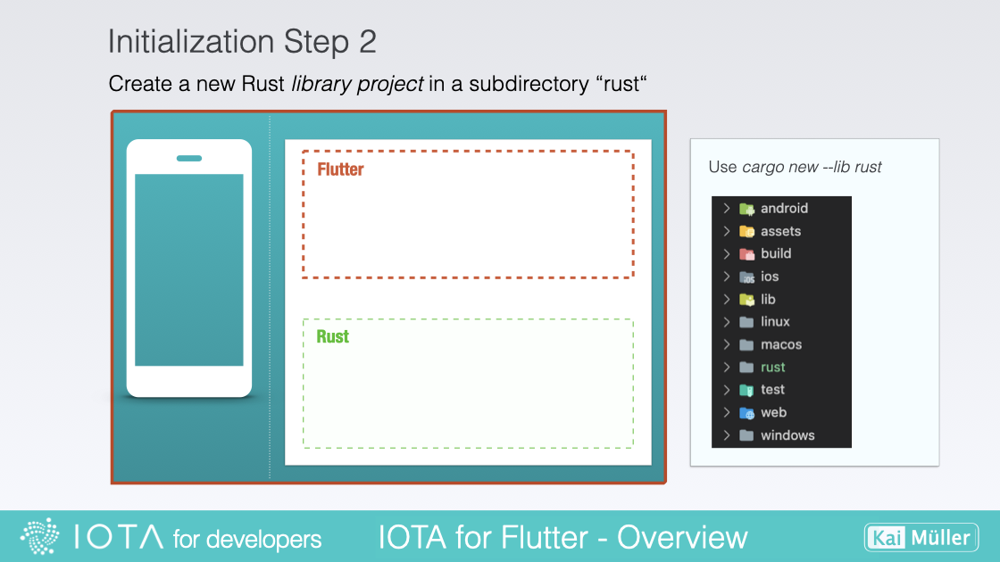
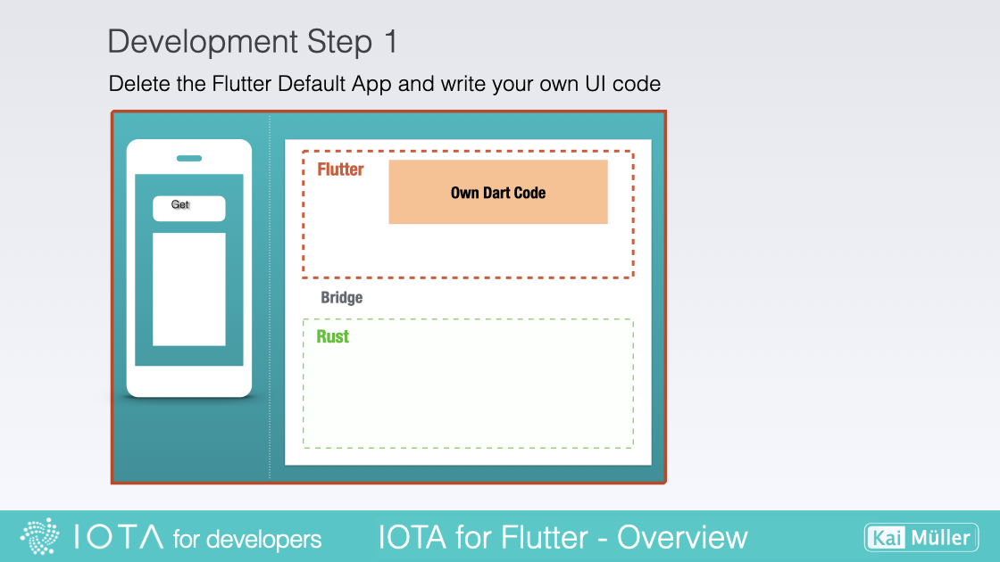
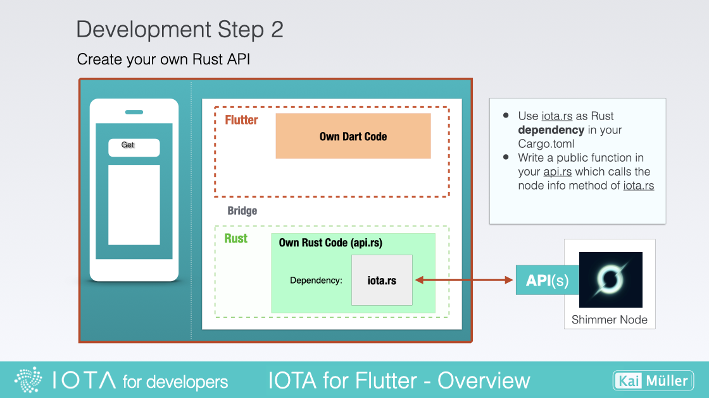
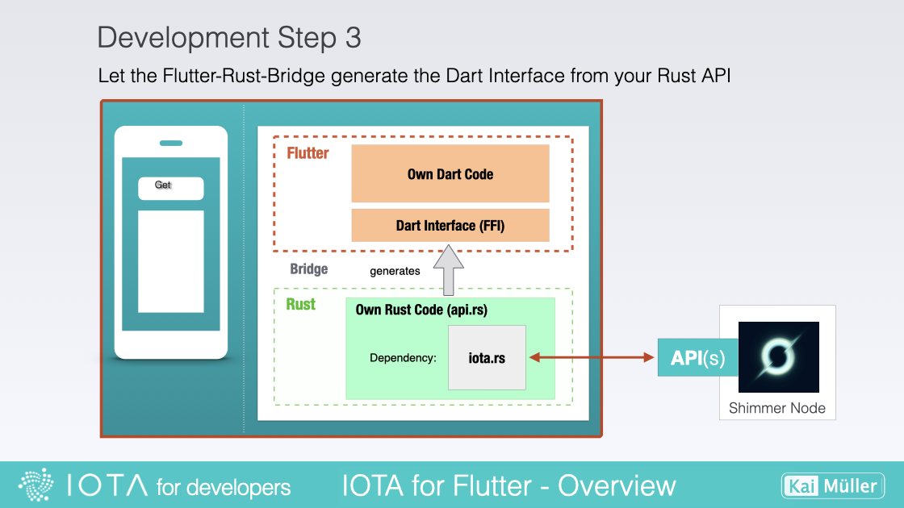
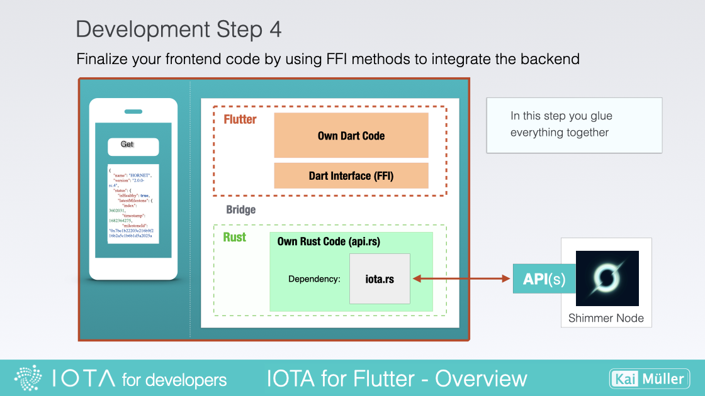
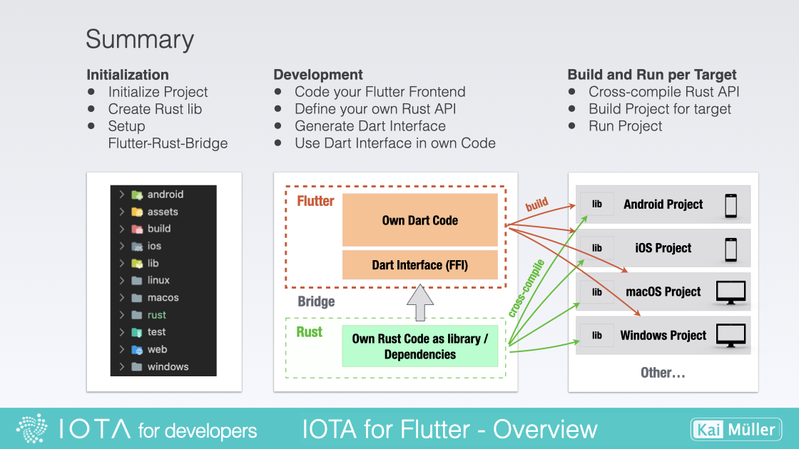

# Workflow

---

A step-by-step guide

---

The workflow is identical to the one demonstrated in the video. I will also provide the commands used in the video for reference. Please keep in mind that this is only a high-level overview for now. More detailed explanations will be provided later on.

> ⚠️ If you genuinely want to practically code the described steps outlined below, I assume that you have completed the setup of your workplace and all tools, as described in the "Fundamentals" section.

## 1. Check the Setup

```
flutter doctor
```

```
rustup show
```

> Before you go on, be sure that possible errors are fixed.

## 2. Initialization Steps

<figure style="margin:0;"><figcaption style="font-size: 0.8em;text-align:center;"><p>Create Flutter Project</p></figcaption></figure>

In the first step, the following command sets up a new Flutter project with the necessary file structure and dependencies, ready for you to start developing your app. It creates a directory with the specified project name and populates it with the required Flutter files and folders. Now you're all set to unleash your creativity and build amazing Flutter applications!

```
flutter create --empty example1
```

---

#### &nbsp;

<figure style="margin:0;"><figcaption style="font-size: 0.8em;text-align:center;"><p>Create Rust Library Project Project</p></figcaption></figure>

This includes the required structure for the Rust code and any additional resources or dependencies needed for the backend implementation:

```
cargo new --lib rust
```

---

#### &nbsp;

<figure style="margin:0;"><figcaption style="font-size: 0.8em;text-align:center;"><p>Setup the Flutter Rust Bridge</p></figcaption></figure>

```
cargo install flutter_rust_bridge_codegen

flutter pub add --dev ffigen && flutter pub add ffi

flutter pub add flutter_rust_bridge

flutter pub add -d build_runner

flutter pub add -d freezed

flutter pub add freezed_annotation
```

In _Cargo.toml_:

```
[dependencies]
flutter_rust_bridge = "1"

[lib]
crate-type = ["staticlib", "cdylib"]
```

In _android/app/build.gradle_, fix error:

```
Replace GradleException by FileNotFoundException
```

In _android/app/build.gradle_, add at the bottom:

```
[
        Debug: null,
        Profile: '--release',
        Release: '--release'
].each {
    def taskPostfix = it.key
    def profileMode = it.value
    tasks.whenTaskAdded { task ->
        if (task.name == "javaPreCompile$taskPostfix") {
            task.dependsOn "cargoBuild$taskPostfix"
        }
    }
    tasks.register("cargoBuild$taskPostfix", Exec) {
        workingDir "../../rust"  // <-- ATTENTION: CHECK THE CORRECT FOLDER!!!
        environment ANDROID_NDK_HOME: "$ANDROID_NDK"
        commandLine 'cargo', 'ndk',
                '-t', 'arm64-v8a',
               '-o', '../android/app/src/main/jniLibs', 'build'
        if (profileMode != null) {
            args profileMode
        }
    }
}
```

Your Android Virtual Device should be compatible to "arm64-v8a". "arm64-v8a" is an architecture designation for Android devices. It refers to the 64-bit version of the ARM architecture commonly used in modern Android devices.

The term "arm64" represents the 64-bit version of the ARM architecture, while "v8a" indicates the ABI (Application Binary Interface) associated with that architecture. Thus, the combination of "arm64" and "v8a" refers to the 64-bit ARM architecture running on devices with that ABI.

## 3. Development Steps

<figure style="margin:0;"><figcaption style="font-size: 0.8em;text-align:center;"><p>Start coding the fronend</p></figcaption></figure>

Add a Flutter package that beautifies JSON outputs:

```
flutter pub add flutter_json_viewer
```

Write this content into _main.dart_:

```
import 'package:flutter/material.dart';
import 'package:flutter_json_viewer/flutter_json_viewer.dart';
import 'dart:convert';
//import 'ffi.dart‘;

void main() {
  runApp(const MyApp());
}

class MyApp extends StatelessWidget {
  const MyApp({Key? key}) : super(key: key);

  // This widget is the root of your application.
  @override
  Widget build(BuildContext context) {
    return MaterialApp(
      title: 'Flutter - Rust - IOTA',
      theme: ThemeData(
        primarySwatch: Colors.green,
      ),
      home: const MyHomePage(title: 'Get Node Info'),
    );
  }
}

class MyHomePage extends StatefulWidget {
  const MyHomePage({Key? key, required this.title}) : super(key: key);

  final String title;

  @override
  State<MyHomePage> createState() => _MyHomePageState();
}

class _MyHomePageState extends State<MyHomePage> {

  String? _ffiNodeInfo;

  @override
  void initState() {
    super.initState();
  }

  @override
  Widget build(BuildContext context) {
    return Scaffold(
      appBar: AppBar(
        title: Text(widget.title),
      ),
      body: ListView(
        children: [
          Container(height: 16),
          Container(
            padding: const EdgeInsets.symmetric(horizontal: 24),
            child: Card(
              child: Container(
                padding:
                    const EdgeInsets.symmetric(horizontal: 24, vertical: 16),
                child: Column(
                  children: [
                    const Text('Result Pane',
                        style: TextStyle(
                            fontSize: 18, fontWeight: FontWeight.bold)),
                    Container(height: 8),
                    const Divider(height: 1.0, thickness: 1.0),
                    Container(height: 24),
                    JsonViewer(json.decode(_ffiNodeInfo ?? "{}")),
                    //JsonViewer(testArray),
                    Container(height: 24),
                    const Divider(height: 1.0, thickness: 1.0),
                    Container(height: 12),
                    ElevatedButton(
                      onPressed: _callFfiGetNodeInfo,
                      child: const Icon(Icons.play_arrow),
                    ),
                  ],
                ),
              ),
            ),
          ),
        ],
      ),
    );
  }

  Future<void> _callFfiGetNodeInfo() async {
    const receivedText = '{"name": "HORNET","version": "2.0.0-rc.5"}';
    //final receivedText = await api.getNodeInfo();
    if (mounted) setState(() => _ffiNodeInfo = receivedText);
  }
}
```

The backend call \_callFfiGetNodeInfo() is mocked, meaning that instead of making a real request to the server, a simulated response is generated. This approach allows us to emulate the behavior of the backend without actually relying on a live server. By mocking the backend call, we can focus on testing and developing the frontend functionality independently, ensuring that the app's features and user interactions are working as intended.

> **Important**: Before starting the application, make sure that your Virtual Android Device is running.

You can start the application with the command:

```
flutter run
```

---

#### &nbsp;

<figure style="margin:0;"><figcaption style="font-size: 0.8em;text-align:center;"><p>Generate the Dart Interface Code (FFI)</p></figcaption></figure>

The first step on the Rust side is to include the iota-client library and other necessary resources.

In _Cargo.toml_ add:

```
[dependencies]
iota-client = { version = "2.0.1-rc.7", default-features = false, features = [ "tls" ] }

serde_json = { version = "1.0.89", default-features = false }
anyhow = "1.0.66"
tokio = { version = "1.21.2", default-features = false, features = ["macros"] }
```

Create the file _api.rs_. **The file _api.rs_ is YOUR RUST WORKING FILE**. The Flutter-Rust-Bridge code generator will identify all public functions within the `api.rs` file and generate the corresponding Dart Interface from these methods. This means that all public functions available in the Rust code will be exposed and accessible for utilization within the Flutter app.

By automatically generating the Dart Interface, the Flutter-Rust-Bridge simplifies the process of bridging the communication between the Flutter frontend and the Rust backend, enabling seamless interaction and integration between the two languages.

Add this content to _api.rs_:

```
use iota_client::Client;
use anyhow::Result;
use tokio::runtime::Runtime;

pub fn get_node_info() -> Result<String> {
    let rt = Runtime::new().unwrap();
    rt.block_on(async {
        let node_url = "https://api.testnet.shimmer.network";

        // Create a client with that node.
        let client = Client::builder()
            .with_node(&node_url)?
            .with_ignore_node_health()
            .finish()?;

        // Get node info.
        let info = client.get_info().await?;

        Ok(serde_json::to_string_pretty(&info).unwrap())
    })
}
```

Replace the content in _lib.rs_ by:

```
mod api;
```

---

#### &nbsp;

<figure style="margin:0;"><figcaption style="font-size: 0.8em;text-align:center;"><p>Integrate the backend</p></figcaption></figure>

This one is easy! It's one of the tasks you need to do whenever the Rust API has changed (e.g. after changing method signatures or add/removing methods). In our example, generate the Dart Interface by executing this command:

```
flutter_rust_bridge_codegen --rust-input rust/src/api.rs --dart-output ./lib/bridge_generated.dart --dart-decl-output ./lib/bridge_definitions.dart
```

---

#### &nbsp;

<figure style="margin:0;"><figcaption style="font-size: 0.8em;text-align:center;"><p>Integrate the Dart Interface into your frontend code</p></figcaption></figure>

Next to _main.dart_, add a new file called _ffi.dart_ and add this content:

```
// This file initializes the dynamic library and connects it with the stub
// generated by flutter_rust_bridge_codegen.

import 'dart:ffi';

import 'bridge_generated.dart';
import 'bridge_definitions.dart';
export 'bridge_definitions.dart';

// Re-export the bridge so it is only necessary to import this file.
export 'bridge_generated.dart';
import 'dart:io' as io;

const _base = 'rust';

// On MacOS, the dynamic library is not bundled with the binary,
// but rather directly **linked** against the binary.
final _dylib = io.Platform.isWindows ? '$_base.dll' : 'lib$_base.so';

final Rust api = RustImpl(io.Platform.isIOS || io.Platform.isMacOS
    ? DynamicLibrary.executable()
    : DynamicLibrary.open(_dylib));

```

Integrating the library involves loading it into our project, enabling us to execute its methods and utilize its functionalities.

Now, in _main.dart_, comment out line 3:

```
ffi.dart  // remove the two slashs
```

The final step is to insert the appropriate function calls to invoke the desired methods from the library. In _main.dart_, update the function \_callFfiGetNodeInfo().

Replace:

```
    const receivedText = '{"name": "HORNET","version": "2.0.0-rc.5"}';
    //final receivedText = await api.getNodeInfo();
```

by:

```
    //const receivedText = '{"name": "HORNET","version": "2.0.0-rc.5"}';
    final receivedText = await api.getNodeInfo();
```

## 4. Build and Run Step

<figure style="margin:0;"><figcaption style="font-size: 0.8em;text-align:center;"><p>Build and Run a target</p></figcaption></figure>

> **Important**: Before starting the application, make sure that your Virtual Android Device is running.

Open the App with the command:

```
flutter run
```

To inform Flutter about the target platform for which it should build with _flutter run_, the corresponding platform is initiated beforehand.

During the build process, the Rust code is cross-compiled into a library specific to the target platform (here: arm64-v8a). This compiled library is then automatically copied into the Android project folder.

Then the app is launched.

## Summary

Here is a brief summary about all steps, in one picture:

<figure style="margin:0;"><figcaption style="font-size: 0.8em;text-align:center;"><p>All steps of the workflow</p></figcaption></figure>
