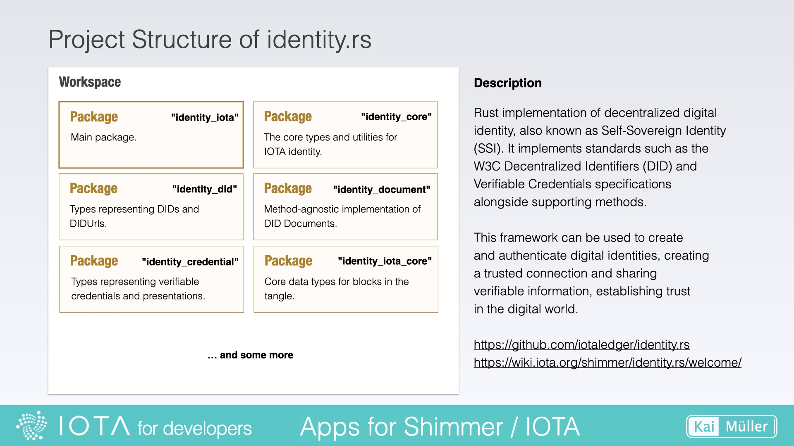
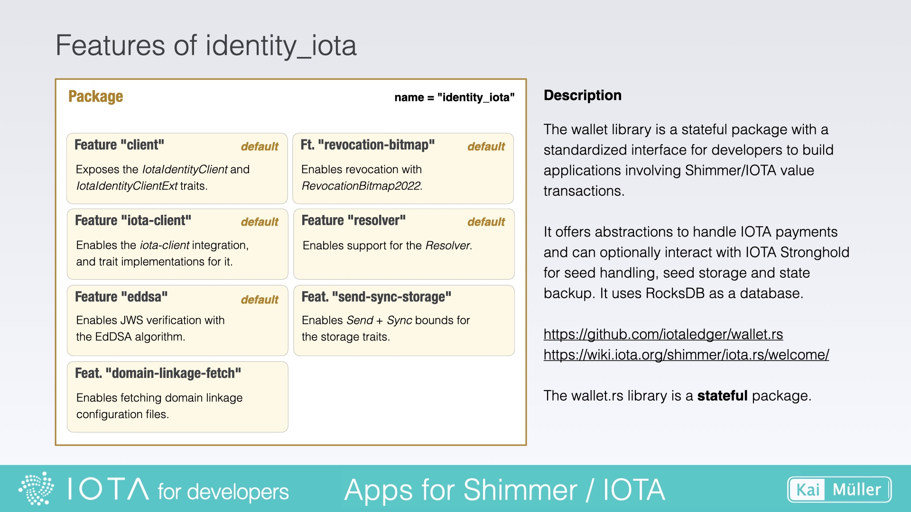

# IOTA SDK and identity.rs

---

//IN WORK

Good news: it's getting easier

---

## A big step in the right direction

<a href="https://wiki.iota.org/iota-sdk/welcome/" target="_blank">👉 &nbsp; Wiki - IOTA SDK</a>

The IOTA SDK consolidates the two deprecated libraries iota.rs and wallet.rs. It also addresses the issue with rocksdb, making it easier for us to use on Android and iOS.

<figure style="margin:0;border: 1px solid green;"><figcaption style="font-size: 0.8em;text-align:center;">
Wikipage
</figcaption></figure>

## IOTA SDK

> In order to better analyze the code, I recommend:
>
> 1. Downloading the latest version of the source code (either by downloading and extracting the zip file or using git clone) and opening it in your IDE.
> 2. Creating the Rust Docs as described in the chapter [Create Rust Docs](../../fundamentals/rust/rust-docs.md).

<figure style="margin:0;border: 1px solid green;"><figcaption style="font-size: 0.8em;text-align:center;">
IOTA SDK
</figcaption></figure>

Take a look inside the `src/` folder. You'll find the `client` and `wallet` directories there.

//TODO: Describe Project Structure of IOTA SDK

## identity.rs

<a href="https://github.com/iotaledger/identity.rs" target="_blank">👉 &nbsp; GitHub - identity.rs</a>

The main package of this workspace is located in the `identity_iota/` directory. This package will be built as a crate with the name "identity_iota" (use this name to search for it in https://crates.io). The other packages of this workspace are dependencies of the main package.

<figure style="margin:0;border: 1px solid green;"><figcaption style="font-size: 0.8em;text-align:center;">
Project Structure of identity.rs
</figcaption></figure>

A look at `identity_iota/Cargo.toml` reveals the features of the library crate.

<figure style="margin:0;border: 1px solid green;"><figcaption style="font-size: 0.8em;text-align:center;">
Features of identity_iota
</figcaption></figure>
