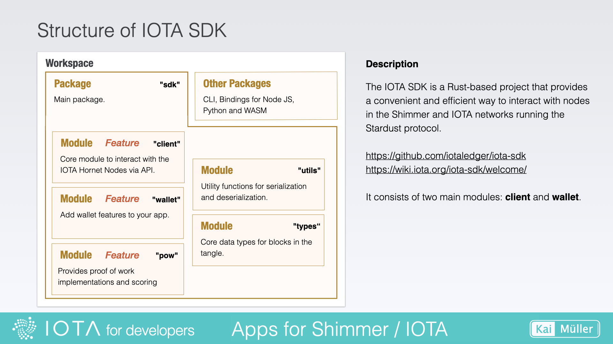
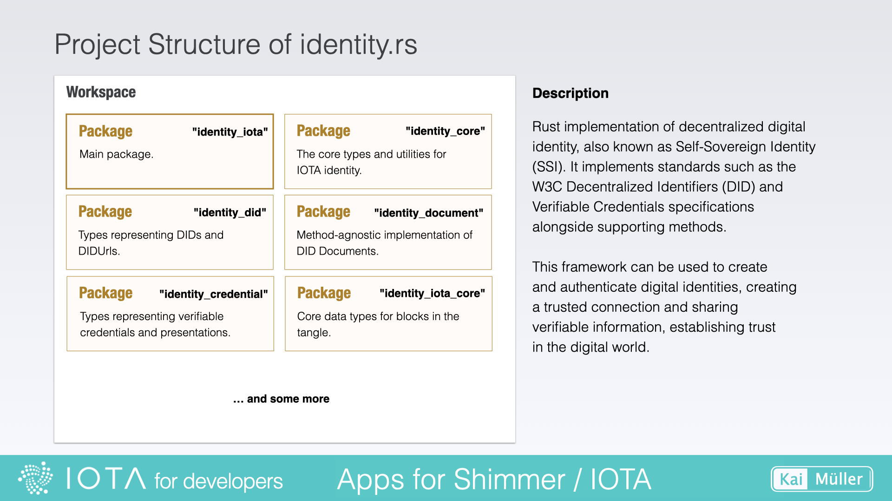
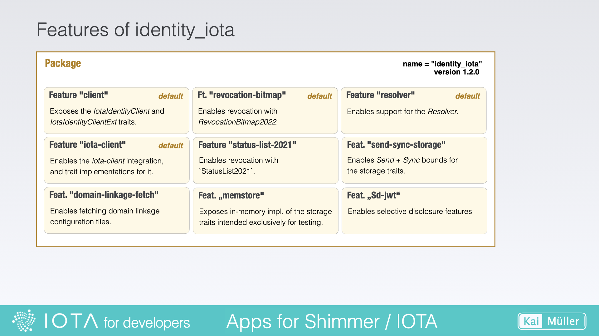

# IOTA SDK and identity.rs

---

Code's organization: How are IOTA's libraries structured?

Good news: it's getting easier!

---

## A big step in the right direction

<a href="https://wiki.iota.org/iota-sdk/welcome/" target="_blank">👉 &nbsp; Wiki - IOTA SDK</a>

The IOTA SDK consolidates the two deprecated libraries iota.rs and wallet.rs. It also addresses the issue with rocksdb, making it easier for us to use on Android and iOS.

<figure style="margin:0;border: 1px solid green;"><figcaption style="font-size: 0.8em;text-align:center;">
Wikipage
</figcaption></figure>

## IOTA SDK

> In order to better analyze the code, I recommend:
>
> 1. Downloading the latest version of the source code (either by downloading and extracting the zip file or using git clone) and opening it in your IDE.
> 2. Creating the Rust Docs as described in the chapter [Create Rust Docs](../../fundamentals/rust/rust-docs.md).

Take a look inside the `src/` folder. You'll find the `client` and `wallet` directories there.

<figure style="margin:0;border: 1px solid green;"><figcaption style="font-size: 0.8em;text-align:center;">
IOTA SDK
</figcaption></figure>

---

<figure style="margin:0;border: 1px solid green;"><figcaption style="font-size: 0.8em;text-align:center;">
Structure of the IOTA SDK
</figcaption></figure>

| Module | Description                                                                                                                                                                                               |
| ------ | --------------------------------------------------------------------------------------------------------------------------------------------------------------------------------------------------------- |
| client | A general purpose IOTA client for interaction with the IOTA network (Tangle). High-level functions are accessible via the Client struct.                                                                  |
| wallet | The IOTA Wallet Library to create and use Accounts which can be secured by Stronghold and can be persisted in a database (rocksdb). Needed to send and receive values.                                    |
| pow    | Provides proof of work implementations and scoring for the IOTA protocol as a means to rate-limit the network. See [Message PoW](https://github.com/iotaledger/tips/blob/main/tips/TIP-0012/tip-0012.md). |
| utils  | Utility functions for serialization and deserialization.                                                                                                                                                  |
| types  | Common types required by nodes and clients APIs like blocks, responses and DTOs.                                                                                                                          |

---

Your task: Review the feature definitions in `sdk/Cargo.toml`. Upon inspection, you'll notice that enabling the _wallet_ feature will inherently incorporate the _client_ feature.

Compare your insights with the source code in `sdk/src/lib.rs`:

<figure style="margin:0;border: 1px solid green;"><figcaption style="font-size: 0.8em;text-align:center;">
The modules client, wallet and pow can be "switched on and off"
</figcaption></figure>

The source code of the modules _client_, _wallet_ and _pow_ can be included or excluded from the IOTA SDK Library, depending on the definition in YOUR PROJECT's `Cargo.toml`.

## identity.rs

<a href="https://github.com/iotaledger/identity.rs" target="_blank">👉 &nbsp; GitHub - identity.rs</a>

The main package of this workspace is located in the `identity_iota/` directory. This package will be built as a crate with the name "identity_iota" (use this name to search for it in https://crates.io). The other packages of this workspace are dependencies of the main package.

<figure style="margin:0;border: 1px solid green;"><figcaption style="font-size: 0.8em;text-align:center;">
Project Structure of identity.rs
</figcaption></figure>

<a href="https://docs.rs/identity_iota/latest/identity_iota/" target="_blank">👉 &nbsp; Complete latest Documentation</a>

<a href="https://wiki.iota.org/identity.rs/welcome/" target="_blank">👉 &nbsp; Wiki - IOTA's Identity Framework</a>

---

The main module "identity_iota" contains the IOTA DID method implementation for the IOTA ledger.

It implements the W3C Decentralized Identifiers (DID)
and Verifiable Credentials specifications.

<a href="https://www.w3.org/TR/did-core/" target="_blank">👉 &nbsp; Decentralized Identifiers (DID)</a>

<a href="https://www.w3.org/TR/vc-data-model/" target="_blank">👉 &nbsp; Verifiable Credentials</a>

---

A look at `identity_iota/Cargo.toml` reveals the features of the library crate.

<figure style="margin:0;border: 1px solid green;"><figcaption style="font-size: 0.8em;text-align:center;">
Features of identity_iota
</figcaption></figure>
