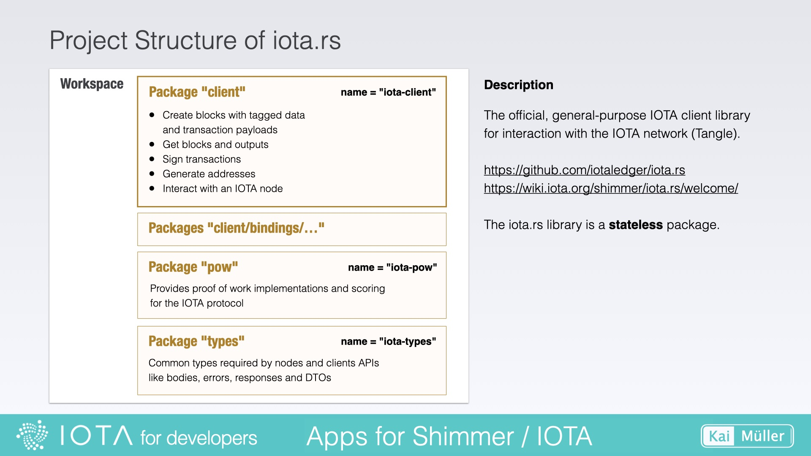
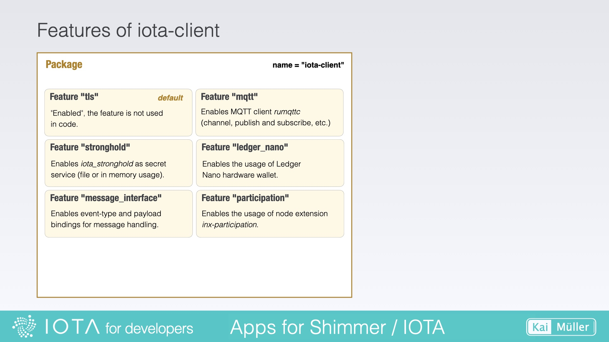
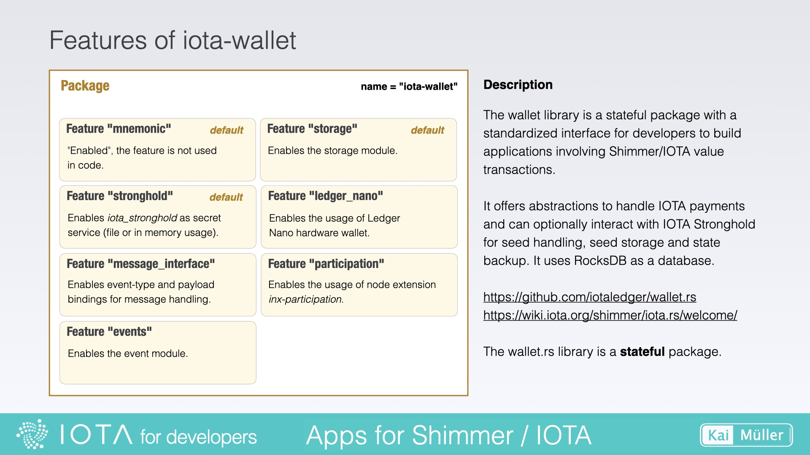
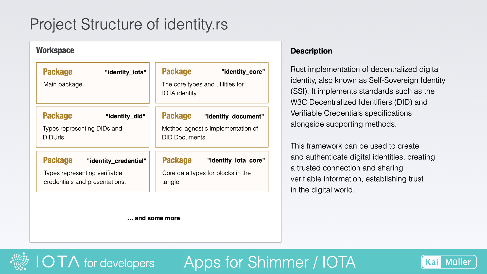
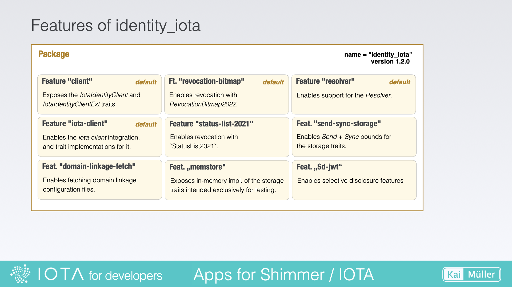

# iota.rs, wallet.rs and identity.rs

---

DEPRECATED

Code's organization: How are IOTA's libraries structured?

---

## iota.rs

<a href="https://github.com/iotaledger/iota.rs" target="_blank">👉 &nbsp; GitHub - iota.rs</a>

The main package of this workspace is located in the `client/` directory. This package will be built as a crate with the name "iota-client" (use this name to search for it in https://crates.io).

<figure style="margin:0;border: 1px solid green;"><figcaption style="font-size: 0.8em;text-align:center;">
Project Structure of iota.rs
</figcaption></figure>

A look at `client/Cargo.toml` reveals the features of the library crate.

<figure style="margin:0;border: 1px solid green;"><figcaption style="font-size: 0.8em;text-align:center;">
Features of iota-client
</figcaption></figure>

If you're looking for another entry point into iota.rs, you can check out the chapter titled [Simple App -> Core API and iota.rs](../../building-a-simple-app/core-api.md). This chapter provides more information about the structure of the iota-client using an example.

## wallet.rs

<a href="https://github.com/iotaledger/wallet.rs" target="_blank">👉 &nbsp; GitHub - wallet.rs</a>

There is no workspace but only a package which will be built as a crate with the name "iota-wallet" (use this name to search for it in https://crates.io).

A look at `Cargo.toml` reveals the features of the library crate.

<figure style="margin:0;border: 1px solid green;"><figcaption style="font-size: 0.8em;text-align:center;">
Structure of wallet.rs and features of iota-wallet
</figcaption></figure>

## identity.rs

<a href="https://github.com/iotaledger/identity.rs" target="_blank">👉 &nbsp; GitHub - identity.rs</a>

The main package of this workspace is located in the `identity_iota/` directory. This package will be built as a crate with the name "identity_iota" (use this name to search for it in https://crates.io). The other packages of this workspace are dependencies of the main package.

<figure style="margin:0;border: 1px solid green;"><figcaption style="font-size: 0.8em;text-align:center;">
Project Structure of identity.rs
</figcaption></figure>

<a href="https://docs.rs/identity_iota/latest/identity_iota/" target="_blank">👉 &nbsp; Complete latest Documentation</a>

<a href="https://wiki.iota.org/identity.rs/welcome/" target="_blank">👉 &nbsp; Wiki - IOTA's Identity Framework Guide</a>

---

The main module "identity_iota" contains the IOTA DID method implementation for the IOTA ledger.

It implements the W3C Decentralized Identifiers (DID)
and Verifiable Credentials specifications.

<a href="https://www.w3.org/TR/did-core/" target="_blank">👉 &nbsp; Decentralized Identifiers (DID)</a>

<a href="https://www.w3.org/TR/vc-data-model/" target="_blank">👉 &nbsp; Verifiable Credentials</a>

---

A look at `identity_iota/Cargo.toml` reveals the features of the library crate.

<figure style="margin:0;border: 1px solid green;"><figcaption style="font-size: 0.8em;text-align:center;">
Features of identity_iota
</figcaption></figure>
