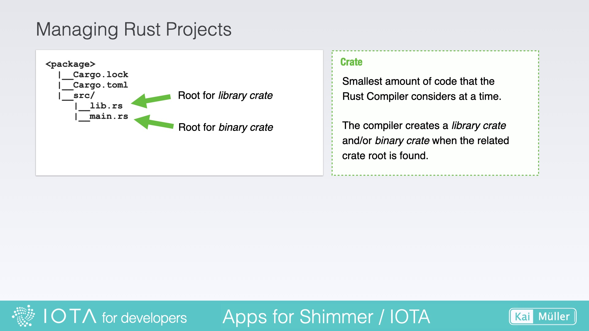
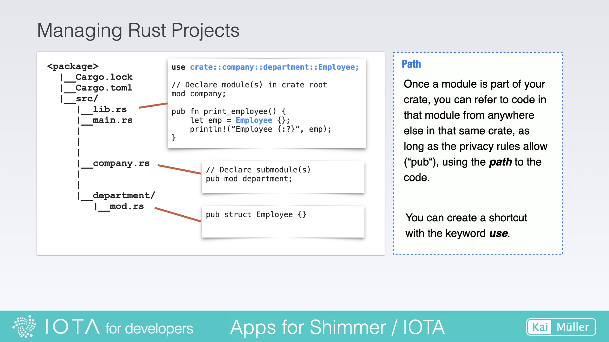

# Rust Project Structure

---

Code's organization: Learn the basics of Rust's _module system_ to analyze a project.

---

## Workspace and Packages

A _Workspace_ is a feature provided by Cargo (Rust's package manager and build tool) that allows you to manage multiple related _Packages_ within a single directory. Workspaces are optional.

By organizing packages as part of a workspace, you can share dependencies, coordinate builds, and simplify the development and testing of interconnected projects.

Workspace and packages each have their own Cargo.toml file.

<figure style="margin:0;"><figcaption style="font-size: 0.8em;text-align:center;">
Rust Project Structure
</figcaption></figure>

## Crates

A _Crate_ is a self-contained unit of code that encapsulates a set of functionality, typically organized into modules, structs, enums, traits, and functions. This unit of code can be shared, imported, and used in other codebases.

Crates can be published to the Rust community's _Crate Registry_, allowing developers to include them as dependencies in their projects:

> <a href="https://crates.io/" target="_blank">👉 &nbsp; The Rust community’s Crate Registry (https://crates.io/)</a>
>
> Hint: Search for the keyword _iota_ in the
> registry to get a list of IOTA related crates.

There are two types of crates: _library crates_ expose public functions or items , and _binary crates_ which are executable programs. A package can contain the source code of one or several crates.

<figure style="margin:0;"><figcaption style="font-size: 0.8em;text-align:center;">
Crates
</figcaption></figure>

## Modules and Paths

A _Module_ is a way to organize and group related code within a crate. It allows for logical separation and encapsulation of functionality, helping to keep code organized and maintainable.

<figure style="margin:0;"><figcaption style="font-size: 0.8em;text-align:center;">
Modules
</figcaption></figure>

A _Path_ refers to the location of a module or item (e.g. structs, enums, functions) within the project's directory structure. It represents the hierarchical structure of directories and subdirectories.

The `use` keyword in Rust is used to bring items from a module or crate into scope, allowing them to be accessed without fully qualifying their paths. It provides a way to conveniently reference items by their short names instead of using their full paths every time.

The requirement, however, is that the used modules and items are public (indicated by the keyword `pub`).

<figure style="margin:0;"><figcaption style="font-size: 0.8em;text-align:center;">
Paths
</figcaption></figure>

---

And here are two official links about this section:

<a href="https://doc.rust-lang.org/book/ch07-00-managing-growing-projects-with-packages-crates-and-modules.html" target="_blank">👉 &nbsp; Rust documentation - Managing Growing Projects with Packages, Crates, and Modules</a>

<a href="https://doc.rust-lang.org/book/ch14-03-cargo-workspaces.html" target="_blank">👉 &nbsp; Rust documentation - Cargo Workspaces</a>
