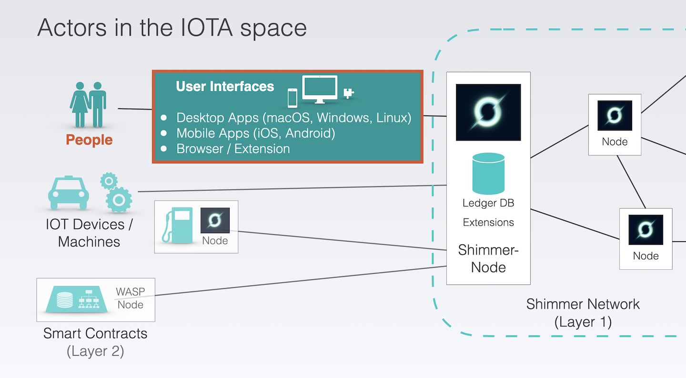

# 💻 What you'll get

---

Explore the world of Distributed Ledger Technology with a hands-on guide using this Github page, companion repositories, and YouTube videos

---

## Seamless User Interfaces for human interaction

<figure style="margin:0;"><figcaption style="font-size: 0.8em;text-align:center;">
This tutorial is about building User Interfaces for human interaction (highlighted in red)
</figcaption></figure>

The focus of this project is to provide a user interface or interaction capability with IOTA for humans. While IOT devices, machines or smart contracts can also interact with IOTA, the primary goal here is to create a seamless experience for people to connect and engage with IOTA's Layer 1 network.

The main goal is achieved by building mobile and desktop apps. The focus is on the target platforms that Flutter supports, with the caveat that the proof-of-concept has only been tested on iOS, Android, and macOS.&#x20;

Rust plays a crucial role in _IOTA for Flutter_, too. All of IOTA's libraries are written in Rust and are referred to as the **Single Source of Truth**. I will explain how these Rust libraries are used as a dependency in a custom library which is cross-compiled and integrated into Flutter.

## Tutorial Structure: Overview, Fundamentals, and Practical Chapters

The _IOTA for Flutter_ tutorial is divided into several sections, including an overview for getting the key concept, a fundamentals section for preparing what you need, and several practical chapters that focus on building real-world products.&#x20;

To make it easier to follow along with the written text, each practical chapter has a corresponding repository on GitHub. I also provide some videos to demonstrate the resulting app, the workflow and guide users through important steps, so you can watch over my shoulder as I work through the examples.&#x20;

> **The Three Pillars of the Tutorial**: Github Page, Repositories and Videos

The practical chapters are structured as follows: first, we start with an introductory chapter to build an app with Flutter and Rust without IOTA. This will introduce the Flutter-Rust-Bridge, the glueing part that brings Flutter and Rust together. Then, we dive into building a simple IOTA-powered app, followed by a comprehensive "Shimmer playground" app to demonstrate all Rust libraries in one app.&#x20;

As a bonus, I provide the code for the MQTT Chat App. In this chapter, I assume that you have gained enough knowledge and experience from the previous practical chapters.
