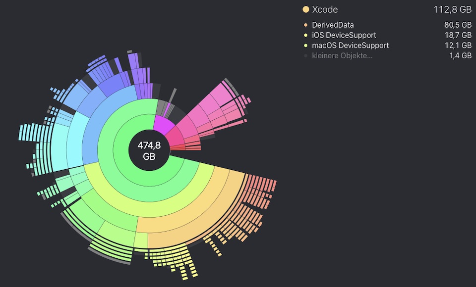
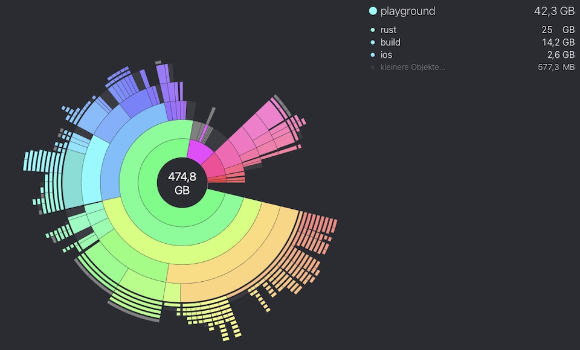

# ✨ Which resources you need

---

Meeting listed requirements of the used tools is a must, with some additional needs

---

## Lots of free GB

XCode, Android Studio, the SDKs and Virtual Devices, all that stuff needs GBs on your disc. Welcome to app development! Additionally it turns out that the cross-compiling process to build the libraries takes an enormous amount of disk space PER target, too.

### XCode

As you continue to use Xcode, the available storage on your hard drive gradually decreases. This is because numerous files are generated automatically during project builds, with a significant amount of them being stored in the DerivedData folder. This folder alone can occupy anywhere from a few hundred MB to several GB of space.

<figure style="margin:0;"><figcaption style="font-size: 0.8em;text-align:center;">
Disc space used by derived data
</figcaption></figure>

Fortunately, you can easily remove files from this folder without any adverse effects. By doing so, you can recover valuable space on your Mac, making it more efficient to work with Xcode.

<a href="https://www.kindacode.com/article/ways-to-delete-derived-data-in-xcode/" target="_blank">👉 &nbsp; 2 Ways to Delete Derived Data in Xcode</a>

### Building apps

If you build more apps and cross-compile more targets, the disk space usage increases. However, you can safely remove these subfolders. The only difference it makes is in terms of time - the first build will take longer if the target folder has been deleted.

<figure style="margin:0;"><figcaption style="font-size: 0.8em;text-align:center;">
Disc space used by build targets of example app "Playground"
</figcaption></figure>

## Required Devices for Testing and Running

Although you can develop code for all platforms on a single machine, you can only execute and test iOS and macOS applications on macOS devices, Windows applications on Windows devices, and Linux applications on Linux devices.

I haven't tried Windows and Linux Cross-Platform Development, see also:&#x20;
[What does this tutorial NOT contain](what-does-this-tutorial-not-contain.md)

## The Key Resource

Finally, the most important resources is: **YOU**

You need to be patient, you may experience some hair-pulling moments when things grind to a halt, but when it finally all comes together, it's like hitting a bullseye on a dartboard - satisfying as heck!
